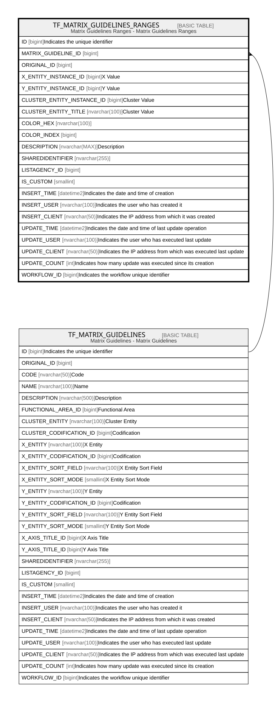

# TF_MATRIX_GUIDELINES_RANGES

## Description

Matrix Guidelines Ranges - Matrix Guidelines Ranges  

## Columns

| Name | Type | Default | Nullable | Parents | Comment |
| ---- | ---- | ------- | -------- | ------- | ------- |
| ID | bigint |  | false |  | Indicates the unique identifier |
| MATRIX_GUIDELINE_ID | bigint |  | false | [TF_MATRIX_GUIDELINES](TF_MATRIX_GUIDELINES.md) |  |
| ORIGINAL_ID | bigint |  | true |  |  |
| X_ENTITY_INSTANCE_ID | bigint |  | false |  | X Value |
| Y_ENTITY_INSTANCE_ID | bigint |  | false |  | Y Value |
| CLUSTER_ENTITY_INSTANCE_ID | bigint |  | true |  | Cluster Value |
| CLUSTER_ENTITY_TITLE | nvarchar(100) |  | true |  | Cluster Value |
| COLOR_HEX | nvarchar(100) |  | true |  |  |
| COLOR_INDEX | bigint |  | true |  |  |
| DESCRIPTION | nvarchar(MAX) |  | true |  | Description |
| SHAREDIDENTIFIER | nvarchar(255) |  | true |  |  |
| LISTAGENCY_ID | bigint |  | true |  |  |
| IS_CUSTOM | smallint |  | false |  |  |
| INSERT_TIME | datetime2 | (sysutcdatetime()) | false |  | Indicates the date and time of creation |
| INSERT_USER | nvarchar(100) | (N'MAIN') | false |  | Indicates the user who has created it |
| INSERT_CLIENT | nvarchar(50) | (N'localhost') | false |  | Indicates the IP address from which it was created |
| UPDATE_TIME | datetime2 | (sysutcdatetime()) | false |  | Indicates the date and time of last update operation |
| UPDATE_USER | nvarchar(100) | (N'MAIN') | false |  | Indicates the user who has executed last update |
| UPDATE_CLIENT | nvarchar(50) | (N'localhost') | false |  | Indicates the IP address from which was executed last update |
| UPDATE_COUNT | int | ((0)) | false |  | Indicates how many update was executed since its creation |
| WORKFLOW_ID | bigint |  | true |  | Indicates the workflow unique identifier |

## Constraints

| Name | Type | Definition |
| ---- | ---- | ---------- |
| PK_MATRIX_GUIDELINES_RANGES | PRIMARY KEY | CLUSTERED, unique, part of a PRIMARY KEY constraint, [ ID ] |
| FK_MATRIX_GUIDELINES_RANGES | FOREIGN KEY | FOREIGN KEY(MATRIX_GUIDELINE_ID) REFERENCES TF_MATRIX_GUIDELINES(ID) ON UPDATE NO_ACTION ON DELETE NO_ACTION |

## Indexes

| Name | Definition |
| ---- | ---------- |
| PK_MATRIX_GUIDELINES_RANGES | CLUSTERED, unique, part of a PRIMARY KEY constraint, [ ID ] |
| IDX_MTRX_RANGES_CUSTOM_FACTORY | NONCLUSTERED, [ ORIGINAL_ID, IS_CUSTOM ] |

## Relations

---

> Generated by [tbls](https://github.com/k1LoW/tbls)
