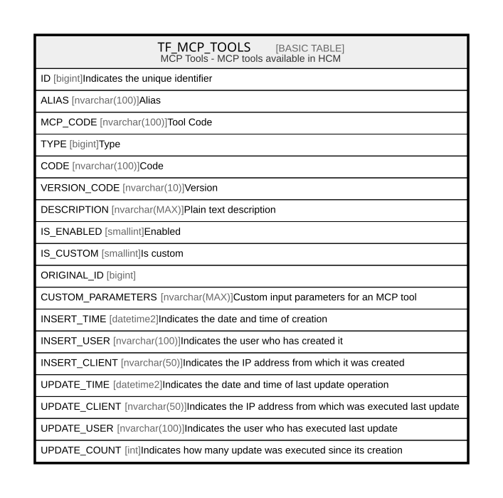

# TF_MCP_TOOLS

## Description

MCP Tools - MCP tools available in HCM  

## Columns

| Name | Type | Default | Nullable | Comment |
| ---- | ---- | ------- | -------- | ------- |
| ID | bigint |  | false | Indicates the unique identifier |
| ALIAS | nvarchar(100) |  | false | Alias |
| MCP_CODE | nvarchar(100) |  | false | Tool Code |
| TYPE | bigint | ((0)) | false | Type |
| CODE | nvarchar(100) |  | false | Code |
| VERSION_CODE | nvarchar(10) |  | true | Version |
| DESCRIPTION | nvarchar(MAX) |  | false | Plain text description |
| IS_ENABLED | smallint | ((0)) | false | Enabled |
| IS_CUSTOM | smallint | ((1)) | false | Is custom |
| ORIGINAL_ID | bigint |  | true |  |
| CUSTOM_PARAMETERS | nvarchar(MAX) |  | true | Custom input parameters for an MCP tool |
| INSERT_TIME | datetime2 | (sysutcdatetime()) | false | Indicates the date and time of creation |
| INSERT_USER | nvarchar(100) | (N'MAIN') | false | Indicates the user who has created it |
| INSERT_CLIENT | nvarchar(50) | (N'localhost') | false | Indicates the IP address from which it was created |
| UPDATE_TIME | datetime2 | (sysutcdatetime()) | false | Indicates the date and time of last update operation |
| UPDATE_CLIENT | nvarchar(50) | (N'localhost') | false | Indicates the IP address from which was executed last update |
| UPDATE_USER | nvarchar(100) | (N'MAIN') | false | Indicates the user who has executed last update |
| UPDATE_COUNT | int | ((0)) | false | Indicates how many update was executed since its creation |

## Constraints

| Name | Type | Definition |
| ---- | ---- | ---------- |
| PK_MCP_TOOLS | PRIMARY KEY | CLUSTERED, unique, part of a PRIMARY KEY constraint, [ ID ] |
| UQ_MCP_TOOLS_ALIAS | UNIQUE | NONCLUSTERED, unique, part of a UNIQUE constraint, [ ALIAS, MCP_CODE ] |
| UQ_MCP_TOOLS_CODE | UNIQUE | NONCLUSTERED, unique, part of a UNIQUE constraint, [ CODE, VERSION_CODE, IS_CUSTOM, IS_ENABLED ] |

## Indexes

| Name | Definition |
| ---- | ---------- |
| PK_MCP_TOOLS | CLUSTERED, unique, part of a PRIMARY KEY constraint, [ ID ] |
| UQ_MCP_TOOLS_ALIAS | NONCLUSTERED, unique, part of a UNIQUE constraint, [ ALIAS, MCP_CODE ] |
| UQ_MCP_TOOLS_CODE | NONCLUSTERED, unique, part of a UNIQUE constraint, [ CODE, VERSION_CODE, IS_CUSTOM, IS_ENABLED ] |

## Relations

---

> Generated by [tbls](https://github.com/k1LoW/tbls)
