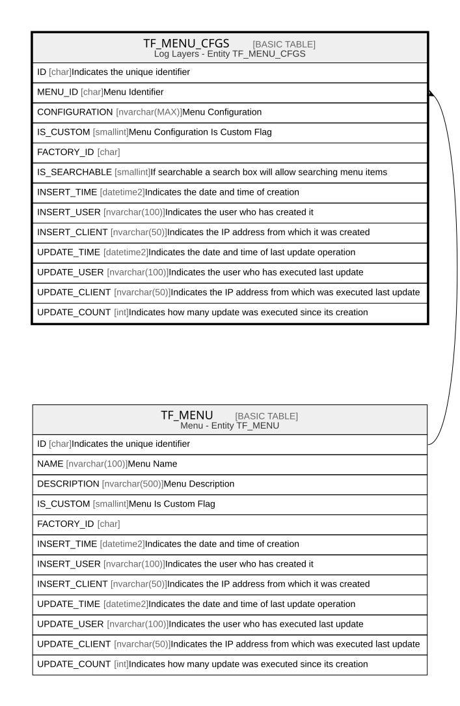

# TF_MENU_CFGS

## Description

Log Layers - Entity TF_MENU_CFGS  

## Columns

| Name | Type | Default | Nullable | Parents | Comment |
| ---- | ---- | ------- | -------- | ------- | ------- |
| ID | char |  | false |  | Indicates the unique identifier |
| MENU_ID | char |  | false | [TF_MENU](TF_MENU.md) | Menu Identifier |
| CONFIGURATION | nvarchar(MAX) |  | false |  | Menu Configuration |
| IS_CUSTOM | smallint | ((0)) | false |  | Menu Configuration Is Custom Flag |
| FACTORY_ID | char |  | true |  |  |
| IS_SEARCHABLE | smallint | ((1)) | false |  | If searchable a search box will allow searching menu items |
| INSERT_TIME | datetime2 | (sysutcdatetime()) | false |  | Indicates the date and time of creation |
| INSERT_USER | nvarchar(100) | (N'MAIN') | false |  | Indicates the user who has created it |
| INSERT_CLIENT | nvarchar(50) | (N'localhost') | false |  | Indicates the IP address from which it was created |
| UPDATE_TIME | datetime2 | (sysutcdatetime()) | false |  | Indicates the date and time of last update operation |
| UPDATE_USER | nvarchar(100) | (N'MAIN') | false |  | Indicates the user who has executed last update |
| UPDATE_CLIENT | nvarchar(50) | (N'localhost') | false |  | Indicates the IP address from which was executed last update |
| UPDATE_COUNT | int | ((0)) | false |  | Indicates how many update was executed since its creation |

## Constraints

| Name | Type | Definition |
| ---- | ---- | ---------- |
| PK_MENU_CFGS | PRIMARY KEY | CLUSTERED, unique, part of a PRIMARY KEY constraint, [ ID ] |
| FK_MENU_MENUCFGS | FOREIGN KEY | FOREIGN KEY(MENU_ID) REFERENCES TF_MENU(ID) ON UPDATE NO_ACTION ON DELETE NO_ACTION |

## Indexes

| Name | Definition |
| ---- | ---------- |
| PK_MENU_CFGS | CLUSTERED, unique, part of a PRIMARY KEY constraint, [ ID ] |
| IDX_MENU_CFGS_CUSTOM_FACTORY | NONCLUSTERED, [ FACTORY_ID, IS_CUSTOM ] |

## Relations

---

> Generated by [tbls](https://github.com/k1LoW/tbls)
