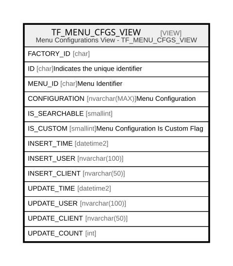

# TF_MENU_CFGS_VIEW

## Description

Menu Configurations View - TF_MENU_CFGS_VIEW  


<details>
<summary><strong>Table Definition</strong></summary>

```sql
-- Talentia Software - All right reserved
-- Type: VIEW                     Name: TF_MENU_CFGS_VIEW
-- Date: 09-04-2026 07:27:59 (UTC)
-- 
-- ChangeLogId: 00000000-0000-0000-0000-000000000000
-- ChangeSetId: cf84e99a-64de-41cb-97a1-6309c831bec6
-- Original file name: C:\repos\Talentia-Software\hcm-core/DB/ProductDB/EDM\Schema\Views\TF_MENU_CFGS_VIEW.xml


CREATE VIEW [TF_MENU_CFGS_VIEW]
 AS 
( 
          SELECT FACTORY_ID,
                 ID,
                 MENU_ID,
                 CONFIGURATION,
                 IS_SEARCHABLE,
                 IS_CUSTOM,
                 INSERT_TIME,
                 INSERT_USER,
                 INSERT_CLIENT,
                 UPDATE_TIME,
                 UPDATE_USER,
                 UPDATE_CLIENT,
                 UPDATE_COUNT
          FROM TF_MENU_CFGS
          WHERE IS_CUSTOM = 1
          UNION ALL
          SELECT FACTORY_ID,
                 ID,
                 MENU_ID,
                 CONFIGURATION,
                 IS_SEARCHABLE,
                 IS_CUSTOM,
                 INSERT_TIME,
                 INSERT_USER,
                 INSERT_CLIENT,
                 UPDATE_TIME,
                 UPDATE_USER,
                 UPDATE_CLIENT,
                 UPDATE_COUNT
          FROM TF_MENU_CFGS
          WHERE IS_CUSTOM = 0 AND NOT EXISTS (SELECT ID FROM TF_MENU_CFGS MC WHERE MC.IS_CUSTOM = 1 AND TF_MENU_CFGS.ID = MC.FACTORY_ID)
         )

```

</details>

## Columns

| Name | Type | Default | Nullable | Comment |
| ---- | ---- | ------- | -------- | ------- |
| FACTORY_ID | char |  | true |  |
| ID | char |  | false | Indicates the unique identifier |
| MENU_ID | char |  | false | Menu Identifier |
| CONFIGURATION | nvarchar(MAX) |  | false | Menu Configuration |
| IS_SEARCHABLE | smallint |  | false |  |
| IS_CUSTOM | smallint |  | false | Menu Configuration Is Custom Flag |
| INSERT_TIME | datetime2 |  | false |  |
| INSERT_USER | nvarchar(100) |  | false |  |
| INSERT_CLIENT | nvarchar(50) |  | false |  |
| UPDATE_TIME | datetime2 |  | false |  |
| UPDATE_USER | nvarchar(100) |  | false |  |
| UPDATE_CLIENT | nvarchar(50) |  | false |  |
| UPDATE_COUNT | int |  | false |  |

## Referenced Tables

| Name | Columns | Comment | Type |
| ---- | ------- | ------- | ---- |
| [TF_MENU_CFGS](TF_MENU_CFGS.md) | 13 | Log Layers - Entity TF_MENU_CFGS<br /> | BASIC TABLE |

## Relations



---

> Generated by [tbls](https://github.com/k1LoW/tbls)
