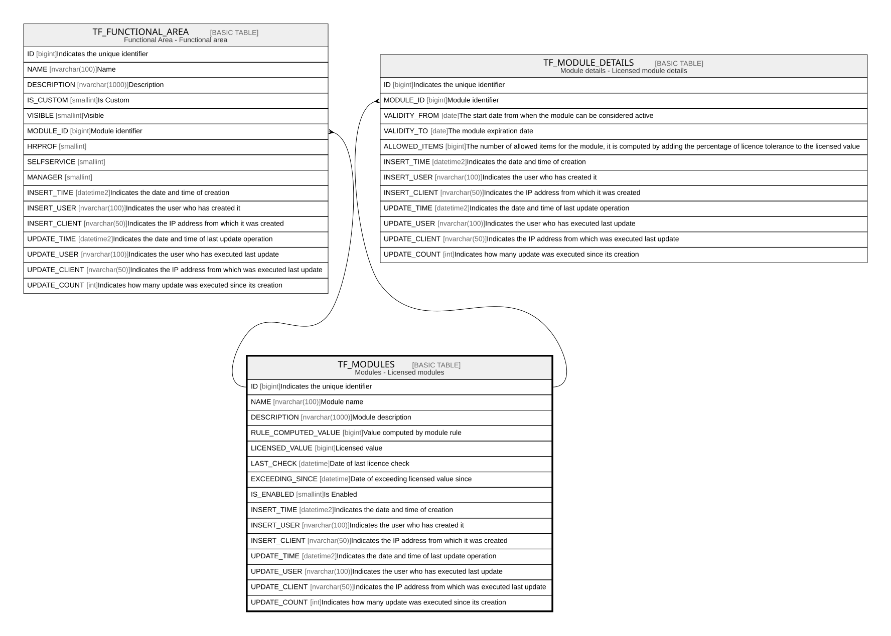

# TF_MODULES

## Description

Modules - Licensed modules  

## Columns

| Name | Type | Default | Nullable | Children | Comment |
| ---- | ---- | ------- | -------- | -------- | ------- |
| ID | bigint |  | false | [TF_FUNCTIONAL_AREA](TF_FUNCTIONAL_AREA.md) [TF_MODULE_DETAILS](TF_MODULE_DETAILS.md) | Indicates the unique identifier |
| NAME | nvarchar(100) |  | false |  | Module name |
| DESCRIPTION | nvarchar(1000) |  | true |  | Module description |
| RULE_COMPUTED_VALUE | bigint |  | true |  | Value computed by module rule |
| LICENSED_VALUE | bigint |  | false |  | Licensed value |
| LAST_CHECK | datetime |  | true |  | Date of last licence check |
| EXCEEDING_SINCE | datetime |  | true |  | Date of exceeding licensed value since |
| IS_ENABLED | smallint |  | false |  | Is Enabled |
| INSERT_TIME | datetime2 | (sysutcdatetime()) | false |  | Indicates the date and time of creation |
| INSERT_USER | nvarchar(100) | (N'MAIN') | false |  | Indicates the user who has created it |
| INSERT_CLIENT | nvarchar(50) | (N'localhost') | false |  | Indicates the IP address from which it was created |
| UPDATE_TIME | datetime2 | (sysutcdatetime()) | false |  | Indicates the date and time of last update operation |
| UPDATE_USER | nvarchar(100) | (N'MAIN') | false |  | Indicates the user who has executed last update |
| UPDATE_CLIENT | nvarchar(50) | (N'localhost') | false |  | Indicates the IP address from which was executed last update |
| UPDATE_COUNT | int | ((0)) | false |  | Indicates how many update was executed since its creation |

## Constraints

| Name | Type | Definition |
| ---- | ---- | ---------- |
| PK_MODULES | PRIMARY KEY | CLUSTERED, unique, part of a PRIMARY KEY constraint, [ ID ] |
| UQ_MODULES_NAME | UNIQUE | NONCLUSTERED, unique, part of a UNIQUE constraint, [ NAME ] |

## Indexes

| Name | Definition |
| ---- | ---------- |
| PK_MODULES | CLUSTERED, unique, part of a PRIMARY KEY constraint, [ ID ] |
| UQ_MODULES_NAME | NONCLUSTERED, unique, part of a UNIQUE constraint, [ NAME ] |

## Relations

---

> Generated by [tbls](https://github.com/k1LoW/tbls)
