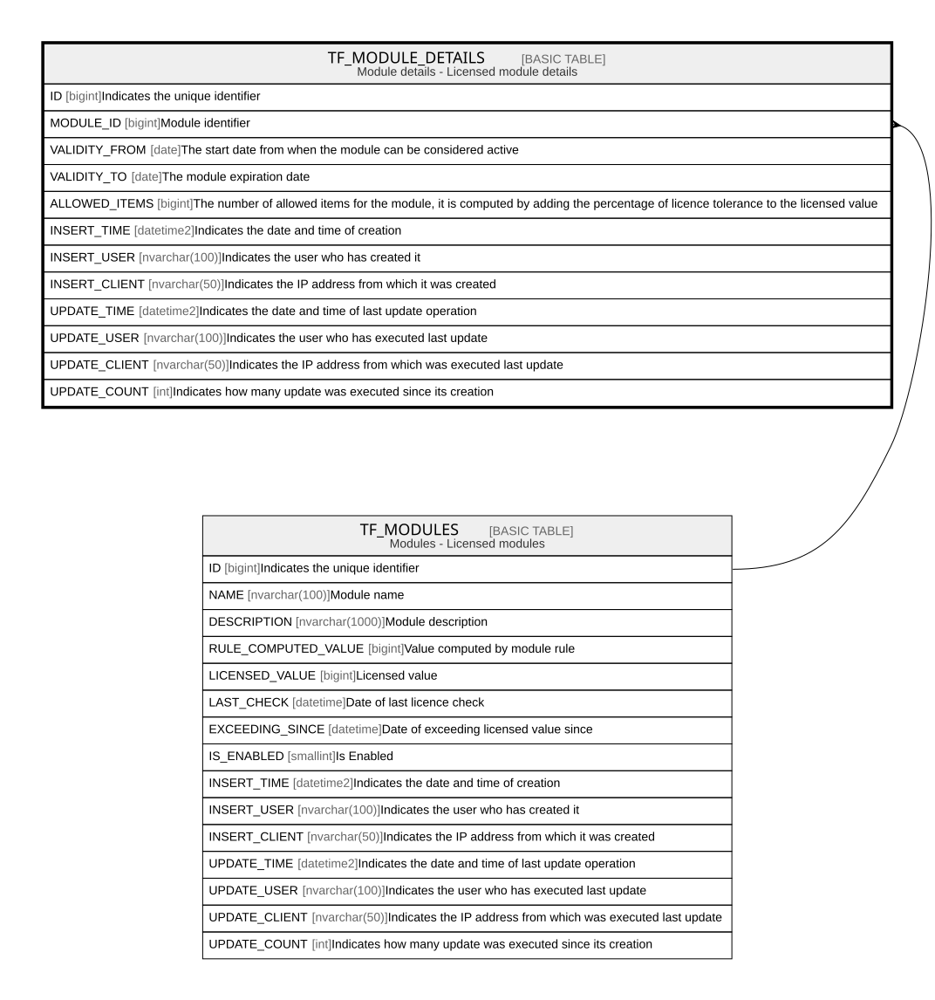

# TF_MODULE_DETAILS

## Description

Module details - Licensed module details  

## Columns

| Name | Type | Default | Nullable | Parents | Comment |
| ---- | ---- | ------- | -------- | ------- | ------- |
| ID | bigint |  | false |  | Indicates the unique identifier |
| MODULE_ID | bigint |  | false | [TF_MODULES](TF_MODULES.md) | Module identifier |
| VALIDITY_FROM | date |  | false |  | The start date from when the module can be considered active |
| VALIDITY_TO | date |  | false |  | The module expiration date |
| ALLOWED_ITEMS | bigint |  | false |  | The number of allowed items for the module, it is computed by adding the percentage of licence tolerance to the licensed value  |
| INSERT_TIME | datetime2 | (sysutcdatetime()) | false |  | Indicates the date and time of creation |
| INSERT_USER | nvarchar(100) | (N'MAIN') | false |  | Indicates the user who has created it |
| INSERT_CLIENT | nvarchar(50) | (N'localhost') | false |  | Indicates the IP address from which it was created |
| UPDATE_TIME | datetime2 | (sysutcdatetime()) | false |  | Indicates the date and time of last update operation |
| UPDATE_USER | nvarchar(100) | (N'MAIN') | false |  | Indicates the user who has executed last update |
| UPDATE_CLIENT | nvarchar(50) | (N'localhost') | false |  | Indicates the IP address from which was executed last update |
| UPDATE_COUNT | int | ((0)) | false |  | Indicates how many update was executed since its creation |

## Constraints

| Name | Type | Definition |
| ---- | ---- | ---------- |
| PK_MODULE_DETAILS | PRIMARY KEY | CLUSTERED, unique, part of a PRIMARY KEY constraint, [ ID ] |
| UQ_MODULE_DETAILS | UNIQUE | NONCLUSTERED, unique, part of a UNIQUE constraint, [ MODULE_ID ] |
| FK_MODULE_DETAILS_MODULES | FOREIGN KEY | FOREIGN KEY(MODULE_ID) REFERENCES TF_MODULES(ID) ON UPDATE NO_ACTION ON DELETE CASCADE |

## Indexes

| Name | Definition |
| ---- | ---------- |
| PK_MODULE_DETAILS | CLUSTERED, unique, part of a PRIMARY KEY constraint, [ ID ] |
| UQ_MODULE_DETAILS | NONCLUSTERED, unique, part of a UNIQUE constraint, [ MODULE_ID ] |

## Relations

---

> Generated by [tbls](https://github.com/k1LoW/tbls)
