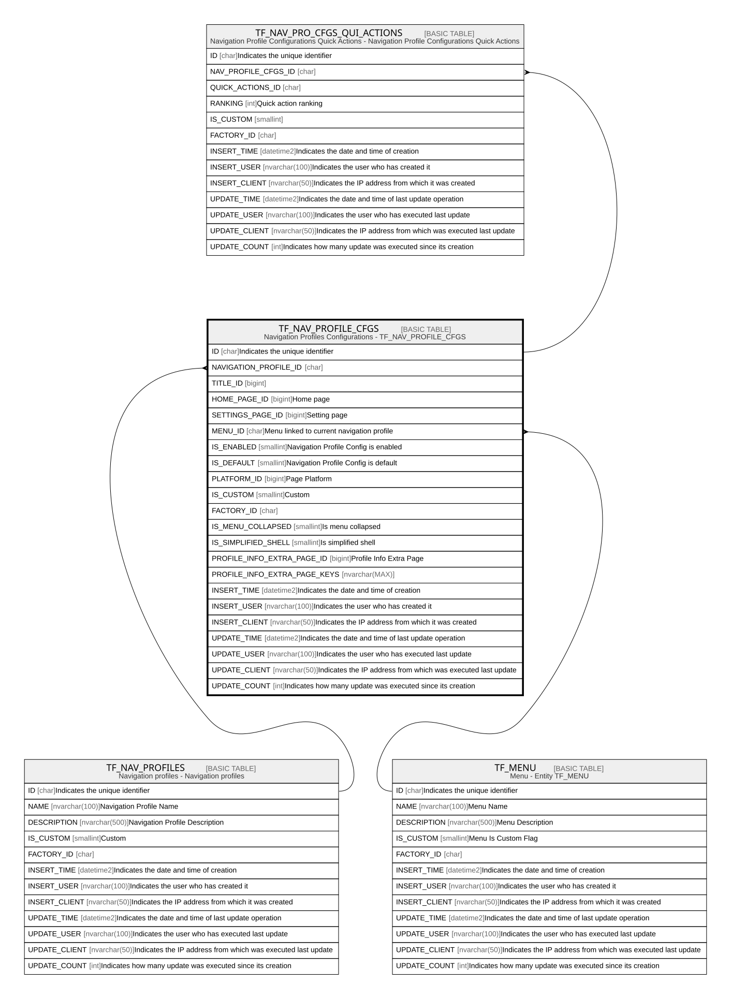

# TF_NAV_PROFILE_CFGS

## Description

Navigation Profiles Configurations - TF_NAV_PROFILE_CFGS  

## Columns

| Name | Type | Default | Nullable | Children | Parents | Comment |
| ---- | ---- | ------- | -------- | -------- | ------- | ------- |
| ID | char |  | false | [TF_NAV_PRO_CFGS_QUI_ACTIONS](TF_NAV_PRO_CFGS_QUI_ACTIONS.md) |  | Indicates the unique identifier |
| NAVIGATION_PROFILE_ID | char |  | false |  | [TF_NAV_PROFILES](TF_NAV_PROFILES.md) |  |
| TITLE_ID | bigint |  | false |  |  |  |
| HOME_PAGE_ID | bigint |  | true |  |  | Home page |
| SETTINGS_PAGE_ID | bigint |  | true |  |  | Setting page |
| MENU_ID | char |  | true |  | [TF_MENU](TF_MENU.md) | Menu linked to current navigation profile |
| IS_ENABLED | smallint |  | false |  |  | Navigation Profile Config is enabled |
| IS_DEFAULT | smallint |  | false |  |  | Navigation Profile Config is default |
| PLATFORM_ID | bigint |  | false |  |  | Page Platform |
| IS_CUSTOM | smallint |  | false |  |  | Custom |
| FACTORY_ID | char |  | true |  |  |  |
| IS_MENU_COLLAPSED | smallint | ((0)) | false |  |  | Is menu collapsed |
| IS_SIMPLIFIED_SHELL | smallint | ((0)) | false |  |  | Is simplified shell |
| PROFILE_INFO_EXTRA_PAGE_ID | bigint |  | true |  |  | Profile Info Extra Page |
| PROFILE_INFO_EXTRA_PAGE_KEYS | nvarchar(MAX) |  | true |  |  |  |
| INSERT_TIME | datetime2 | (sysutcdatetime()) | false |  |  | Indicates the date and time of creation |
| INSERT_USER | nvarchar(100) | (N'MAIN') | false |  |  | Indicates the user who has created it |
| INSERT_CLIENT | nvarchar(50) | (N'localhost') | false |  |  | Indicates the IP address from which it was created |
| UPDATE_TIME | datetime2 | (sysutcdatetime()) | false |  |  | Indicates the date and time of last update operation |
| UPDATE_USER | nvarchar(100) | (N'MAIN') | false |  |  | Indicates the user who has executed last update |
| UPDATE_CLIENT | nvarchar(50) | (N'localhost') | false |  |  | Indicates the IP address from which was executed last update |
| UPDATE_COUNT | int | ((0)) | false |  |  | Indicates how many update was executed since its creation |

## Constraints

| Name | Type | Definition |
| ---- | ---- | ---------- |
| PK_NAV_PROFILE_CFGS | PRIMARY KEY | CLUSTERED, unique, part of a PRIMARY KEY constraint, [ ID ] |
| FK_NAVPROFILECFGS_MENU | FOREIGN KEY | FOREIGN KEY(MENU_ID) REFERENCES TF_MENU(ID) ON UPDATE NO_ACTION ON DELETE NO_ACTION |
| FK_NAVPROFILES_NAVPROFILESCFGS | FOREIGN KEY | FOREIGN KEY(NAVIGATION_PROFILE_ID) REFERENCES TF_NAV_PROFILES(ID) ON UPDATE NO_ACTION ON DELETE NO_ACTION |

## Indexes

| Name | Definition |
| ---- | ---------- |
| PK_NAV_PROFILE_CFGS | CLUSTERED, unique, part of a PRIMARY KEY constraint, [ ID ] |
| IDX_NAV_CFGS_CUSTOM_FACTORY | NONCLUSTERED, [ FACTORY_ID, IS_CUSTOM ] |

## Relations

---

> Generated by [tbls](https://github.com/k1LoW/tbls)
