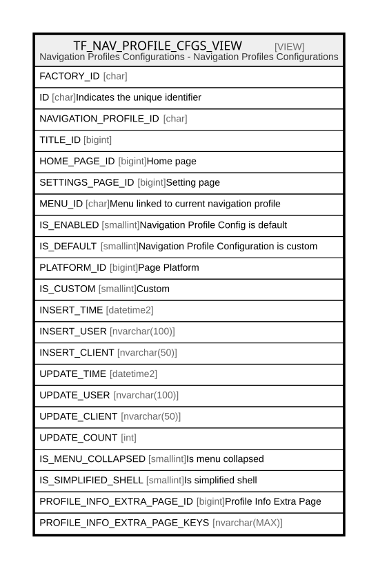

# TF_NAV_PROFILE_CFGS_VIEW

## Description

Navigation Profiles Configurations - Navigation Profiles Configurations  


<details>
<summary><strong>Table Definition</strong></summary>

```sql
-- Talentia Software - All right reserved
-- Type: VIEW                     Name: TF_NAV_PROFILE_CFGS_VIEW
-- Date: 09-04-2026 07:27:59 (UTC)
-- 
-- ChangeLogId: 00000000-0000-0000-0000-000000000000
-- ChangeSetId: 69bf7b36-0d0a-46be-aa14-f9a66a176262
-- Original file name: C:\repos\Talentia-Software\hcm-core/DB/ProductDB/EDM\Schema\Views\TF_NAV_PROFILE_CFGS_VIEW.xml


CREATE VIEW [TF_NAV_PROFILE_CFGS_VIEW]
 AS 
( 
          SELECT FACTORY_ID,
                 ID,
                 NAVIGATION_PROFILE_ID,
                 TITLE_ID,
                 HOME_PAGE_ID,
                 SETTINGS_PAGE_ID,
                 MENU_ID,
                 IS_ENABLED,
                 IS_DEFAULT,
                 PLATFORM_ID,
                 IS_CUSTOM,
                 INSERT_TIME,
                 INSERT_USER,
                 INSERT_CLIENT,
                 UPDATE_TIME,
                 UPDATE_USER,
                 UPDATE_CLIENT,
                 UPDATE_COUNT,
                 IS_MENU_COLLAPSED,
                 IS_SIMPLIFIED_SHELL,
				 PROFILE_INFO_EXTRA_PAGE_ID,
				 PROFILE_INFO_EXTRA_PAGE_KEYS
          FROM TF_NAV_PROFILE_CFGS
          WHERE IS_CUSTOM = 1
          UNION ALL
          SELECT FACTORY_ID,
                 ID,
                 NAVIGATION_PROFILE_ID,
                 TITLE_ID,
                 HOME_PAGE_ID,
                 SETTINGS_PAGE_ID,
                 MENU_ID,
                 IS_ENABLED,
                 IS_DEFAULT,
                 PLATFORM_ID,
                 IS_CUSTOM,
                 INSERT_TIME,
                 INSERT_USER,
                 INSERT_CLIENT,
                 UPDATE_TIME,
                 UPDATE_USER,
                 UPDATE_CLIENT,
                 UPDATE_COUNT,
                 IS_MENU_COLLAPSED,
                 IS_SIMPLIFIED_SHELL,
				 PROFILE_INFO_EXTRA_PAGE_ID,
				 PROFILE_INFO_EXTRA_PAGE_KEYS
          FROM TF_NAV_PROFILE_CFGS
          WHERE IS_CUSTOM = 0 AND NOT EXISTS (SELECT ID FROM TF_NAV_PROFILE_CFGS NPC WHERE NPC.IS_CUSTOM = 1 AND TF_NAV_PROFILE_CFGS.ID = NPC.FACTORY_ID)
         )

```

</details>

## Columns

| Name | Type | Default | Nullable | Comment |
| ---- | ---- | ------- | -------- | ------- |
| FACTORY_ID | char |  | true |  |
| ID | char |  | false | Indicates the unique identifier |
| NAVIGATION_PROFILE_ID | char |  | false |  |
| TITLE_ID | bigint |  | false |  |
| HOME_PAGE_ID | bigint |  | true | Home page |
| SETTINGS_PAGE_ID | bigint |  | true | Setting page |
| MENU_ID | char |  | true | Menu linked to current navigation profile |
| IS_ENABLED | smallint |  | false | Navigation Profile Config is default |
| IS_DEFAULT | smallint |  | false | Navigation Profile Configuration is custom |
| PLATFORM_ID | bigint |  | false | Page Platform |
| IS_CUSTOM | smallint |  | false | Custom |
| INSERT_TIME | datetime2 |  | false |  |
| INSERT_USER | nvarchar(100) |  | false |  |
| INSERT_CLIENT | nvarchar(50) |  | false |  |
| UPDATE_TIME | datetime2 |  | false |  |
| UPDATE_USER | nvarchar(100) |  | false |  |
| UPDATE_CLIENT | nvarchar(50) |  | false |  |
| UPDATE_COUNT | int |  | false |  |
| IS_MENU_COLLAPSED | smallint |  | false | Is menu collapsed |
| IS_SIMPLIFIED_SHELL | smallint |  | false | Is simplified shell |
| PROFILE_INFO_EXTRA_PAGE_ID | bigint |  | true | Profile Info Extra Page |
| PROFILE_INFO_EXTRA_PAGE_KEYS | nvarchar(MAX) |  | true |  |

## Referenced Tables

| Name | Columns | Comment | Type |
| ---- | ------- | ------- | ---- |
| [TF_NAV_PROFILE_CFGS](TF_NAV_PROFILE_CFGS.md) | 22 | Navigation Profiles Configurations - TF_NAV_PROFILE_CFGS<br /> | BASIC TABLE |

## Relations



---

> Generated by [tbls](https://github.com/k1LoW/tbls)
