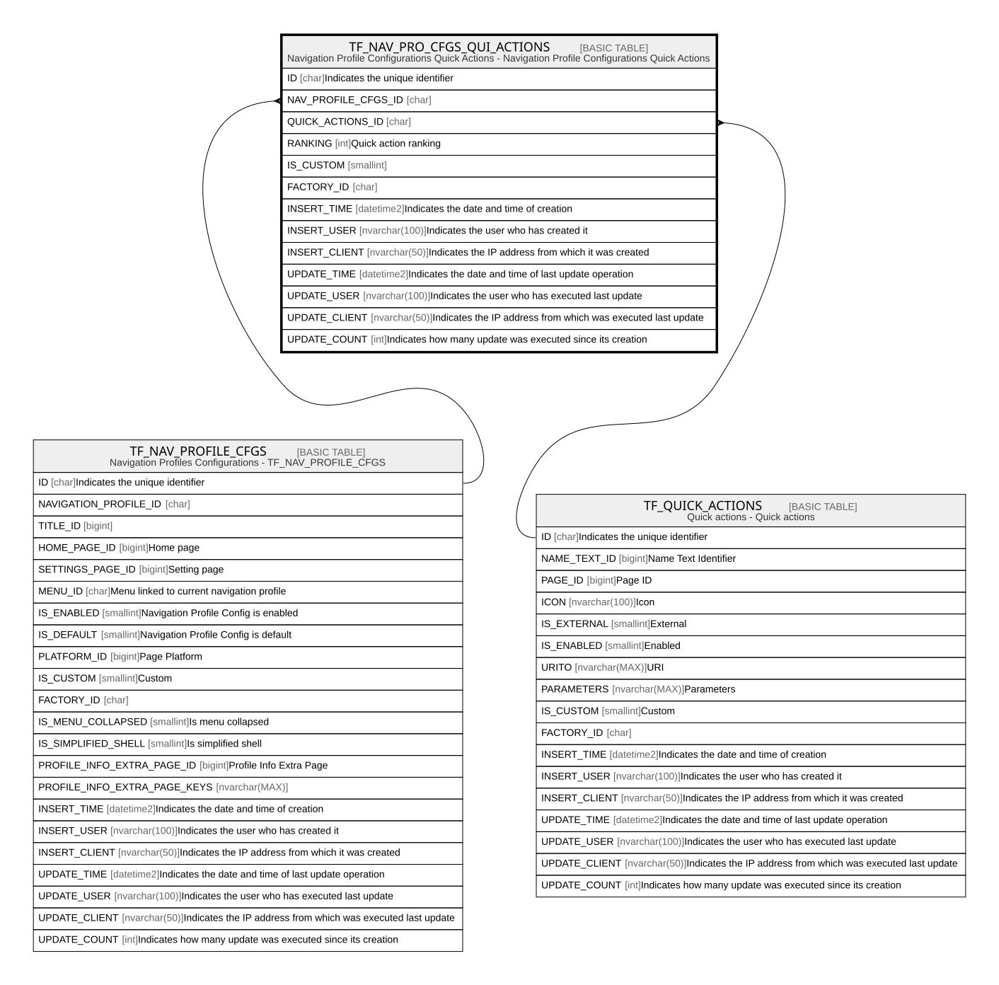

# TF_NAV_PRO_CFGS_QUI_ACTIONS

## Description

Navigation Profile Configurations Quick Actions - Navigation Profile Configurations Quick Actions  

## Columns

| Name | Type | Default | Nullable | Parents | Comment |
| ---- | ---- | ------- | -------- | ------- | ------- |
| ID | char |  | false |  | Indicates the unique identifier |
| NAV_PROFILE_CFGS_ID | char |  | false | [TF_NAV_PROFILE_CFGS](TF_NAV_PROFILE_CFGS.md) |  |
| QUICK_ACTIONS_ID | char |  | false | [TF_QUICK_ACTIONS](TF_QUICK_ACTIONS.md) |  |
| RANKING | int | ((0)) | false |  | Quick action ranking |
| IS_CUSTOM | smallint |  | false |  |  |
| FACTORY_ID | char |  | true |  |  |
| INSERT_TIME | datetime2 | (sysutcdatetime()) | false |  | Indicates the date and time of creation |
| INSERT_USER | nvarchar(100) | (N'MAIN') | false |  | Indicates the user who has created it |
| INSERT_CLIENT | nvarchar(50) | (N'localhost') | false |  | Indicates the IP address from which it was created |
| UPDATE_TIME | datetime2 | (sysutcdatetime()) | false |  | Indicates the date and time of last update operation |
| UPDATE_USER | nvarchar(100) | (N'MAIN') | false |  | Indicates the user who has executed last update |
| UPDATE_CLIENT | nvarchar(50) | (N'localhost') | false |  | Indicates the IP address from which was executed last update |
| UPDATE_COUNT | int | ((0)) | false |  | Indicates how many update was executed since its creation |

## Constraints

| Name | Type | Definition |
| ---- | ---- | ---------- |
| PK_NAV_PRO_CFGS_QUI_ACTIONS | PRIMARY KEY | CLUSTERED, unique, part of a PRIMARY KEY constraint, [ ID ] |
| UQ_NAV_PRO_CFGS_QUI_ACTIONS | UNIQUE | NONCLUSTERED, unique, part of a UNIQUE constraint, [ NAV_PROFILE_CFGS_ID, QUICK_ACTIONS_ID, IS_CUSTOM ] |
| FK_NAVPCFGSQACTIONS_NAVPFGS | FOREIGN KEY | FOREIGN KEY(NAV_PROFILE_CFGS_ID) REFERENCES TF_NAV_PROFILE_CFGS(ID) ON UPDATE NO_ACTION ON DELETE NO_ACTION |
| FK_NAVPCFGSQACTS_QUIACTIONS | FOREIGN KEY | FOREIGN KEY(QUICK_ACTIONS_ID) REFERENCES TF_QUICK_ACTIONS(ID) ON UPDATE NO_ACTION ON DELETE NO_ACTION |

## Indexes

| Name | Definition |
| ---- | ---------- |
| PK_NAV_PRO_CFGS_QUI_ACTIONS | CLUSTERED, unique, part of a PRIMARY KEY constraint, [ ID ] |
| UQ_NAV_PRO_CFGS_QUI_ACTIONS | NONCLUSTERED, unique, part of a UNIQUE constraint, [ NAV_PROFILE_CFGS_ID, QUICK_ACTIONS_ID, IS_CUSTOM ] |
| IDX_N_P_C_Q_A_CUSTOM_FACTORY | NONCLUSTERED, [ FACTORY_ID, IS_CUSTOM ] |

## Relations

---

> Generated by [tbls](https://github.com/k1LoW/tbls)
