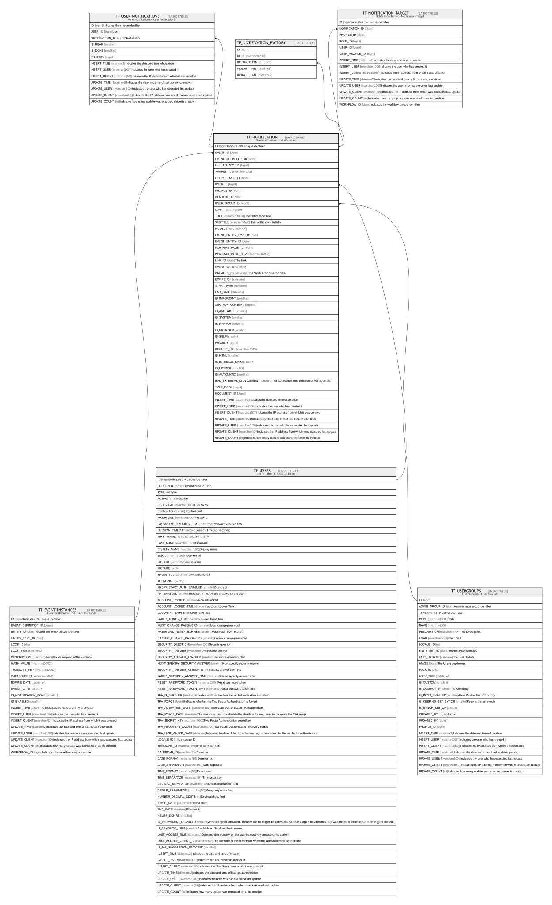

# TF_NOTIFICATION

## Description

The Notifications. - Notifications  

## Columns

| Name | Type | Default | Nullable | Children | Parents | Comment |
| ---- | ---- | ------- | -------- | -------- | ------- | ------- |
| ID | bigint |  | false | [TF_USER_NOTIFICATIONS](TF_USER_NOTIFICATIONS.md) [TF_NOTIFICATION_FACTORY](TF_NOTIFICATION_FACTORY.md) [TF_NOTIFICATION_TARGET](TF_NOTIFICATION_TARGET.md) |  | Indicates the unique identifier |
| EVENT_ID | bigint |  | true |  | [TF_EVENT_INSTANCES](TF_EVENT_INSTANCES.md) |  |
| EVENT_DEFINITION_ID | bigint |  | true |  |  |  |
| LIST_AGENCY_ID | bigint |  | true |  |  |  |
| SHARED_ID | nvarchar(255) |  | true |  |  |  |
| LICENSE_MSG_ID | bigint |  | true |  |  |  |
| USER_ID | bigint |  | true |  | [TF_USERS](TF_USERS.md) |  |
| PROFILE_ID | bigint |  | true |  |  |  |
| CONTEXT_ID | char |  | true |  |  |  |
| USER_GROUP_ID | bigint |  | true |  | [TF_USERGROUPS](TF_USERGROUPS.md) |  |
| ICON | nvarchar(500) |  | true |  |  |  |
| TITLE | nvarchar(1000) |  | false |  |  | The Notification Title |
| SUBTITLE | nvarchar(MAX) |  | true |  |  | The Notification Subtitle |
| MODEL | nvarchar(MAX) |  | true |  |  |  |
| EVENT_ENTITY_TYPE_ID | char |  | true |  |  |  |
| EVENT_ENTITY_ID | bigint |  | true |  |  |  |
| PORTRAIT_PAGE_ID | bigint |  | true |  |  |  |
| PORTRAIT_PAGE_KEYS | nvarchar(MAX) |  | true |  |  |  |
| LINK_ID | bigint |  | true |  |  | The Link. |
| EVENT_DATE | datetime |  | true |  |  |  |
| CREATED_ON | datetime | (getutcdate()) | false |  |  | The Notification creation date |
| EXPIRE_ON | datetime |  | true |  |  |  |
| START_DATE | datetime |  | true |  |  |  |
| END_DATE | datetime |  | true |  |  |  |
| IS_IMPORTANT | smallint | ((0)) | true |  |  |  |
| ASK_FOR_CONSENT | smallint | ((0)) | true |  |  |  |
| IS_AVAILABLE | smallint | ((1)) | false |  |  |  |
| IS_SYSTEM | smallint |  | true |  |  |  |
| IS_HRPROF | smallint |  | true |  |  |  |
| IS_MANAGER | smallint |  | true |  |  |  |
| IS_SELF | smallint |  | true |  |  |  |
| PRIORITY | bigint | ((2)) | false |  |  |  |
| DEFAULT_URL | nvarchar(2000) |  | true |  |  |  |
| IS_HTML | smallint | ((1)) | false |  |  |  |
| IS_INTERNAL_LINK | smallint | ((0)) | false |  |  |  |
| IS_LICENSE | smallint | ((0)) | false |  |  |  |
| IS_AUTOMATIC | smallint | ((0)) | false |  |  |  |
| HAS_EXTERNAL_MANAGEMENT | smallint | ((0)) | false |  |  | The Notification has an External Management. |
| TYPE_CODE | bigint |  | true |  |  |  |
| DOCUMENT_ID | bigint |  | true |  |  |  |
| INSERT_TIME | datetime2 | (sysutcdatetime()) | true |  |  | Indicates the date and time of creation |
| INSERT_USER | nvarchar(100) | (N'MAIN') | true |  |  | Indicates the user who has created it |
| INSERT_CLIENT | nvarchar(50) | (N'localhost') | true |  |  | Indicates the IP address from which it was created |
| UPDATE_TIME | datetime2 | (sysutcdatetime()) | true |  |  | Indicates the date and time of last update operation |
| UPDATE_USER | nvarchar(100) | (N'MAIN') | true |  |  | Indicates the user who has executed last update |
| UPDATE_CLIENT | nvarchar(50) | (N'localhost') | true |  |  | Indicates the IP address from which was executed last update |
| UPDATE_COUNT | int | ((0)) | true |  |  | Indicates how many update was executed since its creation |

## Constraints

| Name | Type | Definition |
| ---- | ---- | ---------- |
| PK_TFNOTIFICATION | PRIMARY KEY | CLUSTERED, unique, part of a PRIMARY KEY constraint, [ ID ] |
| FK_TFNOTIF_EVENTINSTANCES | FOREIGN KEY | FOREIGN KEY(EVENT_ID) REFERENCES TF_EVENT_INSTANCES(ID) ON UPDATE NO_ACTION ON DELETE CASCADE |
| FK_TFNOTIF_USERGROUP | FOREIGN KEY | FOREIGN KEY(USER_GROUP_ID) REFERENCES TF_USERGROUPS(ID) ON UPDATE NO_ACTION ON DELETE NO_ACTION |
| FK_TFNOTIFICATION_USER | FOREIGN KEY | FOREIGN KEY(USER_ID) REFERENCES TF_USERS(ID) ON UPDATE NO_ACTION ON DELETE NO_ACTION |

## Indexes

| Name | Definition |
| ---- | ---------- |
| PK_TFNOTIFICATION | CLUSTERED, unique, part of a PRIMARY KEY constraint, [ ID ] |
| IDX_NOTIFICATION_FACTORY | NONCLUSTERED, [ ID ] |
| IDX_NOTIFICATION | NONCLUSTERED, [ LIST_AGENCY_ID, SHARED_ID ] |

## Relations

---

> Generated by [tbls](https://github.com/k1LoW/tbls)
