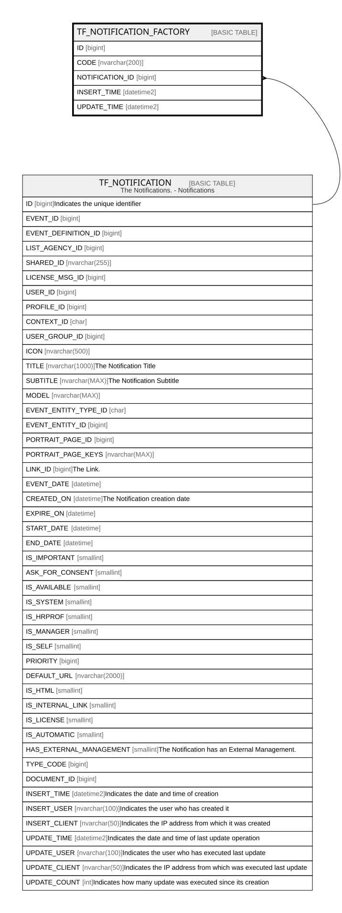

# TF_NOTIFICATION_FACTORY

## Columns

| Name | Type | Default | Nullable | Parents | Comment |
| ---- | ---- | ------- | -------- | ------- | ------- |
| ID | bigint |  | false |  |  |
| CODE | nvarchar(200) |  | false |  |  |
| NOTIFICATION_ID | bigint |  | true | [TF_NOTIFICATION](TF_NOTIFICATION.md) |  |
| INSERT_TIME | datetime2 | (sysutcdatetime()) | true |  |  |
| UPDATE_TIME | datetime2 | (sysutcdatetime()) | true |  |  |

## Constraints

| Name | Type | Definition |
| ---- | ---- | ---------- |
| PK_TF_NOTIFICATION_FACTORY | PRIMARY KEY | CLUSTERED, unique, part of a PRIMARY KEY constraint, [ ID ] |
| UQ_FACTORYNOTIFICATION_CODE | UNIQUE | NONCLUSTERED, unique, part of a UNIQUE constraint, [ CODE ] |
| FK_TFNOTIFICATION | FOREIGN KEY | FOREIGN KEY(NOTIFICATION_ID) REFERENCES TF_NOTIFICATION(ID) ON UPDATE NO_ACTION ON DELETE NO_ACTION |

## Indexes

| Name | Definition |
| ---- | ---------- |
| PK_TF_NOTIFICATION_FACTORY | CLUSTERED, unique, part of a PRIMARY KEY constraint, [ ID ] |
| UQ_FACTORYNOTIFICATION_CODE | NONCLUSTERED, unique, part of a UNIQUE constraint, [ CODE ] |

## Relations

---

> Generated by [tbls](https://github.com/k1LoW/tbls)
