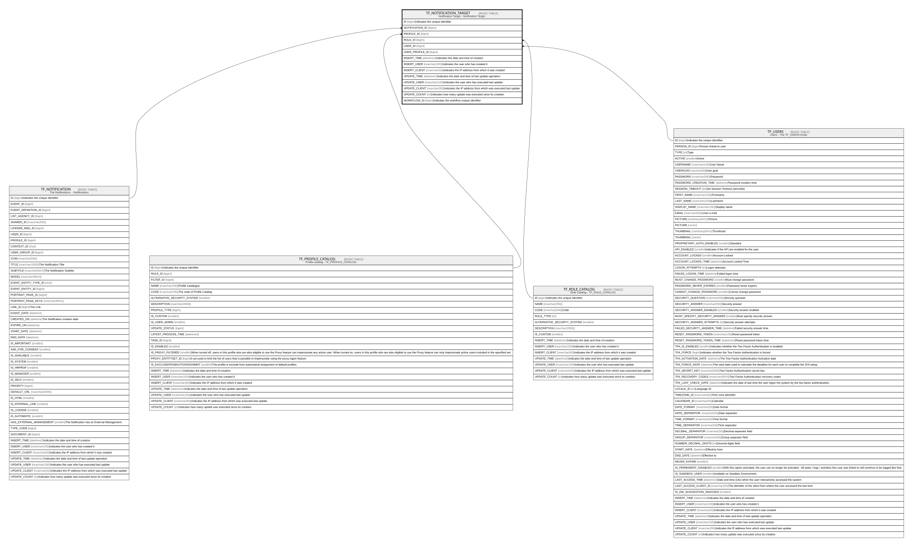

# TF_NOTIFICATION_TARGET

## Description

Notification Target - Notification Target  

## Columns

| Name | Type | Default | Nullable | Parents | Comment |
| ---- | ---- | ------- | -------- | ------- | ------- |
| ID | bigint |  | false |  | Indicates the unique identifier |
| NOTIFICATION_ID | bigint |  | true | [TF_NOTIFICATION](TF_NOTIFICATION.md) |  |
| PROFILE_ID | bigint |  | true | [TF_PROFILE_CATALOG](TF_PROFILE_CATALOG.md) |  |
| ROLE_ID | bigint |  | true | [TF_ROLE_CATALOG](TF_ROLE_CATALOG.md) |  |
| USER_ID | bigint |  | true | [TF_USERS](TF_USERS.md) |  |
| USER_PROFILE_ID | bigint |  | true |  |  |
| INSERT_TIME | datetime2 | (sysutcdatetime()) | true |  | Indicates the date and time of creation |
| INSERT_USER | nvarchar(100) | (N'MAIN') | true |  | Indicates the user who has created it |
| INSERT_CLIENT | nvarchar(50) | (N'localhost') | true |  | Indicates the IP address from which it was created |
| UPDATE_TIME | datetime2 | (sysutcdatetime()) | true |  | Indicates the date and time of last update operation |
| UPDATE_USER | nvarchar(100) | (N'MAIN') | true |  | Indicates the user who has executed last update |
| UPDATE_CLIENT | nvarchar(50) | (N'localhost') | true |  | Indicates the IP address from which was executed last update |
| UPDATE_COUNT | int | ((0)) | true |  | Indicates how many update was executed since its creation |
| WORKFLOW_ID | bigint |  | true |  | Indicates the workflow unique identifier |

## Constraints

| Name | Type | Definition |
| ---- | ---- | ---------- |
| PK_TFNOT_TARGET | PRIMARY KEY | CLUSTERED, unique, part of a PRIMARY KEY constraint, [ ID ] |
| FK_TFNOT_TARGET_NOTIF | FOREIGN KEY | FOREIGN KEY(NOTIFICATION_ID) REFERENCES TF_NOTIFICATION(ID) ON UPDATE NO_ACTION ON DELETE CASCADE |
| FK_TFNOT_TARGET_PROFILE | FOREIGN KEY | FOREIGN KEY(PROFILE_ID) REFERENCES TF_PROFILE_CATALOG(ID) ON UPDATE NO_ACTION ON DELETE CASCADE |
| FK_TFNOT_TARGET_ROLE | FOREIGN KEY | FOREIGN KEY(ROLE_ID) REFERENCES TF_ROLE_CATALOG(ID) ON UPDATE NO_ACTION ON DELETE NO_ACTION |
| FK_TFNOT_TARGET_USER | FOREIGN KEY | FOREIGN KEY(USER_ID) REFERENCES TF_USERS(ID) ON UPDATE NO_ACTION ON DELETE CASCADE |

## Indexes

| Name | Definition |
| ---- | ---------- |
| PK_TFNOT_TARGET | CLUSTERED, unique, part of a PRIMARY KEY constraint, [ ID ] |
| IDX_NOTIFICATION_TARGET | NONCLUSTERED, [ NOTIFICATION_ID ] |

## Relations

---

> Generated by [tbls](https://github.com/k1LoW/tbls)
