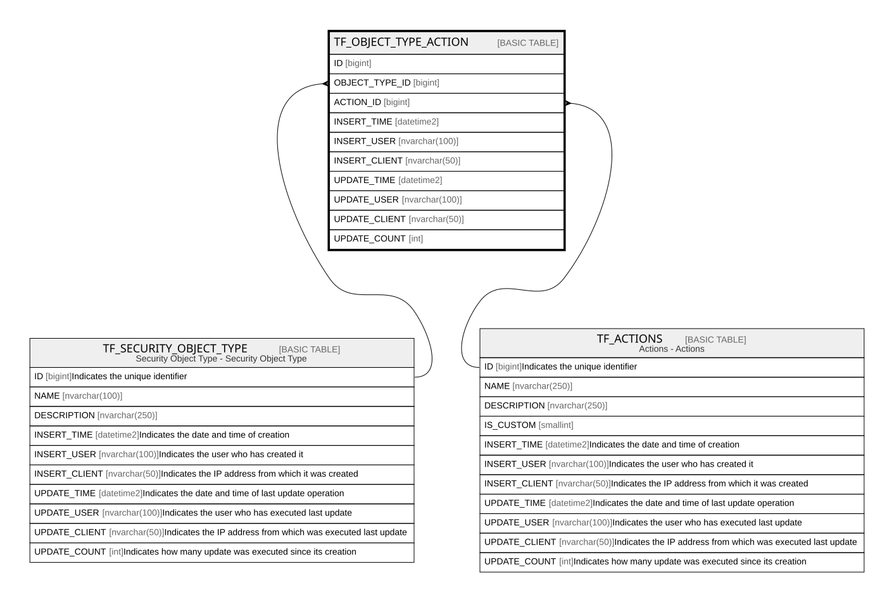

# TF_OBJECT_TYPE_ACTION

## Columns

| Name | Type | Default | Nullable | Parents | Comment |
| ---- | ---- | ------- | -------- | ------- | ------- |
| ID | bigint |  | false |  |  |
| OBJECT_TYPE_ID | bigint |  | false | [TF_SECURITY_OBJECT_TYPE](TF_SECURITY_OBJECT_TYPE.md) |  |
| ACTION_ID | bigint |  | false | [TF_ACTIONS](TF_ACTIONS.md) |  |
| INSERT_TIME | datetime2 | (sysutcdatetime()) | false |  |  |
| INSERT_USER | nvarchar(100) | (N'MAIN') | false |  |  |
| INSERT_CLIENT | nvarchar(50) | (N'localhost') | false |  |  |
| UPDATE_TIME | datetime2 | (sysutcdatetime()) | false |  |  |
| UPDATE_USER | nvarchar(100) | (N'MAIN') | false |  |  |
| UPDATE_CLIENT | nvarchar(50) | (N'localhost') | false |  |  |
| UPDATE_COUNT | int | ((0)) | false |  |  |

## Constraints

| Name | Type | Definition |
| ---- | ---- | ---------- |
| PK_OBJECTTYPEACTION | PRIMARY KEY | CLUSTERED, unique, part of a PRIMARY KEY constraint, [ ID ] |
| FK_OBJECTTYPEACTION_ACTIONS | FOREIGN KEY | FOREIGN KEY(ACTION_ID) REFERENCES TF_ACTIONS(ID) ON UPDATE NO_ACTION ON DELETE NO_ACTION |
| FK_OBJECTTYPEACTION_TYPE | FOREIGN KEY | FOREIGN KEY(OBJECT_TYPE_ID) REFERENCES TF_SECURITY_OBJECT_TYPE(ID) ON UPDATE NO_ACTION ON DELETE NO_ACTION |

## Indexes

| Name | Definition |
| ---- | ---------- |
| PK_OBJECTTYPEACTION | CLUSTERED, unique, part of a PRIMARY KEY constraint, [ ID ] |

## Relations

---

> Generated by [tbls](https://github.com/k1LoW/tbls)
