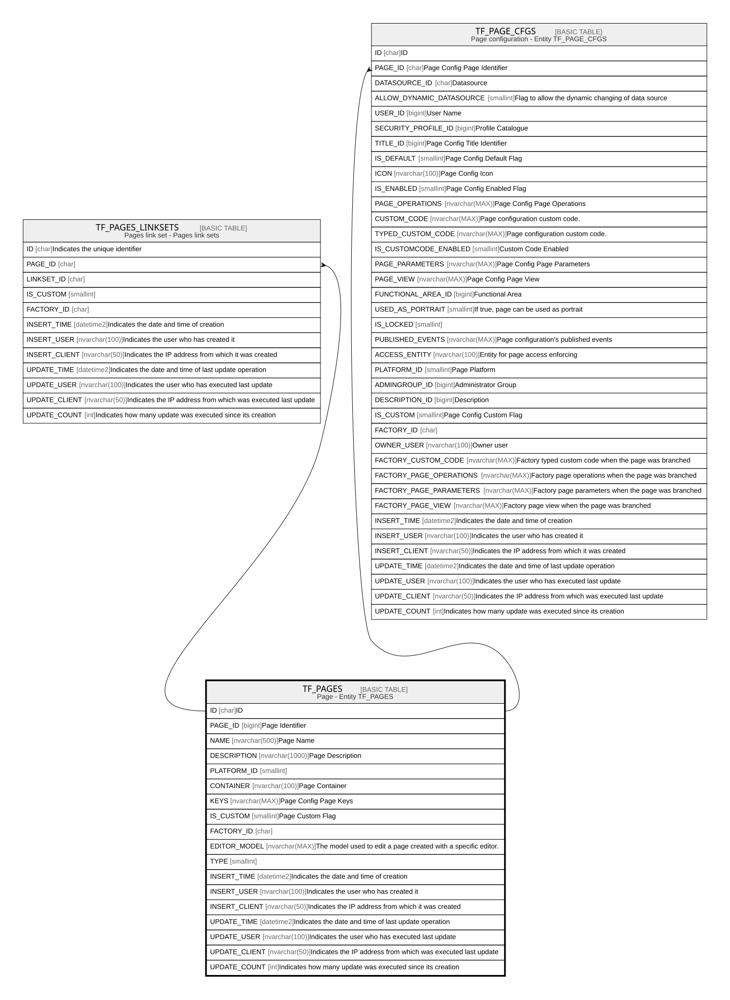

# TF_PAGES

## Description

Page - Entity TF_PAGES  

## Columns

| Name | Type | Default | Nullable | Children | Comment |
| ---- | ---- | ------- | -------- | -------- | ------- |
| ID | char |  | false | [TF_PAGES_LINKSETS](TF_PAGES_LINKSETS.md) [TF_PAGE_CFGS](TF_PAGE_CFGS.md) | ID |
| PAGE_ID | bigint |  | false |  | Page Identifier |
| NAME | nvarchar(500) |  | false |  | Page Name |
| DESCRIPTION | nvarchar(1000) |  | true |  | Page Description |
| PLATFORM_ID | smallint |  | true |  |  |
| CONTAINER | nvarchar(100) |  | false |  | Page Container |
| KEYS | nvarchar(MAX) |  | true |  | Page Config Page Keys |
| IS_CUSTOM | smallint |  | false |  | Page Custom Flag |
| FACTORY_ID | char |  | true |  |  |
| EDITOR_MODEL | nvarchar(MAX) |  | true |  | The model used to edit a page created with a specific editor. |
| TYPE | smallint |  | true |  |  |
| INSERT_TIME | datetime2 | (sysutcdatetime()) | false |  | Indicates the date and time of creation |
| INSERT_USER | nvarchar(100) | (N'MAIN') | false |  | Indicates the user who has created it |
| INSERT_CLIENT | nvarchar(50) | (N'localhost') | false |  | Indicates the IP address from which it was created |
| UPDATE_TIME | datetime2 | (sysutcdatetime()) | false |  | Indicates the date and time of last update operation |
| UPDATE_USER | nvarchar(100) | (N'MAIN') | false |  | Indicates the user who has executed last update |
| UPDATE_CLIENT | nvarchar(50) | (N'localhost') | false |  | Indicates the IP address from which was executed last update |
| UPDATE_COUNT | int | ((0)) | false |  | Indicates how many update was executed since its creation |

## Constraints

| Name | Type | Definition |
| ---- | ---- | ---------- |
| PK_PAGES | PRIMARY KEY | CLUSTERED, unique, part of a PRIMARY KEY constraint, [ ID ] |
| UQ_PAGES | UNIQUE | NONCLUSTERED, unique, part of a UNIQUE constraint, [ PAGE_ID, IS_CUSTOM ] |
| UQ_PAGESNAME | UNIQUE | NONCLUSTERED, unique, part of a UNIQUE constraint, [ NAME, IS_CUSTOM ] |

## Indexes

| Name | Definition |
| ---- | ---------- |
| PK_PAGES | CLUSTERED, unique, part of a PRIMARY KEY constraint, [ ID ] |
| UQ_PAGES | NONCLUSTERED, unique, part of a UNIQUE constraint, [ PAGE_ID, IS_CUSTOM ] |
| UQ_PAGESNAME | NONCLUSTERED, unique, part of a UNIQUE constraint, [ NAME, IS_CUSTOM ] |
| IDX_PAGES | NONCLUSTERED, [ FACTORY_ID, IS_CUSTOM ] |

## Relations

---

> Generated by [tbls](https://github.com/k1LoW/tbls)
