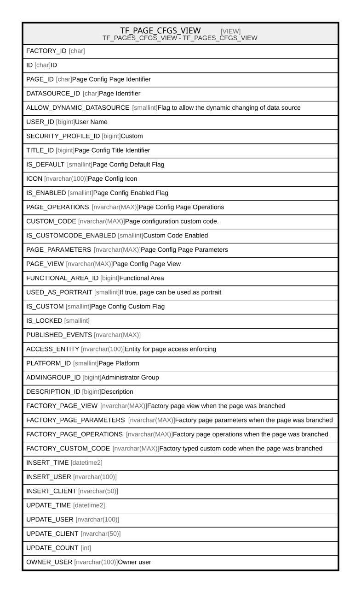

# TF_PAGE_CFGS_VIEW

## Description

TF_PAGES_CFGS_VIEW - TF_PAGES_CFGS_VIEW  


<details>
<summary><strong>Table Definition</strong></summary>

```sql
-- Talentia Software - All right reserved
-- Type: VIEW                     Name: TF_PAGE_CFGS_VIEW
-- Date: 09-04-2026 07:27:59 (UTC)
-- 
-- ChangeLogId: 00000000-0000-0000-0000-000000000000
-- ChangeSetId: 6a1f65c9-e2ff-40b3-ac8c-8ed1a1a779c7
-- Original file name: C:\repos\Talentia-Software\hcm-core/DB/ProductDB/EDM\Schema\Views\TF_PAGE_CFGS_VIEW.xml


CREATE VIEW [TF_PAGE_CFGS_VIEW]
 AS 
( 
          SELECT FACTORY_ID,
                 ID,
                 PAGE_ID,
                 DATASOURCE_ID,
                 ALLOW_DYNAMIC_DATASOURCE,
                 USER_ID,
                 SECURITY_PROFILE_ID,
                 TITLE_ID,
                 IS_DEFAULT,
                 ICON,
                 IS_ENABLED,
                 PAGE_OPERATIONS,
                 CUSTOM_CODE,
                 IS_CUSTOMCODE_ENABLED,
                 PAGE_PARAMETERS,
                 PAGE_VIEW,
                 FUNCTIONAL_AREA_ID,
                 USED_AS_PORTRAIT,
                 IS_CUSTOM,
                 IS_LOCKED,
                 PUBLISHED_EVENTS,
                 ACCESS_ENTITY,
                 PLATFORM_ID,
                 ADMINGROUP_ID,
                 DESCRIPTION_ID,
                 FACTORY_PAGE_VIEW, 
                 FACTORY_PAGE_PARAMETERS, 
                 FACTORY_PAGE_OPERATIONS, 
                 FACTORY_CUSTOM_CODE,
                 INSERT_TIME,
                 INSERT_USER,
                 INSERT_CLIENT,
                 UPDATE_TIME,
                 UPDATE_USER,
                 UPDATE_CLIENT,
                 UPDATE_COUNT,
				 COALESCE(OWNER_USER, INSERT_USER) OWNER_USER
          FROM TF_PAGE_CFGS
          WHERE IS_CUSTOM = 1
          UNION ALL
          SELECT FACTORY_ID,
                 ID,
                 PAGE_ID,
                 DATASOURCE_ID,
                 ALLOW_DYNAMIC_DATASOURCE,
                 USER_ID,
                 SECURITY_PROFILE_ID,
                 TITLE_ID,
                 IS_DEFAULT,
                 ICON,
                 IS_ENABLED,
                 PAGE_OPERATIONS,
                 CUSTOM_CODE,
                 IS_CUSTOMCODE_ENABLED,
                 PAGE_PARAMETERS,
                 PAGE_VIEW,
                 FUNCTIONAL_AREA_ID,
                 USED_AS_PORTRAIT,
                 IS_CUSTOM,
                 IS_LOCKED,
                 PUBLISHED_EVENTS,
                 ACCESS_ENTITY,
                 PLATFORM_ID,
                 ADMINGROUP_ID,
                 DESCRIPTION_ID,
                 FACTORY_PAGE_VIEW, 
                 FACTORY_PAGE_PARAMETERS, 
                 FACTORY_PAGE_OPERATIONS, 
                 FACTORY_CUSTOM_CODE,
                 INSERT_TIME,
                 INSERT_USER,
                 INSERT_CLIENT,
                 UPDATE_TIME,
                 UPDATE_USER,
                 UPDATE_CLIENT,
                 UPDATE_COUNT,
				 COALESCE(OWNER_USER, INSERT_USER) OWNER_USER
          FROM TF_PAGE_CFGS
          WHERE IS_CUSTOM = 0 AND NOT EXISTS (SELECT ID FROM TF_PAGE_CFGS PC WHERE PC.IS_CUSTOM = 1 AND TF_PAGE_CFGS.ID = PC.FACTORY_ID)
         )

```

</details>

## Columns

| Name | Type | Default | Nullable | Comment |
| ---- | ---- | ------- | -------- | ------- |
| FACTORY_ID | char |  | true |  |
| ID | char |  | false | ID |
| PAGE_ID | char |  | false | Page Config Page Identifier |
| DATASOURCE_ID | char |  | false | Page Identifier |
| ALLOW_DYNAMIC_DATASOURCE | smallint |  | false | Flag to allow the dynamic changing of data source |
| USER_ID | bigint |  | true | User Name |
| SECURITY_PROFILE_ID | bigint |  | true | Custom |
| TITLE_ID | bigint |  | false | Page Config Title Identifier |
| IS_DEFAULT | smallint |  | false | Page Config Default Flag |
| ICON | nvarchar(100) |  | true | Page Config Icon |
| IS_ENABLED | smallint |  | false | Page Config Enabled Flag |
| PAGE_OPERATIONS | nvarchar(MAX) |  | true | Page Config Page Operations |
| CUSTOM_CODE | nvarchar(MAX) |  | true | Page configuration custom code. |
| IS_CUSTOMCODE_ENABLED | smallint |  | false | Custom Code Enabled |
| PAGE_PARAMETERS | nvarchar(MAX) |  | true | Page Config Page Parameters |
| PAGE_VIEW | nvarchar(MAX) |  | true | Page Config Page View |
| FUNCTIONAL_AREA_ID | bigint |  | true | Functional Area |
| USED_AS_PORTRAIT | smallint |  | false | If true, page can be used as portrait |
| IS_CUSTOM | smallint |  | false | Page Config Custom Flag |
| IS_LOCKED | smallint |  | false |  |
| PUBLISHED_EVENTS | nvarchar(MAX) |  | true |  |
| ACCESS_ENTITY | nvarchar(100) |  | true | Entity for page access enforcing |
| PLATFORM_ID | smallint |  | false | Page Platform |
| ADMINGROUP_ID | bigint |  | true | Administrator Group |
| DESCRIPTION_ID | bigint |  | true | Description |
| FACTORY_PAGE_VIEW | nvarchar(MAX) |  | true | Factory page view when the page was branched |
| FACTORY_PAGE_PARAMETERS | nvarchar(MAX) |  | true | Factory page parameters when the page was branched |
| FACTORY_PAGE_OPERATIONS | nvarchar(MAX) |  | true | Factory page operations when the page was branched |
| FACTORY_CUSTOM_CODE | nvarchar(MAX) |  | true | Factory typed custom code when the page was branched |
| INSERT_TIME | datetime2 |  | false |  |
| INSERT_USER | nvarchar(100) |  | false |  |
| INSERT_CLIENT | nvarchar(50) |  | false |  |
| UPDATE_TIME | datetime2 |  | false |  |
| UPDATE_USER | nvarchar(100) |  | false |  |
| UPDATE_CLIENT | nvarchar(50) |  | false |  |
| UPDATE_COUNT | int |  | false |  |
| OWNER_USER | nvarchar(100) |  | true | Owner user |

## Referenced Tables

| Name | Columns | Comment | Type |
| ---- | ------- | ------- | ---- |
| [TF_PAGE_CFGS](TF_PAGE_CFGS.md) | 38 | Page configuration - Entity TF_PAGE_CFGS<br /> | BASIC TABLE |

## Relations



---

> Generated by [tbls](https://github.com/k1LoW/tbls)
