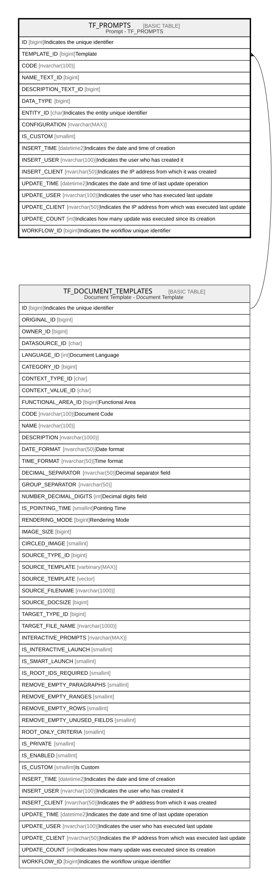

# TF_PROMPTS

## Description

Prompt - TF_PROMPTS  

## Columns

| Name | Type | Default | Nullable | Parents | Comment |
| ---- | ---- | ------- | -------- | ------- | ------- |
| ID | bigint |  | false |  | Indicates the unique identifier |
| TEMPLATE_ID | bigint |  | true | [TF_DOCUMENT_TEMPLATES](TF_DOCUMENT_TEMPLATES.md) | Template |
| CODE | nvarchar(100) |  | true |  |  |
| NAME_TEXT_ID | bigint |  | true |  |  |
| DESCRIPTION_TEXT_ID | bigint |  | true |  |  |
| DATA_TYPE | bigint | ((1)) | false |  |  |
| ENTITY_ID | char |  | false |  | Indicates the entity unique identifier |
| CONFIGURATION | nvarchar(MAX) |  | true |  |  |
| IS_CUSTOM | smallint |  | false |  |  |
| INSERT_TIME | datetime2 | (sysutcdatetime()) | false |  | Indicates the date and time of creation |
| INSERT_USER | nvarchar(100) | (N'MAIN') | false |  | Indicates the user who has created it |
| INSERT_CLIENT | nvarchar(50) | (N'localhost') | false |  | Indicates the IP address from which it was created |
| UPDATE_TIME | datetime2 | (sysutcdatetime()) | false |  | Indicates the date and time of last update operation |
| UPDATE_USER | nvarchar(100) | (N'MAIN') | false |  | Indicates the user who has executed last update |
| UPDATE_CLIENT | nvarchar(50) | (N'localhost') | false |  | Indicates the IP address from which was executed last update |
| UPDATE_COUNT | int | ((0)) | false |  | Indicates how many update was executed since its creation |
| WORKFLOW_ID | bigint |  | true |  | Indicates the workflow unique identifier |

## Constraints

| Name | Type | Definition |
| ---- | ---- | ---------- |
| PK_TF_PROMPTS | PRIMARY KEY | CLUSTERED, unique, part of a PRIMARY KEY constraint, [ ID ] |
| UQ_TF_PROMPTS | UNIQUE | NONCLUSTERED, unique, part of a UNIQUE constraint, [ TEMPLATE_ID, ENTITY_ID, CODE ] |
| FK_PROMPTS_DOCTEMPLATE | FOREIGN KEY | FOREIGN KEY(TEMPLATE_ID) REFERENCES TF_DOCUMENT_TEMPLATES(ID) ON UPDATE NO_ACTION ON DELETE NO_ACTION |

## Indexes

| Name | Definition |
| ---- | ---------- |
| PK_TF_PROMPTS | CLUSTERED, unique, part of a PRIMARY KEY constraint, [ ID ] |
| UQ_TF_PROMPTS | NONCLUSTERED, unique, part of a UNIQUE constraint, [ TEMPLATE_ID, ENTITY_ID, CODE ] |

## Relations

---

> Generated by [tbls](https://github.com/k1LoW/tbls)
