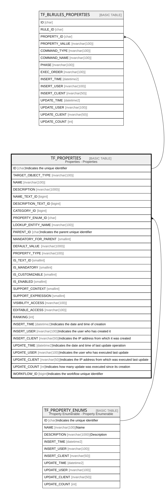

# TF_PROPERTIES

## Description

Properties - Properties  

## Columns

| Name | Type | Default | Nullable | Children | Parents | Comment |
| ---- | ---- | ------- | -------- | -------- | ------- | ------- |
| ID | char |  | false | [TF_BLRULES_PROPERTIES](TF_BLRULES_PROPERTIES.md) |  | Indicates the unique identifier |
| TARGET_OBJECT_TYPE | nvarchar(100) |  | false |  |  |  |
| NAME | nvarchar(100) |  | false |  |  |  |
| DESCRIPTION | nvarchar(1000) |  | true |  |  |  |
| NAME_TEXT_ID | bigint |  | true |  |  |  |
| DESCRIPTION_TEXT_ID | bigint |  | true |  |  |  |
| CATEGORY_ID | bigint | ((0)) | false |  |  |  |
| PROPERTY_ENUM_ID | char |  | true |  | [TF_PROPERTY_ENUMS](TF_PROPERTY_ENUMS.md) |  |
| LOOKUP_ENTITY_NAME | nvarchar(100) |  | true |  |  |  |
| PARENT_ID | char |  | true |  |  | Indicates the parent unique identifier |
| MANDATORY_FOR_PARENT | smallint | ((0)) | false |  |  |  |
| DEFAULT_VALUE | nvarchar(1000) |  | true |  |  |  |
| PROPERTY_TYPE | nvarchar(100) |  | false |  |  |  |
| IS_TEXT_ID | smallint | ((0)) | false |  |  |  |
| IS_MANDATORY | smallint | ((0)) | false |  |  |  |
| IS_CUSTOMIZABLE | smallint | ((1)) | false |  |  |  |
| IS_ENABLED | smallint | ((1)) | false |  |  |  |
| SUPPORT_CONTEXT | smallint | ((1)) | false |  |  |  |
| SUPPORT_EXPRESSION | smallint | ((1)) | false |  |  |  |
| VISIBILITY_ACCESS | nvarchar(100) | (N'All') | false |  |  |  |
| EDITABLE_ACCESS | nvarchar(100) | (N'All') | false |  |  |  |
| RANKING | int | ((0)) | false |  |  |  |
| INSERT_TIME | datetime2 | (sysutcdatetime()) | false |  |  | Indicates the date and time of creation |
| INSERT_USER | nvarchar(100) | (N'MAIN') | false |  |  | Indicates the user who has created it |
| INSERT_CLIENT | nvarchar(50) | (N'localhost') | false |  |  | Indicates the IP address from which it was created |
| UPDATE_TIME | datetime2 | (sysutcdatetime()) | false |  |  | Indicates the date and time of last update operation |
| UPDATE_USER | nvarchar(100) | (N'MAIN') | false |  |  | Indicates the user who has executed last update |
| UPDATE_CLIENT | nvarchar(50) | (N'localhost') | false |  |  | Indicates the IP address from which was executed last update |
| UPDATE_COUNT | int | ((0)) | false |  |  | Indicates how many update was executed since its creation |
| WORKFLOW_ID | bigint |  | true |  |  | Indicates the workflow unique identifier |

## Constraints

| Name | Type | Definition |
| ---- | ---- | ---------- |
| PK_PROPERTIES | PRIMARY KEY | CLUSTERED, unique, part of a PRIMARY KEY constraint, [ ID ] |
| FK_PROPERTIES_ENUMS | FOREIGN KEY | FOREIGN KEY(PROPERTY_ENUM_ID) REFERENCES TF_PROPERTY_ENUMS(ID) ON UPDATE NO_ACTION ON DELETE NO_ACTION |

## Indexes

| Name | Definition |
| ---- | ---------- |
| PK_PROPERTIES | CLUSTERED, unique, part of a PRIMARY KEY constraint, [ ID ] |

## Relations

---

> Generated by [tbls](https://github.com/k1LoW/tbls)
