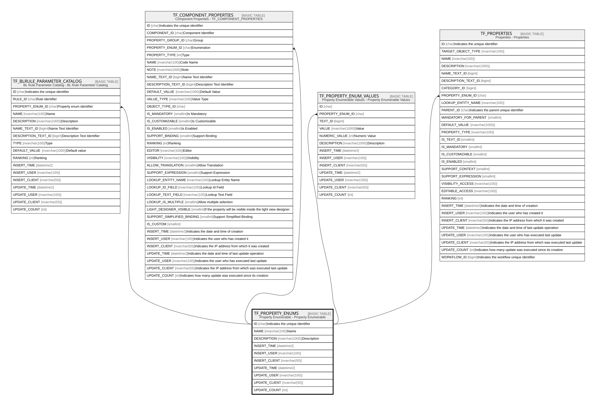

# TF_PROPERTY_ENUMS

## Description

Property Enumerable - Property Enumerable  

## Columns

| Name | Type | Default | Nullable | Children | Comment |
| ---- | ---- | ------- | -------- | -------- | ------- |
| ID | char |  | false | [TF_BLRULE_PARAMETER_CATALOG](TF_BLRULE_PARAMETER_CATALOG.md) [TF_COMPONENT_PROPERTIES](TF_COMPONENT_PROPERTIES.md) [TF_PROPERTY_ENUM_VALUES](TF_PROPERTY_ENUM_VALUES.md) [TF_PROPERTIES](TF_PROPERTIES.md) | Indicates the unique identifier |
| NAME | nvarchar(100) |  | false |  | Name |
| DESCRIPTION | nvarchar(1000) |  | true |  | Description |
| INSERT_TIME | datetime2 | (sysutcdatetime()) | false |  |  |
| INSERT_USER | nvarchar(100) | (N'MAIN') | false |  |  |
| INSERT_CLIENT | nvarchar(50) | (N'localhost') | false |  |  |
| UPDATE_TIME | datetime2 | (sysutcdatetime()) | false |  |  |
| UPDATE_USER | nvarchar(100) | (N'MAIN') | false |  |  |
| UPDATE_CLIENT | nvarchar(50) | (N'localhost') | false |  |  |
| UPDATE_COUNT | int | ((0)) | false |  |  |

## Constraints

| Name | Type | Definition |
| ---- | ---- | ---------- |
| PK_PROPERTY_ENUMS | PRIMARY KEY | CLUSTERED, unique, part of a PRIMARY KEY constraint, [ ID ] |
| UQ_PROPERTY_ENUMS | UNIQUE | NONCLUSTERED, unique, part of a UNIQUE constraint, [ NAME ] |

## Indexes

| Name | Definition |
| ---- | ---------- |
| PK_PROPERTY_ENUMS | CLUSTERED, unique, part of a PRIMARY KEY constraint, [ ID ] |
| UQ_PROPERTY_ENUMS | NONCLUSTERED, unique, part of a UNIQUE constraint, [ NAME ] |

## Relations

---

> Generated by [tbls](https://github.com/k1LoW/tbls)
