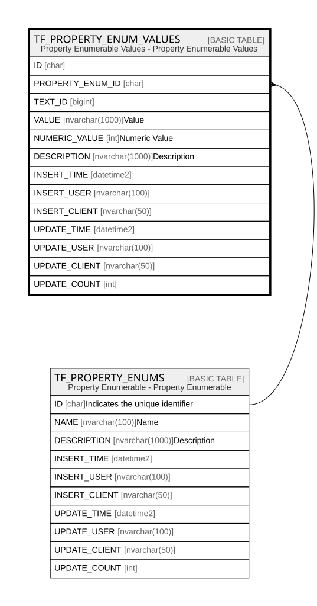

# TF_PROPERTY_ENUM_VALUES

## Description

Property Enumerable Values - Property Enumerable Values  

## Columns

| Name | Type | Default | Nullable | Parents | Comment |
| ---- | ---- | ------- | -------- | ------- | ------- |
| ID | char |  | false |  |  |
| PROPERTY_ENUM_ID | char |  | false | [TF_PROPERTY_ENUMS](TF_PROPERTY_ENUMS.md) |  |
| TEXT_ID | bigint |  | true |  |  |
| VALUE | nvarchar(1000) |  | false |  | Value |
| NUMERIC_VALUE | int | ((0)) | false |  | Numeric Value |
| DESCRIPTION | nvarchar(1000) |  | true |  | Description |
| INSERT_TIME | datetime2 | (sysutcdatetime()) | false |  |  |
| INSERT_USER | nvarchar(100) | (N'MAIN') | false |  |  |
| INSERT_CLIENT | nvarchar(50) | (N'localhost') | false |  |  |
| UPDATE_TIME | datetime2 | (sysutcdatetime()) | false |  |  |
| UPDATE_USER | nvarchar(100) | (N'MAIN') | false |  |  |
| UPDATE_CLIENT | nvarchar(50) | (N'localhost') | false |  |  |
| UPDATE_COUNT | int | ((0)) | false |  |  |

## Constraints

| Name | Type | Definition |
| ---- | ---- | ---------- |
| PK_PROPERTY_ENUM_VALUES | PRIMARY KEY | CLUSTERED, unique, part of a PRIMARY KEY constraint, [ ID ] |
| UQ_PROPERTY_ENUM_VALUES | UNIQUE | NONCLUSTERED, unique, part of a UNIQUE constraint, [ PROPERTY_ENUM_ID, VALUE ] |
| FK_VALUES_ENUMS | FOREIGN KEY | FOREIGN KEY(PROPERTY_ENUM_ID) REFERENCES TF_PROPERTY_ENUMS(ID) ON UPDATE NO_ACTION ON DELETE CASCADE |

## Indexes

| Name | Definition |
| ---- | ---------- |
| PK_PROPERTY_ENUM_VALUES | CLUSTERED, unique, part of a PRIMARY KEY constraint, [ ID ] |
| UQ_PROPERTY_ENUM_VALUES | NONCLUSTERED, unique, part of a UNIQUE constraint, [ PROPERTY_ENUM_ID, VALUE ] |

## Relations

---

> Generated by [tbls](https://github.com/k1LoW/tbls)
