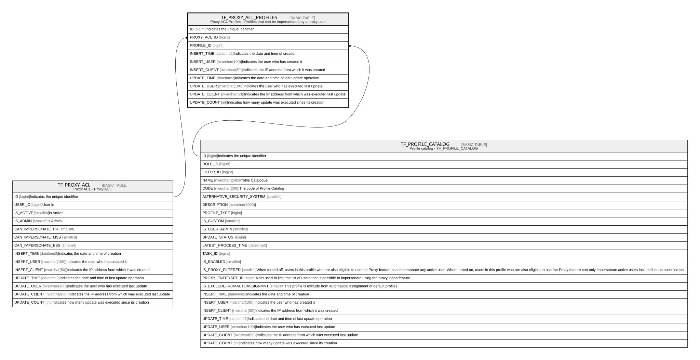

# TF_PROXY_ACL_PROFILES

## Description

Proxy ACL Profiles - Profiles that can be impersonated by a proxy user  

## Columns

| Name | Type | Default | Nullable | Parents | Comment |
| ---- | ---- | ------- | -------- | ------- | ------- |
| ID | bigint |  | false |  | Indicates the unique identifier |
| PROXY_ACL_ID | bigint |  | false | [TF_PROXY_ACL](TF_PROXY_ACL.md) |  |
| PROFILE_ID | bigint |  | false | [TF_PROFILE_CATALOG](TF_PROFILE_CATALOG.md) |  |
| INSERT_TIME | datetime2 | (sysutcdatetime()) | false |  | Indicates the date and time of creation |
| INSERT_USER | nvarchar(100) | (N'MAIN') | false |  | Indicates the user who has created it |
| INSERT_CLIENT | nvarchar(50) | (N'localhost') | false |  | Indicates the IP address from which it was created |
| UPDATE_TIME | datetime2 | (sysutcdatetime()) | false |  | Indicates the date and time of last update operation |
| UPDATE_USER | nvarchar(100) | (N'MAIN') | false |  | Indicates the user who has executed last update |
| UPDATE_CLIENT | nvarchar(50) | (N'localhost') | false |  | Indicates the IP address from which was executed last update |
| UPDATE_COUNT | int | ((0)) | false |  | Indicates how many update was executed since its creation |

## Constraints

| Name | Type | Definition |
| ---- | ---- | ---------- |
| PK_PROXY_ACL_PROFILES | PRIMARY KEY | CLUSTERED, unique, part of a PRIMARY KEY constraint, [ ID ] |
| UQ_PROXY_ACL_PROFILES_AK | UNIQUE | NONCLUSTERED, unique, part of a UNIQUE constraint, [ PROXY_ACL_ID, PROFILE_ID ] |
| FK_PROXY_ACL_PROF_PROXY_ACL | FOREIGN KEY | FOREIGN KEY(PROXY_ACL_ID) REFERENCES TF_PROXY_ACL(ID) ON UPDATE NO_ACTION ON DELETE NO_ACTION |
| FK_PROXY_ACL_PROFILE | FOREIGN KEY | FOREIGN KEY(PROFILE_ID) REFERENCES TF_PROFILE_CATALOG(ID) ON UPDATE NO_ACTION ON DELETE CASCADE |

## Indexes

| Name | Definition |
| ---- | ---------- |
| PK_PROXY_ACL_PROFILES | CLUSTERED, unique, part of a PRIMARY KEY constraint, [ ID ] |
| UQ_PROXY_ACL_PROFILES_AK | NONCLUSTERED, unique, part of a UNIQUE constraint, [ PROXY_ACL_ID, PROFILE_ID ] |

## Relations

---

> Generated by [tbls](https://github.com/k1LoW/tbls)
