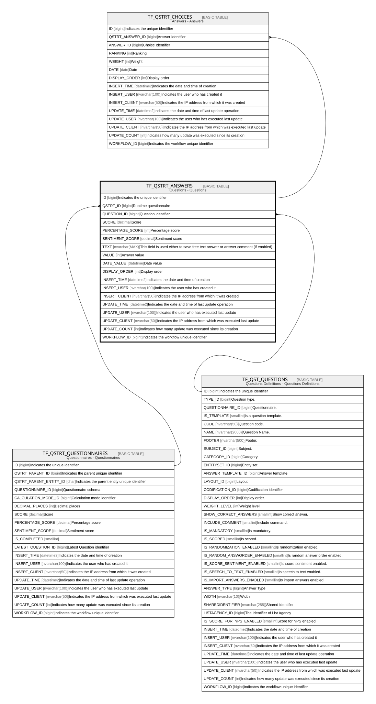

# TF_QSTRT_ANSWERS

## Description

Questions - Questions  

## Columns

| Name | Type | Default | Nullable | Children | Parents | Comment |
| ---- | ---- | ------- | -------- | -------- | ------- | ------- |
| ID | bigint |  | false | [TF_QSTRT_CHOICES](TF_QSTRT_CHOICES.md) |  | Indicates the unique identifier |
| QSTRT_ID | bigint |  | false |  | [TF_QSTRT_QUESTIONNAIRES](TF_QSTRT_QUESTIONNAIRES.md) | Runtime questionnaire |
| QUESTION_ID | bigint |  | false |  | [TF_QST_QUESTIONS](TF_QST_QUESTIONS.md) | Question identifier |
| SCORE | decimal |  | true |  |  | Score |
| PERCENTAGE_SCORE | int |  | true |  |  | Percentage score |
| SENTIMENT_SCORE | decimal |  | true |  |  | Sentiment score |
| TEXT | nvarchar(MAX) |  | true |  |  | This field is used either to save free text answer or answer comment (if enabled) |
| VALUE | int |  | true |  |  | Answer value |
| DATE_VALUE | datetime |  | true |  |  | Date value |
| DISPLAY_ORDER | int | ((0)) | true |  |  | Display order |
| INSERT_TIME | datetime2 | (sysutcdatetime()) | false |  |  | Indicates the date and time of creation |
| INSERT_USER | nvarchar(100) | (N'MAIN') | false |  |  | Indicates the user who has created it |
| INSERT_CLIENT | nvarchar(50) | (N'localhost') | false |  |  | Indicates the IP address from which it was created |
| UPDATE_TIME | datetime2 | (sysutcdatetime()) | false |  |  | Indicates the date and time of last update operation |
| UPDATE_USER | nvarchar(100) | (N'MAIN') | false |  |  | Indicates the user who has executed last update |
| UPDATE_CLIENT | nvarchar(50) | (N'localhost') | false |  |  | Indicates the IP address from which was executed last update |
| UPDATE_COUNT | int | ((0)) | false |  |  | Indicates how many update was executed since its creation |
| WORKFLOW_ID | bigint |  | true |  |  | Indicates the workflow unique identifier |

## Constraints

| Name | Type | Definition |
| ---- | ---- | ---------- |
| PK_QSTRT_ANSWERS | PRIMARY KEY | CLUSTERED, unique, part of a PRIMARY KEY constraint, [ ID ] |
| UQ_RQUEST_QUESTIONS_AK | UNIQUE | NONCLUSTERED, unique, part of a UNIQUE constraint, [ QSTRT_ID, QUESTION_ID ] |
| FK_QUESTIONS_RTANSWERS | FOREIGN KEY | FOREIGN KEY(QUESTION_ID) REFERENCES TF_QST_QUESTIONS(ID) ON UPDATE NO_ACTION ON DELETE NO_ACTION |
| FK_RQUESTIONNAIRES_RTANSWER | FOREIGN KEY | FOREIGN KEY(QSTRT_ID) REFERENCES TF_QSTRT_QUESTIONNAIRES(ID) ON UPDATE NO_ACTION ON DELETE CASCADE |

## Indexes

| Name | Definition |
| ---- | ---------- |
| PK_QSTRT_ANSWERS | CLUSTERED, unique, part of a PRIMARY KEY constraint, [ ID ] |
| UQ_RQUEST_QUESTIONS_AK | NONCLUSTERED, unique, part of a UNIQUE constraint, [ QSTRT_ID, QUESTION_ID ] |

## Relations

---

> Generated by [tbls](https://github.com/k1LoW/tbls)
