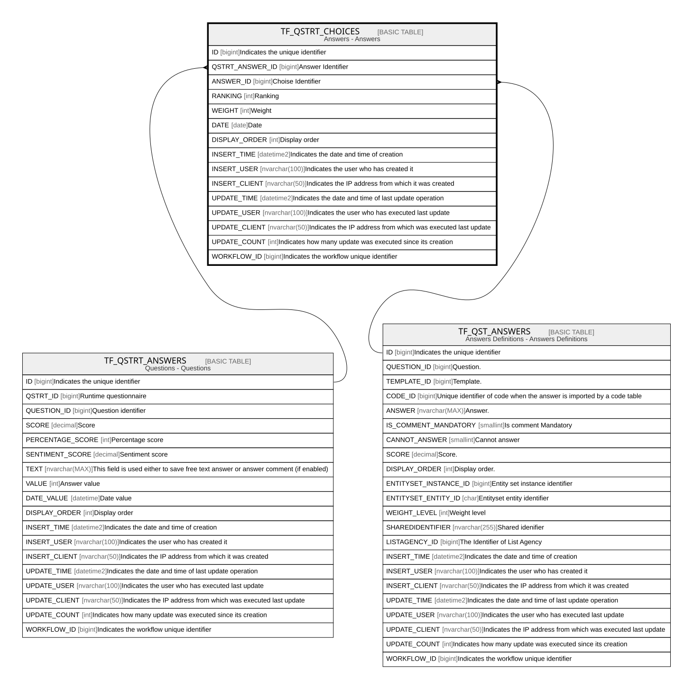

# TF_QSTRT_CHOICES

## Description

Answers - Answers  

## Columns

| Name | Type | Default | Nullable | Parents | Comment |
| ---- | ---- | ------- | -------- | ------- | ------- |
| ID | bigint |  | false |  | Indicates the unique identifier |
| QSTRT_ANSWER_ID | bigint |  | false | [TF_QSTRT_ANSWERS](TF_QSTRT_ANSWERS.md) | Answer Identifier |
| ANSWER_ID | bigint |  | false | [TF_QST_ANSWERS](TF_QST_ANSWERS.md) | Choise Identifier |
| RANKING | int |  | true |  | Ranking |
| WEIGHT | int |  | true |  | Weight |
| DATE | date |  | true |  | Date |
| DISPLAY_ORDER | int | ((0)) | true |  | Display order |
| INSERT_TIME | datetime2 | (sysutcdatetime()) | false |  | Indicates the date and time of creation |
| INSERT_USER | nvarchar(100) | (N'MAIN') | false |  | Indicates the user who has created it |
| INSERT_CLIENT | nvarchar(50) | (N'localhost') | false |  | Indicates the IP address from which it was created |
| UPDATE_TIME | datetime2 | (sysutcdatetime()) | false |  | Indicates the date and time of last update operation |
| UPDATE_USER | nvarchar(100) | (N'MAIN') | false |  | Indicates the user who has executed last update |
| UPDATE_CLIENT | nvarchar(50) | (N'localhost') | false |  | Indicates the IP address from which was executed last update |
| UPDATE_COUNT | int | ((0)) | false |  | Indicates how many update was executed since its creation |
| WORKFLOW_ID | bigint |  | true |  | Indicates the workflow unique identifier |

## Constraints

| Name | Type | Definition |
| ---- | ---- | ---------- |
| PK_QSTRT_CHOICES | PRIMARY KEY | CLUSTERED, unique, part of a PRIMARY KEY constraint, [ ID ] |
| FK_ANSWERS_RTCHOICES | FOREIGN KEY | FOREIGN KEY(ANSWER_ID) REFERENCES TF_QST_ANSWERS(ID) ON UPDATE NO_ACTION ON DELETE NO_ACTION |
| FK_RTANSWERS_RTCHOICES | FOREIGN KEY | FOREIGN KEY(QSTRT_ANSWER_ID) REFERENCES TF_QSTRT_ANSWERS(ID) ON UPDATE NO_ACTION ON DELETE CASCADE |

## Indexes

| Name | Definition |
| ---- | ---------- |
| PK_QSTRT_CHOICES | CLUSTERED, unique, part of a PRIMARY KEY constraint, [ ID ] |
| IDX_QSTRTCHOICES_ANSWERID | NONCLUSTERED, [ QSTRT_ANSWER_ID ] |

## Relations

---

> Generated by [tbls](https://github.com/k1LoW/tbls)
