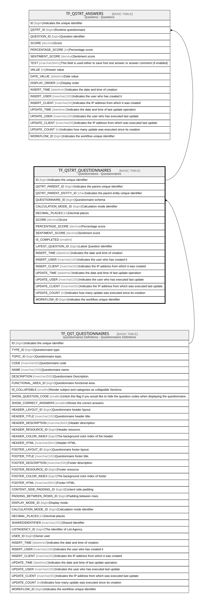

# TF_QSTRT_QUESTIONNAIRES

## Description

Questionnaires - Questionnaires  

## Columns

| Name | Type | Default | Nullable | Children | Parents | Comment |
| ---- | ---- | ------- | -------- | -------- | ------- | ------- |
| ID | bigint |  | false | [TF_QSTRT_ANSWERS](TF_QSTRT_ANSWERS.md) |  | Indicates the unique identifier |
| QSTRT_PARENT_ID | bigint |  | false |  |  | Indicates the parent unique identifier |
| QSTRT_PARENT_ENTITY_ID | char |  | false |  |  | Indicates the parent entity unique identifier |
| QUESTIONNAIRE_ID | bigint |  | false |  | [TF_QST_QUESTIONNAIRES](TF_QST_QUESTIONNAIRES.md) | Questionnaire schema |
| CALCULATION_MODE_ID | bigint |  | false |  |  | Calculation mode identifier |
| DECIMAL_PLACES | int |  | false |  |  | Decimal places |
| SCORE | decimal |  | true |  |  | Score |
| PERCENTAGE_SCORE | decimal |  | true |  |  | Percentage score |
| SENTIMENT_SCORE | decimal |  | true |  |  | Sentiment score |
| IS_COMPLETED | smallint | ((0)) | true |  |  |  |
| LATEST_QUESTION_ID | bigint |  | true |  |  | Latest Question identifier |
| INSERT_TIME | datetime2 | (sysutcdatetime()) | false |  |  | Indicates the date and time of creation |
| INSERT_USER | nvarchar(100) | (N'MAIN') | false |  |  | Indicates the user who has created it |
| INSERT_CLIENT | nvarchar(50) | (N'localhost') | false |  |  | Indicates the IP address from which it was created |
| UPDATE_TIME | datetime2 | (sysutcdatetime()) | false |  |  | Indicates the date and time of last update operation |
| UPDATE_USER | nvarchar(100) | (N'MAIN') | false |  |  | Indicates the user who has executed last update |
| UPDATE_CLIENT | nvarchar(50) | (N'localhost') | false |  |  | Indicates the IP address from which was executed last update |
| UPDATE_COUNT | int | ((0)) | false |  |  | Indicates how many update was executed since its creation |
| WORKFLOW_ID | bigint |  | true |  |  | Indicates the workflow unique identifier |

## Constraints

| Name | Type | Definition |
| ---- | ---- | ---------- |
| PK_QSTRT_QUESTIONNAIRES | PRIMARY KEY | CLUSTERED, unique, part of a PRIMARY KEY constraint, [ ID ] |
| UQ_RUNTIMEQUESTIONNAIRES_AK | UNIQUE | NONCLUSTERED, unique, part of a UNIQUE constraint, [ QSTRT_PARENT_ID, QSTRT_PARENT_ENTITY_ID, QUESTIONNAIRE_ID ] |
| FK_RTQUESTIONNAIRES_QUESTNN | FOREIGN KEY | FOREIGN KEY(QUESTIONNAIRE_ID) REFERENCES TF_QST_QUESTIONNAIRES(ID) ON UPDATE NO_ACTION ON DELETE NO_ACTION |

## Indexes

| Name | Definition |
| ---- | ---------- |
| PK_QSTRT_QUESTIONNAIRES | CLUSTERED, unique, part of a PRIMARY KEY constraint, [ ID ] |
| UQ_RUNTIMEQUESTIONNAIRES_AK | NONCLUSTERED, unique, part of a UNIQUE constraint, [ QSTRT_PARENT_ID, QSTRT_PARENT_ENTITY_ID, QUESTIONNAIRE_ID ] |

## Relations

---

> Generated by [tbls](https://github.com/k1LoW/tbls)
