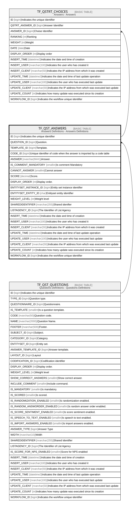

# TF_QST_ANSWERS

## Description

Answers Definitions - Answers Definitions  

## Columns

| Name | Type | Default | Nullable | Children | Parents | Comment |
| ---- | ---- | ------- | -------- | -------- | ------- | ------- |
| ID | bigint |  | false | [TF_QSTRT_CHOICES](TF_QSTRT_CHOICES.md) |  | Indicates the unique identifier |
| QUESTION_ID | bigint |  | false |  | [TF_QST_QUESTIONS](TF_QST_QUESTIONS.md) | Question. |
| TEMPLATE_ID | bigint |  | true |  |  | Template. |
| CODE_ID | bigint |  | true |  |  | Unique identifier of code when the answer is imported by a code table |
| ANSWER | nvarchar(MAX) |  | false |  |  | Answer. |
| IS_COMMENT_MANDATORY | smallint | ((0)) | false |  |  | Is comment Mandatory |
| CANNOT_ANSWER | smallint | ((0)) | false |  |  | Cannot answer |
| SCORE | decimal |  | true |  |  | Score. |
| DISPLAY_ORDER | int | ((0)) | false |  |  | Display order. |
| ENTITYSET_INSTANCE_ID | bigint |  | true |  |  | Entity set instance identifier |
| ENTITYSET_ENTITY_ID | char |  | true |  |  | Entityset entity identifier |
| WEIGHT_LEVEL | int | ((0)) | false |  |  | Weight level |
| SHAREDIDENTIFIER | nvarchar(255) |  | true |  |  | Shared idenifier |
| LISTAGENCY_ID | bigint |  | true |  |  | The Identifier of List Agency |
| INSERT_TIME | datetime2 | (sysutcdatetime()) | false |  |  | Indicates the date and time of creation |
| INSERT_USER | nvarchar(100) | (N'MAIN') | false |  |  | Indicates the user who has created it |
| INSERT_CLIENT | nvarchar(50) | (N'localhost') | false |  |  | Indicates the IP address from which it was created |
| UPDATE_TIME | datetime2 | (sysutcdatetime()) | false |  |  | Indicates the date and time of last update operation |
| UPDATE_USER | nvarchar(100) | (N'MAIN') | false |  |  | Indicates the user who has executed last update |
| UPDATE_CLIENT | nvarchar(50) | (N'localhost') | false |  |  | Indicates the IP address from which was executed last update |
| UPDATE_COUNT | int | ((0)) | false |  |  | Indicates how many update was executed since its creation |
| WORKFLOW_ID | bigint |  | true |  |  | Indicates the workflow unique identifier |

## Constraints

| Name | Type | Definition |
| ---- | ---- | ---------- |
| PK_QST_ANSWERS | PRIMARY KEY | CLUSTERED, unique, part of a PRIMARY KEY constraint, [ ID ] |
| FK_QUESTIONS_ANSWERS | FOREIGN KEY | FOREIGN KEY(QUESTION_ID) REFERENCES TF_QST_QUESTIONS(ID) ON UPDATE NO_ACTION ON DELETE NO_ACTION |

## Indexes

| Name | Definition |
| ---- | ---------- |
| PK_QST_ANSWERS | CLUSTERED, unique, part of a PRIMARY KEY constraint, [ ID ] |

## Relations

---

> Generated by [tbls](https://github.com/k1LoW/tbls)
