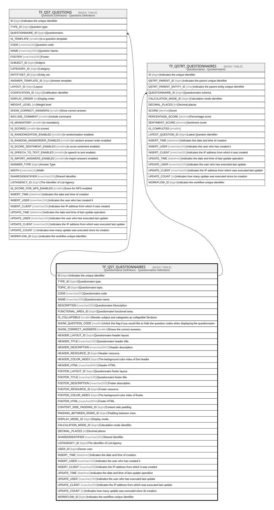

# TF_QST_QUESTIONNAIRES

## Description

Questionnaires Definitions - Questionnaires Definitions  

## Columns

| Name | Type | Default | Nullable | Children | Comment |
| ---- | ---- | ------- | -------- | -------- | ------- |
| ID | bigint |  | false | [TF_QST_QUESTIONS](TF_QST_QUESTIONS.md) [TF_QSTRT_QUESTIONNAIRES](TF_QSTRT_QUESTIONNAIRES.md) | Indicates the unique identifier |
| TYPE_ID | bigint |  | false |  | Questionnaire type. |
| TOPIC_ID | bigint |  | true |  | Questionnaire topic. |
| CODE | nvarchar(50) |  | false |  | Questionnaire code |
| NAME | nvarchar(100) |  | false |  | Questionnaire name. |
| DESCRIPTION | nvarchar(500) |  | true |  | Questionnaire Description. |
| FUNCTIONAL_AREA_ID | bigint |  | true |  | Questionnaire functional area. |
| IS_COLLAPSIBLE | smallint | ((1)) | false |  | Render subject and categories as collapsible Sections |
| SHOW_QUESTION_CODE | smallint | ((1)) | false |  | Untick this flag if you would like to hide the question codes when displaying the questionnaire. |
| SHOW_CORRECT_ANSWERS | smallint | ((0)) | false |  | Shows the correct answers. |
| HEADER_LAYOUT_ID | bigint |  | true |  | Questionnaire header layout. |
| HEADER_TITLE | nvarchar(100) |  | true |  | Questionnaire header title. |
| HEADER_DESCRIPTION | nvarchar(MAX) |  | true |  | Header description. |
| HEADER_RESOURCE_ID | bigint |  | true |  | Header resource. |
| HEADER_COLOR_INDEX | bigint |  | true |  | The background color index of the header  |
| HEADER_HTML | nvarchar(MAX) |  | true |  | Header HTML. |
| FOOTER_LAYOUT_ID | bigint |  | true |  | Questionnaire footer layout. |
| FOOTER_TITLE | nvarchar(100) |  | true |  | Questionnaire footer title. |
| FOOTER_DESCRIPTION | nvarchar(500) |  | true |  | Footer description. |
| FOOTER_RESOURCE_ID | bigint |  | true |  | Footer resource. |
| FOOTER_COLOR_INDEX | bigint |  | true |  | The background color index of footer |
| FOOTER_HTML | nvarchar(MAX) |  | true |  | Footer HTML. |
| CONTENT_SIDE_PADDING_ID | bigint |  | false |  | Content side padding |
| PADDING_BETWEEN_ROWS_ID | bigint |  | false |  | Padding between rows. |
| DISPLAY_MODE_ID | bigint |  | false |  | Display mode. |
| CALCULATION_MODE_ID | bigint |  | false |  | Calculation mode identifier |
| DECIMAL_PLACES | int | ((0)) | false |  | Decimal places |
| SHAREDIDENTIFIER | nvarchar(255) |  | true |  | Shared Identifier |
| LISTAGENCY_ID | bigint |  | true |  | The Identifier of List Agency |
| USER_ID | bigint |  | true |  | Owner user |
| INSERT_TIME | datetime2 | (sysutcdatetime()) | false |  | Indicates the date and time of creation |
| INSERT_USER | nvarchar(100) | (N'MAIN') | false |  | Indicates the user who has created it |
| INSERT_CLIENT | nvarchar(50) | (N'localhost') | false |  | Indicates the IP address from which it was created |
| UPDATE_TIME | datetime2 | (sysutcdatetime()) | false |  | Indicates the date and time of last update operation |
| UPDATE_USER | nvarchar(100) | (N'MAIN') | false |  | Indicates the user who has executed last update |
| UPDATE_CLIENT | nvarchar(50) | (N'localhost') | false |  | Indicates the IP address from which was executed last update |
| UPDATE_COUNT | int | ((0)) | false |  | Indicates how many update was executed since its creation |
| WORKFLOW_ID | bigint |  | true |  | Indicates the workflow unique identifier |

## Constraints

| Name | Type | Definition |
| ---- | ---- | ---------- |
| PK_QST_QUESTIONNAIRES | PRIMARY KEY | CLUSTERED, unique, part of a PRIMARY KEY constraint, [ ID ] |
| UQ_QUESTIONNAIRE_CODE | UNIQUE | NONCLUSTERED, unique, part of a UNIQUE constraint, [ CODE ] |

## Indexes

| Name | Definition |
| ---- | ---------- |
| PK_QST_QUESTIONNAIRES | CLUSTERED, unique, part of a PRIMARY KEY constraint, [ ID ] |
| UQ_QUESTIONNAIRE_CODE | NONCLUSTERED, unique, part of a UNIQUE constraint, [ CODE ] |

## Relations

---

> Generated by [tbls](https://github.com/k1LoW/tbls)
