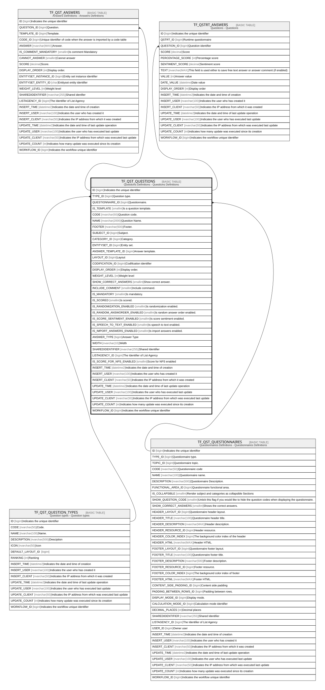

# TF_QST_QUESTIONS

## Description

Questions Definitions - Questions Definitions  

## Columns

| Name | Type | Default | Nullable | Children | Parents | Comment |
| ---- | ---- | ------- | -------- | -------- | ------- | ------- |
| ID | bigint |  | false | [TF_QST_ANSWERS](TF_QST_ANSWERS.md) [TF_QSTRT_ANSWERS](TF_QSTRT_ANSWERS.md) |  | Indicates the unique identifier |
| TYPE_ID | bigint |  | false |  | [TF_QST_QUESTION_TYPES](TF_QST_QUESTION_TYPES.md) | Question type. |
| QUESTIONNAIRE_ID | bigint |  | true |  | [TF_QST_QUESTIONNAIRES](TF_QST_QUESTIONNAIRES.md) | Questionnaire. |
| IS_TEMPLATE | smallint | ((0)) | false |  |  | Is a question template. |
| CODE | nvarchar(50) |  | false |  |  | Question code. |
| NAME | nvarchar(2000) |  | false |  |  | Question Name. |
| FOOTER | nvarchar(500) |  | true |  |  | Footer. |
| SUBJECT_ID | bigint |  | true |  |  | Subject. |
| CATEGORY_ID | bigint |  | true |  |  | Category. |
| ENTITYSET_ID | bigint |  | true |  |  | Entity set. |
| ANSWER_TEMPLATE_ID | bigint |  | true |  |  | Answer template. |
| LAYOUT_ID | bigint |  | true |  |  | Layout |
| CODIFICATION_ID | bigint |  | true |  |  | Codification identifier |
| DISPLAY_ORDER | int |  | false |  |  | Display order. |
| WEIGHT_LEVEL | int | ((100)) | false |  |  | Weight level |
| SHOW_CORRECT_ANSWERS | smallint | ((0)) | false |  |  | Show correct answer. |
| INCLUDE_COMMENT | smallint | ((0)) | false |  |  | Include command. |
| IS_MANDATORY | smallint | ((0)) | false |  |  | Is mandatory. |
| IS_SCORED | smallint | ((0)) | false |  |  | Is scored. |
| IS_RANDOMIZATION_ENABLED | smallint | ((0)) | false |  |  | Is randomization enabled. |
| IS_RANDOM_ANSWORDER_ENABLED | smallint | ((0)) | false |  |  | Is random answer order enabled. |
| IS_SCORE_SENTIMENT_ENABLED | smallint | ((0)) | false |  |  | Is score sentiment enabled. |
| IS_SPEECH_TO_TEXT_ENABLED | smallint | ((0)) | false |  |  | Is speech to text enabled. |
| IS_IMPORT_ANSWERS_ENABLED | smallint | ((0)) | false |  |  | Is import answers enabled. |
| ANSWER_TYPE | bigint | ((0)) | false |  |  | Answer Type |
| WIDTH | nvarchar(10) |  | true |  |  | Width |
| SHAREDIDENTIFIER | nvarchar(255) |  | true |  |  | Shared Identifier |
| LISTAGENCY_ID | bigint |  | true |  |  | The Identifier of List Agency |
| IS_SCORE_FOR_NPS_ENABLED | smallint | ((0)) | false |  |  | Score for NPS enabled |
| INSERT_TIME | datetime2 | (sysutcdatetime()) | false |  |  | Indicates the date and time of creation |
| INSERT_USER | nvarchar(100) | (N'MAIN') | false |  |  | Indicates the user who has created it |
| INSERT_CLIENT | nvarchar(50) | (N'localhost') | false |  |  | Indicates the IP address from which it was created |
| UPDATE_TIME | datetime2 | (sysutcdatetime()) | false |  |  | Indicates the date and time of last update operation |
| UPDATE_USER | nvarchar(100) | (N'MAIN') | false |  |  | Indicates the user who has executed last update |
| UPDATE_CLIENT | nvarchar(50) | (N'localhost') | false |  |  | Indicates the IP address from which was executed last update |
| UPDATE_COUNT | int | ((0)) | false |  |  | Indicates how many update was executed since its creation |
| WORKFLOW_ID | bigint |  | true |  |  | Indicates the workflow unique identifier |

## Constraints

| Name | Type | Definition |
| ---- | ---- | ---------- |
| PK_QST_QUESTIONS | PRIMARY KEY | CLUSTERED, unique, part of a PRIMARY KEY constraint, [ ID ] |
| UQ_QUESTION_CODE | UNIQUE | NONCLUSTERED, unique, part of a UNIQUE constraint, [ QUESTIONNAIRE_ID, CODE ] |
| FK_QUESTION_TYPES_QUESTIONS | FOREIGN KEY | FOREIGN KEY(TYPE_ID) REFERENCES TF_QST_QUESTION_TYPES(ID) ON UPDATE NO_ACTION ON DELETE NO_ACTION |
| FK_QUESTIONNAIRE_QUESTIONS | FOREIGN KEY | FOREIGN KEY(QUESTIONNAIRE_ID) REFERENCES TF_QST_QUESTIONNAIRES(ID) ON UPDATE NO_ACTION ON DELETE NO_ACTION |

## Indexes

| Name | Definition |
| ---- | ---------- |
| PK_QST_QUESTIONS | CLUSTERED, unique, part of a PRIMARY KEY constraint, [ ID ] |
| UQ_QUESTION_CODE | NONCLUSTERED, unique, part of a UNIQUE constraint, [ QUESTIONNAIRE_ID, CODE ] |

## Relations

---

> Generated by [tbls](https://github.com/k1LoW/tbls)
