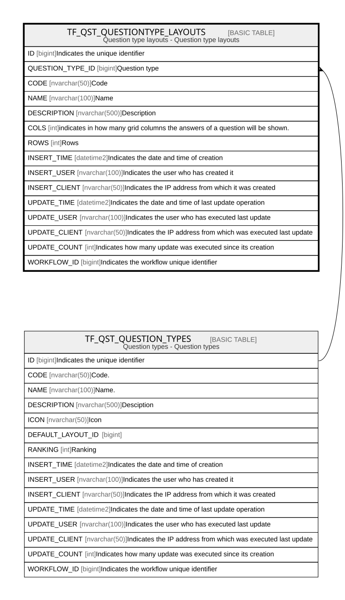

# TF_QST_QUESTIONTYPE_LAYOUTS

## Description

Question type layouts - Question type layouts  

## Columns

| Name | Type | Default | Nullable | Parents | Comment |
| ---- | ---- | ------- | -------- | ------- | ------- |
| ID | bigint |  | false |  | Indicates the unique identifier |
| QUESTION_TYPE_ID | bigint |  | false | [TF_QST_QUESTION_TYPES](TF_QST_QUESTION_TYPES.md) | Question type |
| CODE | nvarchar(50) |  | false |  | Code |
| NAME | nvarchar(100) |  | false |  | Name |
| DESCRIPTION | nvarchar(500) |  | true |  | Description |
| COLS | int |  | true |  | indicates in how many grid columns the answers of a question will be shown. |
| ROWS | int |  | true |  | Rows |
| INSERT_TIME | datetime2 | (sysutcdatetime()) | false |  | Indicates the date and time of creation |
| INSERT_USER | nvarchar(100) | (N'MAIN') | false |  | Indicates the user who has created it |
| INSERT_CLIENT | nvarchar(50) | (N'localhost') | false |  | Indicates the IP address from which it was created |
| UPDATE_TIME | datetime2 | (sysutcdatetime()) | false |  | Indicates the date and time of last update operation |
| UPDATE_USER | nvarchar(100) | (N'MAIN') | false |  | Indicates the user who has executed last update |
| UPDATE_CLIENT | nvarchar(50) | (N'localhost') | false |  | Indicates the IP address from which was executed last update |
| UPDATE_COUNT | int | ((0)) | false |  | Indicates how many update was executed since its creation |
| WORKFLOW_ID | bigint |  | true |  | Indicates the workflow unique identifier |

## Constraints

| Name | Type | Definition |
| ---- | ---- | ---------- |
| PK_QST_QUESTIONTYPE_LAYOUTS | PRIMARY KEY | CLUSTERED, unique, part of a PRIMARY KEY constraint, [ ID ] |
| FK_QUESTTYPE_QUESTLAYOUTS | FOREIGN KEY | FOREIGN KEY(QUESTION_TYPE_ID) REFERENCES TF_QST_QUESTION_TYPES(ID) ON UPDATE NO_ACTION ON DELETE NO_ACTION |

## Indexes

| Name | Definition |
| ---- | ---------- |
| PK_QST_QUESTIONTYPE_LAYOUTS | CLUSTERED, unique, part of a PRIMARY KEY constraint, [ ID ] |

## Relations

---

> Generated by [tbls](https://github.com/k1LoW/tbls)
