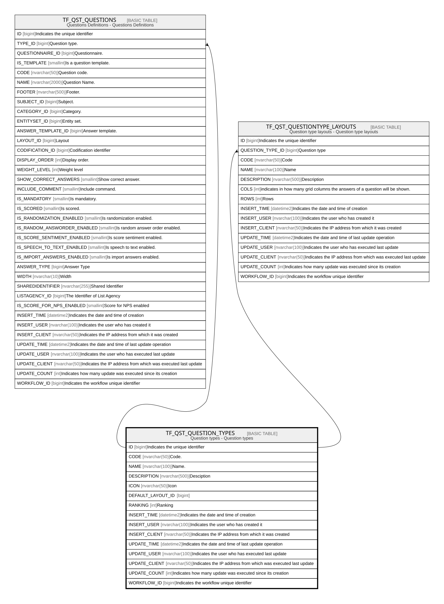

# TF_QST_QUESTION_TYPES

## Description

Question types - Question types  

## Columns

| Name | Type | Default | Nullable | Children | Comment |
| ---- | ---- | ------- | -------- | -------- | ------- |
| ID | bigint |  | false | [TF_QST_QUESTIONS](TF_QST_QUESTIONS.md) [TF_QST_QUESTIONTYPE_LAYOUTS](TF_QST_QUESTIONTYPE_LAYOUTS.md) | Indicates the unique identifier |
| CODE | nvarchar(50) |  | false |  | Code. |
| NAME | nvarchar(100) |  | false |  | Name. |
| DESCRIPTION | nvarchar(500) |  | true |  | Desciption |
| ICON | nvarchar(50) |  | false |  | Icon |
| DEFAULT_LAYOUT_ID | bigint |  | true |  |  |
| RANKING | int | ((0)) | false |  | Ranking |
| INSERT_TIME | datetime2 | (sysutcdatetime()) | false |  | Indicates the date and time of creation |
| INSERT_USER | nvarchar(100) | (N'MAIN') | false |  | Indicates the user who has created it |
| INSERT_CLIENT | nvarchar(50) | (N'localhost') | false |  | Indicates the IP address from which it was created |
| UPDATE_TIME | datetime2 | (sysutcdatetime()) | false |  | Indicates the date and time of last update operation |
| UPDATE_USER | nvarchar(100) | (N'MAIN') | false |  | Indicates the user who has executed last update |
| UPDATE_CLIENT | nvarchar(50) | (N'localhost') | false |  | Indicates the IP address from which was executed last update |
| UPDATE_COUNT | int | ((0)) | false |  | Indicates how many update was executed since its creation |
| WORKFLOW_ID | bigint |  | true |  | Indicates the workflow unique identifier |

## Constraints

| Name | Type | Definition |
| ---- | ---- | ---------- |
| PK_QST_QUESTION_TYPES | PRIMARY KEY | CLUSTERED, unique, part of a PRIMARY KEY constraint, [ ID ] |

## Indexes

| Name | Definition |
| ---- | ---------- |
| PK_QST_QUESTION_TYPES | CLUSTERED, unique, part of a PRIMARY KEY constraint, [ ID ] |

## Relations

---

> Generated by [tbls](https://github.com/k1LoW/tbls)
