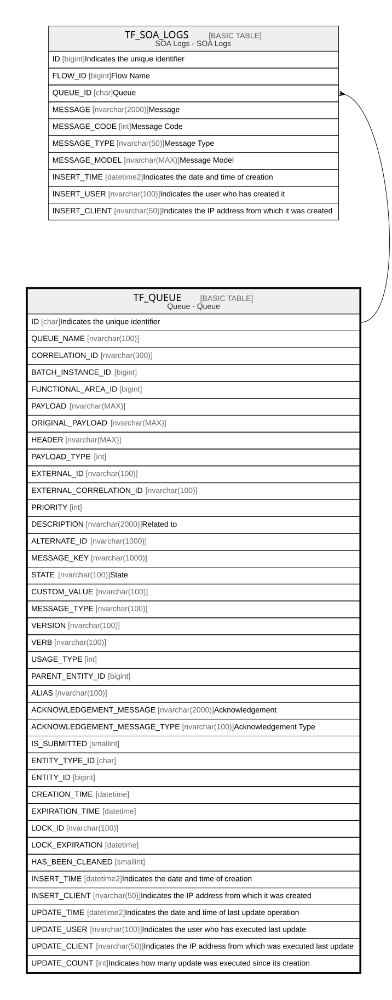

# TF_QUEUE

## Description

Queue - Queue  

## Columns

| Name | Type | Default | Nullable | Children | Comment |
| ---- | ---- | ------- | -------- | -------- | ------- |
| ID | char |  | false | [TF_SOA_LOGS](TF_SOA_LOGS.md) | Indicates the unique identifier |
| QUEUE_NAME | nvarchar(100) |  | false |  |  |
| CORRELATION_ID | nvarchar(300) |  | true |  |  |
| BATCH_INSTANCE_ID | bigint | ((-1)) | false |  |  |
| FUNCTIONAL_AREA_ID | bigint |  | true |  |  |
| PAYLOAD | nvarchar(MAX) |  | true |  |  |
| ORIGINAL_PAYLOAD | nvarchar(MAX) |  | true |  |  |
| HEADER | nvarchar(MAX) |  | false |  |  |
| PAYLOAD_TYPE | int |  | false |  |  |
| EXTERNAL_ID | nvarchar(100) |  | true |  |  |
| EXTERNAL_CORRELATION_ID | nvarchar(100) |  | true |  |  |
| PRIORITY | int |  | false |  |  |
| DESCRIPTION | nvarchar(2000) |  | true |  | Related to |
| ALTERNATE_ID | nvarchar(1000) |  | true |  |  |
| MESSAGE_KEY | nvarchar(1000) |  | true |  |  |
| STATE | nvarchar(100) |  | true |  | State |
| CUSTOM_VALUE | nvarchar(100) |  | true |  |  |
| MESSAGE_TYPE | nvarchar(100) |  | true |  |  |
| VERSION | nvarchar(100) |  | true |  |  |
| VERB | nvarchar(100) |  | true |  |  |
| USAGE_TYPE | int |  | true |  |  |
| PARENT_ENTITY_ID | bigint |  | true |  |  |
| ALIAS | nvarchar(100) |  | true |  |  |
| ACKNOWLEDGEMENT_MESSAGE | nvarchar(2000) |  | true |  | Acknowledgement |
| ACKNOWLEDGEMENT_MESSAGE_TYPE | nvarchar(100) |  | true |  | Acknowledgement Type |
| IS_SUBMITTED | smallint | ((0)) | false |  |  |
| ENTITY_TYPE_ID | char |  | true |  |  |
| ENTITY_ID | bigint |  | true |  |  |
| CREATION_TIME | datetime |  | false |  |  |
| EXPIRATION_TIME | datetime |  | false |  |  |
| LOCK_ID | nvarchar(100) |  | true |  |  |
| LOCK_EXPIRATION | datetime |  | true |  |  |
| HAS_BEEN_CLEANED | smallint | ((0)) | false |  |  |
| INSERT_TIME | datetime2 |  | false |  | Indicates the date and time of creation |
| INSERT_CLIENT | nvarchar(50) |  | false |  | Indicates the IP address from which it was created |
| UPDATE_TIME | datetime2 |  | false |  | Indicates the date and time of last update operation |
| UPDATE_USER | nvarchar(100) |  | true |  | Indicates the user who has executed last update |
| UPDATE_CLIENT | nvarchar(50) |  | false |  | Indicates the IP address from which was executed last update |
| UPDATE_COUNT | int |  | false |  | Indicates how many update was executed since its creation |

## Constraints

| Name | Type | Definition |
| ---- | ---- | ---------- |
| PK_TF_QUEUE | PRIMARY KEY | CLUSTERED, unique, part of a PRIMARY KEY constraint, [ ID ] |

## Indexes

| Name | Definition |
| ---- | ---------- |
| PK_TF_QUEUE | CLUSTERED, unique, part of a PRIMARY KEY constraint, [ ID ] |
| IDX_TF_QUEUE_ID_QUEUE_NAME | NONCLUSTERED, unique, [ ID, QUEUE_NAME ] |
| IDX_TF_QUEUE_NAME_EXT_ID | NONCLUSTERED, [ QUEUE_NAME, EXTERNAL_ID ] |
| IDX_TF_QUEUE_NAME_ALT_ID | NONCLUSTERED, [ QUEUE_NAME, ALTERNATE_ID ] |
| IDX_TF_QUEUE_USAGE_TYPE | NONCLUSTERED, [ USAGE_TYPE ] |
| IDX_TF_QUEUE_PARENT_ENTITY_ID | NONCLUSTERED, [ PARENT_ENTITY_ID ] |
| IDX_TF_QUEUE_NAME_CREATION | NONCLUSTERED, [ QUEUE_NAME, PARENT_ENTITY_ID, CREATION_TIME ] |

## Relations

---

> Generated by [tbls](https://github.com/k1LoW/tbls)
