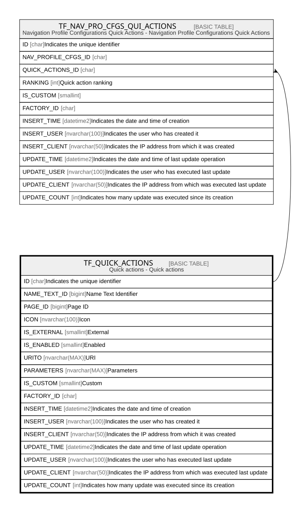

# TF_QUICK_ACTIONS

## Description

Quick actions - Quick actions  

## Columns

| Name | Type | Default | Nullable | Children | Comment |
| ---- | ---- | ------- | -------- | -------- | ------- |
| ID | char |  | false | [TF_NAV_PRO_CFGS_QUI_ACTIONS](TF_NAV_PRO_CFGS_QUI_ACTIONS.md) | Indicates the unique identifier |
| NAME_TEXT_ID | bigint |  | false |  | Name Text Identifier |
| PAGE_ID | bigint |  | true |  | Page ID |
| ICON | nvarchar(100) |  | false |  | Icon |
| IS_EXTERNAL | smallint | ((0)) | false |  | External |
| IS_ENABLED | smallint |  | false |  | Enabled |
| URITO | nvarchar(MAX) |  | true |  | URI |
| PARAMETERS | nvarchar(MAX) |  | true |  | Parameters |
| IS_CUSTOM | smallint |  | false |  | Custom |
| FACTORY_ID | char |  | true |  |  |
| INSERT_TIME | datetime2 | (sysutcdatetime()) | false |  | Indicates the date and time of creation |
| INSERT_USER | nvarchar(100) | (N'MAIN') | false |  | Indicates the user who has created it |
| INSERT_CLIENT | nvarchar(50) | (N'localhost') | false |  | Indicates the IP address from which it was created |
| UPDATE_TIME | datetime2 | (sysutcdatetime()) | false |  | Indicates the date and time of last update operation |
| UPDATE_USER | nvarchar(100) | (N'MAIN') | false |  | Indicates the user who has executed last update |
| UPDATE_CLIENT | nvarchar(50) | (N'localhost') | false |  | Indicates the IP address from which was executed last update |
| UPDATE_COUNT | int | ((0)) | false |  | Indicates how many update was executed since its creation |

## Constraints

| Name | Type | Definition |
| ---- | ---- | ---------- |
| PK_QUICK_ACTIONS | PRIMARY KEY | CLUSTERED, unique, part of a PRIMARY KEY constraint, [ ID ] |
| UQ_QUICKACTIONSNAME | UNIQUE | NONCLUSTERED, unique, part of a UNIQUE constraint, [ NAME_TEXT_ID, IS_CUSTOM ] |

## Indexes

| Name | Definition |
| ---- | ---------- |
| PK_QUICK_ACTIONS | CLUSTERED, unique, part of a PRIMARY KEY constraint, [ ID ] |
| UQ_QUICKACTIONSNAME | NONCLUSTERED, unique, part of a UNIQUE constraint, [ NAME_TEXT_ID, IS_CUSTOM ] |
| IDX_QUICK_ACTS_CUSTOM_FACTORY | NONCLUSTERED, [ FACTORY_ID, IS_CUSTOM ] |

## Relations

---

> Generated by [tbls](https://github.com/k1LoW/tbls)
