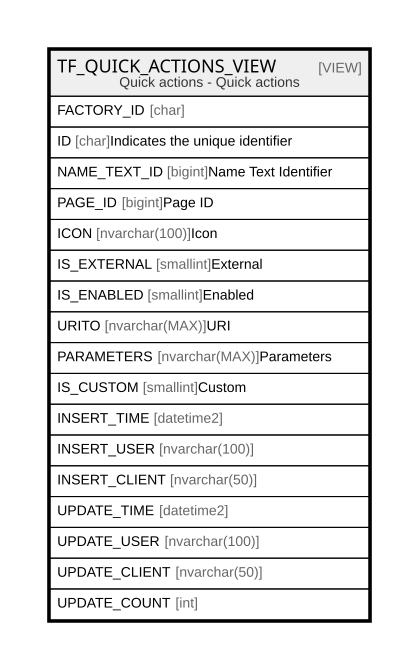

# TF_QUICK_ACTIONS_VIEW

## Description

Quick actions - Quick actions  


<details>
<summary><strong>Table Definition</strong></summary>

```sql
-- Talentia Software - All right reserved
-- Type: VIEW                     Name: TF_QUICK_ACTIONS_VIEW
-- Date: 09-04-2026 07:27:59 (UTC)
-- 
-- ChangeLogId: 00000000-0000-0000-0000-000000000000
-- ChangeSetId: A942C0F3-F827-4DF1-BB6A-5B66F4F95AD5
-- Original file name: C:\repos\Talentia-Software\hcm-core/DB/ProductDB/EDM\Schema\Views\TF_QUICK_ACTIONS_VIEW.xml


CREATE VIEW [TF_QUICK_ACTIONS_VIEW]
 AS 
( 
                  SELECT FACTORY_ID,
                         ID,
                         NAME_TEXT_ID,
                         PAGE_ID,
                         ICON,
                         IS_EXTERNAL,
                         IS_ENABLED,
                         URITO,
                         PARAMETERS,
                         IS_CUSTOM,
                         INSERT_TIME,
                         INSERT_USER,
                         INSERT_CLIENT,
                         UPDATE_TIME,
                         UPDATE_USER,
                         UPDATE_CLIENT,
                         UPDATE_COUNT
                  FROM TF_QUICK_ACTIONS
                  WHERE IS_CUSTOM = 1
                  UNION ALL
                  SELECT FACTORY_ID,
                         ID,
                         NAME_TEXT_ID,
                         PAGE_ID,
                         ICON,
                         IS_EXTERNAL,
                         IS_ENABLED,
                         URITO,
                         PARAMETERS,
                         IS_CUSTOM,
                         INSERT_TIME,
                         INSERT_USER,
                         INSERT_CLIENT,
                         UPDATE_TIME,
                         UPDATE_USER,
                         UPDATE_CLIENT,
                         UPDATE_COUNT
                  FROM TF_QUICK_ACTIONS
                  WHERE IS_CUSTOM = 0 AND NOT EXISTS (SELECT ID FROM TF_QUICK_ACTIONS QA WHERE QA.IS_CUSTOM = 1 AND TF_QUICK_ACTIONS.ID = QA.FACTORY_ID)
                 )

```

</details>

## Columns

| Name | Type | Default | Nullable | Comment |
| ---- | ---- | ------- | -------- | ------- |
| FACTORY_ID | char |  | true |  |
| ID | char |  | false | Indicates the unique identifier |
| NAME_TEXT_ID | bigint |  | false | Name Text Identifier |
| PAGE_ID | bigint |  | true | Page ID |
| ICON | nvarchar(100) |  | false | Icon |
| IS_EXTERNAL | smallint |  | false | External |
| IS_ENABLED | smallint |  | false | Enabled |
| URITO | nvarchar(MAX) |  | true | URI |
| PARAMETERS | nvarchar(MAX) |  | true | Parameters |
| IS_CUSTOM | smallint |  | false | Custom |
| INSERT_TIME | datetime2 |  | false |  |
| INSERT_USER | nvarchar(100) |  | false |  |
| INSERT_CLIENT | nvarchar(50) |  | false |  |
| UPDATE_TIME | datetime2 |  | false |  |
| UPDATE_USER | nvarchar(100) |  | false |  |
| UPDATE_CLIENT | nvarchar(50) |  | false |  |
| UPDATE_COUNT | int |  | false |  |

## Referenced Tables

| Name | Columns | Comment | Type |
| ---- | ------- | ------- | ---- |
| [TF_QUICK_ACTIONS](TF_QUICK_ACTIONS.md) | 17 | Quick actions - Quick actions<br /> | BASIC TABLE |

## Relations



---

> Generated by [tbls](https://github.com/k1LoW/tbls)
