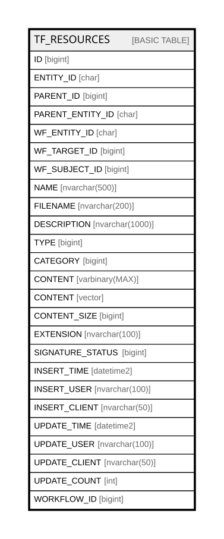

# TF_RESOURCES

## Columns

| Name | Type | Default | Nullable | Comment |
| ---- | ---- | ------- | -------- | ------- |
| ID | bigint |  | false |  |
| ENTITY_ID | char |  | false |  |
| PARENT_ID | bigint |  | false |  |
| PARENT_ENTITY_ID | char |  | false |  |
| WF_ENTITY_ID | char |  | true |  |
| WF_TARGET_ID | bigint |  | true |  |
| WF_SUBJECT_ID | bigint |  | true |  |
| NAME | nvarchar(500) |  | true |  |
| FILENAME | nvarchar(200) |  | true |  |
| DESCRIPTION | nvarchar(1000) |  | false |  |
| TYPE | bigint |  | true |  |
| CATEGORY | bigint |  | true |  |
| CONTENT | varbinary(MAX) |  | true |  |
| CONTENT | vector |  | true |  |
| CONTENT_SIZE | bigint |  | true |  |
| EXTENSION | nvarchar(100) |  | true |  |
| SIGNATURE_STATUS | bigint | ((0)) | false |  |
| INSERT_TIME | datetime2 | (sysutcdatetime()) | false |  |
| INSERT_USER | nvarchar(100) | (N'MAIN') | false |  |
| INSERT_CLIENT | nvarchar(50) | (N'localhost') | false |  |
| UPDATE_TIME | datetime2 | (sysutcdatetime()) | false |  |
| UPDATE_USER | nvarchar(100) | (N'MAIN') | false |  |
| UPDATE_CLIENT | nvarchar(50) | (N'localhost') | false |  |
| UPDATE_COUNT | int | ((0)) | false |  |
| WORKFLOW_ID | bigint |  | true |  |

## Constraints

| Name | Type | Definition |
| ---- | ---- | ---------- |
| PK_RESOURCES | PRIMARY KEY | CLUSTERED, unique, part of a PRIMARY KEY constraint, [ ID ] |

## Indexes

| Name | Definition |
| ---- | ---------- |
| PK_RESOURCES | CLUSTERED, unique, part of a PRIMARY KEY constraint, [ ID ] |
| IDX_RESOURCES_PENTITY_CATEGORY | NONCLUSTERED, [ PARENT_ENTITY_ID, CATEGORY ] |
| IDX_RESOURCES_SEARCH | NONCLUSTERED, [ ID, DESCRIPTION, ENTITY_ID, PARENT_ID, FILENAME, CATEGORY, CONTENT_SIZE, SIGNATURE_STATUS ] |

## Relations

---

> Generated by [tbls](https://github.com/k1LoW/tbls)
