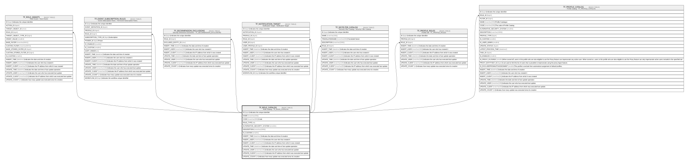

# TF_ROLE_CATALOG

## Description

Role Catalog - TF_ROLE_CATALOG  

## Columns

| Name | Type | Default | Nullable | Children | Comment |
| ---- | ---- | ------- | -------- | -------- | ------- |
| ID | bigint |  | false | [TF_ROLE_GRANTS](TF_ROLE_GRANTS.md) [TF_EVENT_SUBSCRIPTION_RULES](TF_EVENT_SUBSCRIPTION_RULES.md) [TF_SECDIMENSION_EXCLUSIONS](TF_SECDIMENSION_EXCLUSIONS.md) [TF_NOTIFICATION_TARGET](TF_NOTIFICATION_TARGET.md) [TF_SECFILTER_CATALOG](TF_SECFILTER_CATALOG.md) [TF_PROFILE_ROLES](TF_PROFILE_ROLES.md) [TF_PROFILE_CATALOG](TF_PROFILE_CATALOG.md) | Indicates the unique identifier |
| NAME | nvarchar(250) |  | false |  |  |
| CODE | nvarchar(500) |  | true |  | Code |
| ROLE_TYPE | int | ((0)) | false |  |  |
| ALTERNATIVE_SECURITY_SYSTEM | smallint | ((0)) | true |  |  |
| DESCRIPTION | nvarchar(2000) |  | true |  |  |
| IS_CUSTOM | smallint | ((1)) | true |  |  |
| INSERT_TIME | datetime2 | (sysutcdatetime()) | false |  | Indicates the date and time of creation |
| INSERT_USER | nvarchar(100) | (N'MAIN') | false |  | Indicates the user who has created it |
| INSERT_CLIENT | nvarchar(50) | (N'localhost') | false |  | Indicates the IP address from which it was created |
| UPDATE_TIME | datetime2 | (sysutcdatetime()) | false |  | Indicates the date and time of last update operation |
| UPDATE_USER | nvarchar(100) | (N'MAIN') | false |  | Indicates the user who has executed last update |
| UPDATE_CLIENT | nvarchar(50) | (N'localhost') | false |  | Indicates the IP address from which was executed last update |
| UPDATE_COUNT | int | ((0)) | false |  | Indicates how many update was executed since its creation |

## Constraints

| Name | Type | Definition |
| ---- | ---- | ---------- |
| PK_ROLE_CATALOG | PRIMARY KEY | CLUSTERED, unique, part of a PRIMARY KEY constraint, [ ID ] |
| UQ_ROLE_CODE | UNIQUE | NONCLUSTERED, unique, part of a UNIQUE constraint, [ CODE ] |

## Indexes

| Name | Definition |
| ---- | ---------- |
| PK_ROLE_CATALOG | CLUSTERED, unique, part of a PRIMARY KEY constraint, [ ID ] |
| UQ_ROLE_CODE | NONCLUSTERED, unique, part of a UNIQUE constraint, [ CODE ] |

## Relations

---

> Generated by [tbls](https://github.com/k1LoW/tbls)
