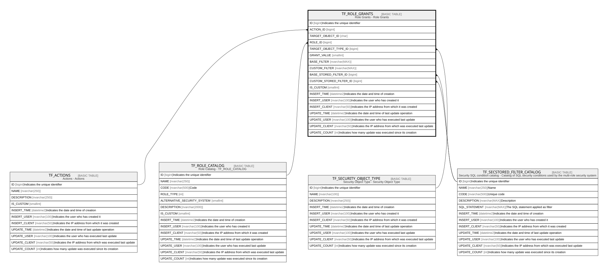

# TF_ROLE_GRANTS

## Description

Role Grants - Role Grants  

## Columns

| Name | Type | Default | Nullable | Parents | Comment |
| ---- | ---- | ------- | -------- | ------- | ------- |
| ID | bigint |  | false |  | Indicates the unique identifier |
| ACTION_ID | bigint |  | false | [TF_ACTIONS](TF_ACTIONS.md) |  |
| TARGET_OBJECT_ID | char |  | false |  |  |
| ROLE_ID | bigint |  | false | [TF_ROLE_CATALOG](TF_ROLE_CATALOG.md) |  |
| TARGET_OBJECT_TYPE_ID | bigint |  | false | [TF_SECURITY_OBJECT_TYPE](TF_SECURITY_OBJECT_TYPE.md) |  |
| GRANT_VALUE | smallint |  | false |  |  |
| BASE_FILTER | nvarchar(MAX) | (N'#FILTER') | true |  |  |
| CUSTOM_FILTER | nvarchar(MAX) |  | true |  |  |
| BASE_STORED_FILTER_ID | bigint |  | true | [TF_SECSTORED_FILTER_CATALOG](TF_SECSTORED_FILTER_CATALOG.md) |  |
| CUSTOM_STORED_FILTER_ID | bigint |  | true | [TF_SECSTORED_FILTER_CATALOG](TF_SECSTORED_FILTER_CATALOG.md) |  |
| IS_CUSTOM | smallint | ((0)) | false |  |  |
| INSERT_TIME | datetime2 | (sysutcdatetime()) | false |  | Indicates the date and time of creation |
| INSERT_USER | nvarchar(100) | (N'MAIN') | false |  | Indicates the user who has created it |
| INSERT_CLIENT | nvarchar(50) | (N'localhost') | false |  | Indicates the IP address from which it was created |
| UPDATE_TIME | datetime2 | (sysutcdatetime()) | false |  | Indicates the date and time of last update operation |
| UPDATE_USER | nvarchar(100) | (N'MAIN') | false |  | Indicates the user who has executed last update |
| UPDATE_CLIENT | nvarchar(50) | (N'localhost') | false |  | Indicates the IP address from which was executed last update |
| UPDATE_COUNT | int | ((0)) | false |  | Indicates how many update was executed since its creation |

## Constraints

| Name | Type | Definition |
| ---- | ---- | ---------- |
| PK_ROLE_GRANTS | PRIMARY KEY | CLUSTERED, unique, part of a PRIMARY KEY constraint, [ ID ] |
| UQ_ROLE_GRANTS_AK | UNIQUE | NONCLUSTERED, unique, part of a UNIQUE constraint, [ ROLE_ID, ACTION_ID, TARGET_OBJECT_TYPE_ID, TARGET_OBJECT_ID ] |
| FK_B_RGRANTS_STRDFILTERCAT | FOREIGN KEY | FOREIGN KEY(BASE_STORED_FILTER_ID) REFERENCES TF_SECSTORED_FILTER_CATALOG(ID) ON UPDATE NO_ACTION ON DELETE NO_ACTION |
| FK_C_RGRANTS_STRDFILTERCAT | FOREIGN KEY | FOREIGN KEY(CUSTOM_STORED_FILTER_ID) REFERENCES TF_SECSTORED_FILTER_CATALOG(ID) ON UPDATE NO_ACTION ON DELETE NO_ACTION |
| FK_ROLE_GRANTS_ACTIONS | FOREIGN KEY | FOREIGN KEY(ACTION_ID) REFERENCES TF_ACTIONS(ID) ON UPDATE NO_ACTION ON DELETE NO_ACTION |
| FK_ROLE_GRANTS_OBJ_TYPE | FOREIGN KEY | FOREIGN KEY(TARGET_OBJECT_TYPE_ID) REFERENCES TF_SECURITY_OBJECT_TYPE(ID) ON UPDATE NO_ACTION ON DELETE NO_ACTION |
| FK_ROLE_GRANTS_ROLE | FOREIGN KEY | FOREIGN KEY(ROLE_ID) REFERENCES TF_ROLE_CATALOG(ID) ON UPDATE NO_ACTION ON DELETE NO_ACTION |

## Indexes

| Name | Definition |
| ---- | ---------- |
| PK_ROLE_GRANTS | CLUSTERED, unique, part of a PRIMARY KEY constraint, [ ID ] |
| UQ_ROLE_GRANTS_AK | NONCLUSTERED, unique, part of a UNIQUE constraint, [ ROLE_ID, ACTION_ID, TARGET_OBJECT_TYPE_ID, TARGET_OBJECT_ID ] |
| IDX_ROLEGRANTS_ID_TAROBJTYID | NONCLUSTERED, [ ACTION_ID, TARGET_OBJECT_ID, GRANT_VALUE, ROLE_ID, TARGET_OBJECT_TYPE_ID ] |

## Relations

---

> Generated by [tbls](https://github.com/k1LoW/tbls)
