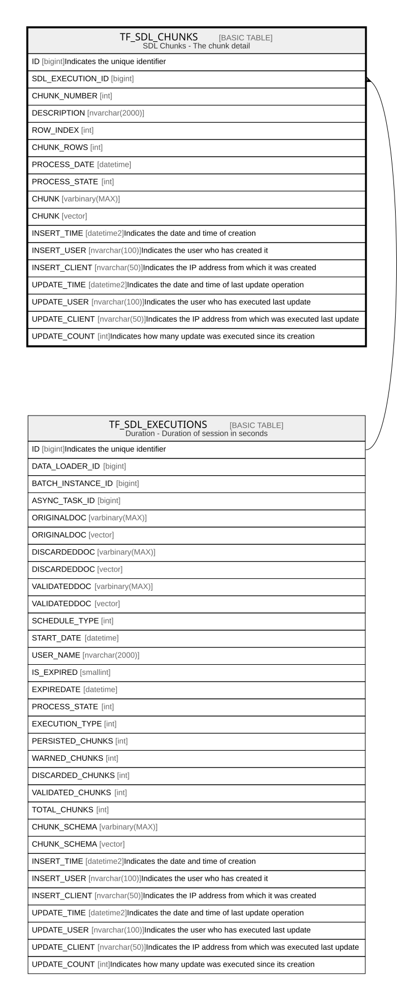

# TF_SDL_CHUNKS

## Description

SDL Chunks - The chunk detail  

## Columns

| Name | Type | Default | Nullable | Parents | Comment |
| ---- | ---- | ------- | -------- | ------- | ------- |
| ID | bigint |  | false |  | Indicates the unique identifier |
| SDL_EXECUTION_ID | bigint |  | false | [TF_SDL_EXECUTIONS](TF_SDL_EXECUTIONS.md) |  |
| CHUNK_NUMBER | int |  | false |  |  |
| DESCRIPTION | nvarchar(2000) |  | true |  |  |
| ROW_INDEX | int |  | false |  |  |
| CHUNK_ROWS | int |  | false |  |  |
| PROCESS_DATE | datetime |  | false |  |  |
| PROCESS_STATE | int | ((0)) | false |  |  |
| CHUNK | varbinary(MAX) |  | false |  |  |
| CHUNK | vector |  | false |  |  |
| INSERT_TIME | datetime2 | (sysutcdatetime()) | false |  | Indicates the date and time of creation |
| INSERT_USER | nvarchar(100) | (N'MAIN') | false |  | Indicates the user who has created it |
| INSERT_CLIENT | nvarchar(50) | (N'localhost') | false |  | Indicates the IP address from which it was created |
| UPDATE_TIME | datetime2 | (sysutcdatetime()) | false |  | Indicates the date and time of last update operation |
| UPDATE_USER | nvarchar(100) | (N'MAIN') | false |  | Indicates the user who has executed last update |
| UPDATE_CLIENT | nvarchar(50) | (N'localhost') | false |  | Indicates the IP address from which was executed last update |
| UPDATE_COUNT | int | ((0)) | false |  | Indicates how many update was executed since its creation |

## Constraints

| Name | Type | Definition |
| ---- | ---- | ---------- |
| PK_SDLCHUNKS | PRIMARY KEY | CLUSTERED, unique, part of a PRIMARY KEY constraint, [ ID ] |
| FK_CHUNKS_EXECUTIONS | FOREIGN KEY | FOREIGN KEY(SDL_EXECUTION_ID) REFERENCES TF_SDL_EXECUTIONS(ID) ON UPDATE NO_ACTION ON DELETE CASCADE |

## Indexes

| Name | Definition |
| ---- | ---------- |
| PK_SDLCHUNKS | CLUSTERED, unique, part of a PRIMARY KEY constraint, [ ID ] |

## Relations

---

> Generated by [tbls](https://github.com/k1LoW/tbls)
