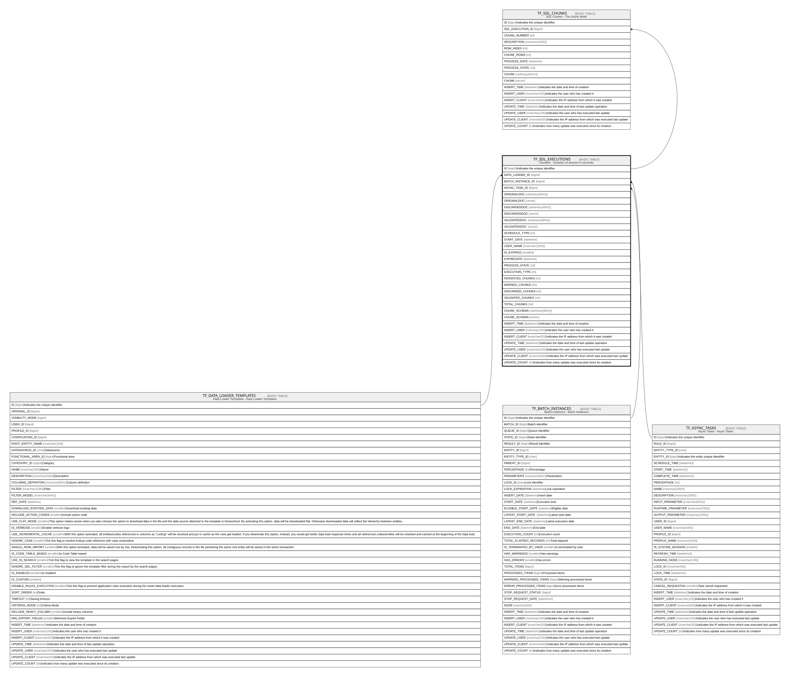

# TF_SDL_EXECUTIONS

## Description

Duration - Duration of session in seconds  

## Columns

| Name | Type | Default | Nullable | Children | Parents | Comment |
| ---- | ---- | ------- | -------- | -------- | ------- | ------- |
| ID | bigint |  | false | [TF_SDL_CHUNKS](TF_SDL_CHUNKS.md) |  | Indicates the unique identifier |
| DATA_LOADER_ID | bigint |  | false |  | [TF_DATA_LOADER_TEMPLATES](TF_DATA_LOADER_TEMPLATES.md) |  |
| BATCH_INSTANCE_ID | bigint |  | true |  | [TF_BATCH_INSTANCES](TF_BATCH_INSTANCES.md) |  |
| ASYNC_TASK_ID | bigint |  | true |  | [TF_ASYNC_TASKS](TF_ASYNC_TASKS.md) |  |
| ORIGINALDOC | varbinary(MAX) |  | true |  |  |  |
| ORIGINALDOC | vector |  | true |  |  |  |
| DISCARDEDDOC | varbinary(MAX) |  | true |  |  |  |
| DISCARDEDDOC | vector |  | true |  |  |  |
| VALIDATEDDOC | varbinary(MAX) |  | true |  |  |  |
| VALIDATEDDOC | vector |  | true |  |  |  |
| SCHEDULE_TYPE | int |  | true |  |  |  |
| START_DATE | datetime |  | true |  |  |  |
| USER_NAME | nvarchar(2000) |  | true |  |  |  |
| IS_EXPIRED | smallint | ((0)) | false |  |  |  |
| EXPIREDATE | datetime |  | true |  |  |  |
| PROCESS_STATE | int | ((0)) | false |  |  |  |
| EXECUTION_TYPE | int | ((0)) | false |  |  |  |
| PERSISTED_CHUNKS | int | ((0)) | false |  |  |  |
| WARNED_CHUNKS | int | ((0)) | false |  |  |  |
| DISCARDED_CHUNKS | int | ((0)) | false |  |  |  |
| VALIDATED_CHUNKS | int | ((0)) | false |  |  |  |
| TOTAL_CHUNKS | int | ((0)) | false |  |  |  |
| CHUNK_SCHEMA | varbinary(MAX) |  | true |  |  |  |
| CHUNK_SCHEMA | vector |  | true |  |  |  |
| INSERT_TIME | datetime2 | (sysutcdatetime()) | false |  |  | Indicates the date and time of creation |
| INSERT_USER | nvarchar(100) | (N'MAIN') | false |  |  | Indicates the user who has created it |
| INSERT_CLIENT | nvarchar(50) | (N'localhost') | false |  |  | Indicates the IP address from which it was created |
| UPDATE_TIME | datetime2 | (sysutcdatetime()) | false |  |  | Indicates the date and time of last update operation |
| UPDATE_USER | nvarchar(100) | (N'MAIN') | false |  |  | Indicates the user who has executed last update |
| UPDATE_CLIENT | nvarchar(50) | (N'localhost') | false |  |  | Indicates the IP address from which was executed last update |
| UPDATE_COUNT | int | ((0)) | false |  |  | Indicates how many update was executed since its creation |

## Constraints

| Name | Type | Definition |
| ---- | ---- | ---------- |
| PK_SDL_EXECUTIONS | PRIMARY KEY | CLUSTERED, unique, part of a PRIMARY KEY constraint, [ ID ] |
| FK_DLOADER_ASYNCTASK | FOREIGN KEY | FOREIGN KEY(ASYNC_TASK_ID) REFERENCES TF_ASYNC_TASKS(ID) ON UPDATE NO_ACTION ON DELETE CASCADE |
| FK_SDLEXEC_BATCHES | FOREIGN KEY | FOREIGN KEY(BATCH_INSTANCE_ID) REFERENCES TF_BATCH_INSTANCES(ID) ON UPDATE NO_ACTION ON DELETE CASCADE |
| FK_SDLEXEC_DATALOADER | FOREIGN KEY | FOREIGN KEY(DATA_LOADER_ID) REFERENCES TF_DATA_LOADER_TEMPLATES(ID) ON UPDATE NO_ACTION ON DELETE CASCADE |

## Indexes

| Name | Definition |
| ---- | ---------- |
| PK_SDL_EXECUTIONS | CLUSTERED, unique, part of a PRIMARY KEY constraint, [ ID ] |

## Relations

---

> Generated by [tbls](https://github.com/k1LoW/tbls)
