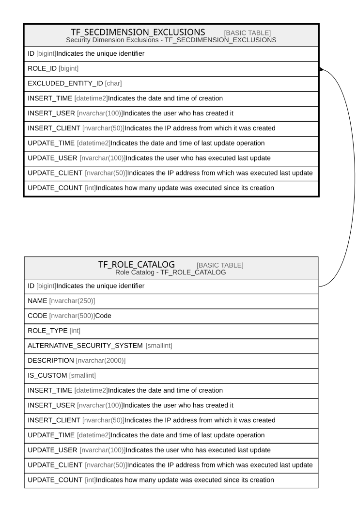

# TF_SECDIMENSION_EXCLUSIONS

## Description

Security Dimension Exclusions - TF_SECDIMENSION_EXCLUSIONS  

## Columns

| Name | Type | Default | Nullable | Parents | Comment |
| ---- | ---- | ------- | -------- | ------- | ------- |
| ID | bigint |  | false |  | Indicates the unique identifier |
| ROLE_ID | bigint |  | false | [TF_ROLE_CATALOG](TF_ROLE_CATALOG.md) |  |
| EXCLUDED_ENTITY_ID | char |  | false |  |  |
| INSERT_TIME | datetime2 | (sysutcdatetime()) | false |  | Indicates the date and time of creation |
| INSERT_USER | nvarchar(100) | (N'MAIN') | false |  | Indicates the user who has created it |
| INSERT_CLIENT | nvarchar(50) | (N'localhost') | false |  | Indicates the IP address from which it was created |
| UPDATE_TIME | datetime2 | (sysutcdatetime()) | false |  | Indicates the date and time of last update operation |
| UPDATE_USER | nvarchar(100) | (N'MAIN') | false |  | Indicates the user who has executed last update |
| UPDATE_CLIENT | nvarchar(50) | (N'localhost') | false |  | Indicates the IP address from which was executed last update |
| UPDATE_COUNT | int | ((0)) | false |  | Indicates how many update was executed since its creation |

## Constraints

| Name | Type | Definition |
| ---- | ---- | ---------- |
| PK_SECDIMESION_EXCLUSIONS | PRIMARY KEY | CLUSTERED, unique, part of a PRIMARY KEY constraint, [ ID ] |
| UQ_SECDIMESION_EXCLUSIONS | UNIQUE | NONCLUSTERED, unique, part of a UNIQUE constraint, [ ROLE_ID, EXCLUDED_ENTITY_ID ] |
| FK_SECDIMESION_EXCLUS_ROLE | FOREIGN KEY | FOREIGN KEY(ROLE_ID) REFERENCES TF_ROLE_CATALOG(ID) ON UPDATE NO_ACTION ON DELETE CASCADE |

## Indexes

| Name | Definition |
| ---- | ---------- |
| PK_SECDIMESION_EXCLUSIONS | CLUSTERED, unique, part of a PRIMARY KEY constraint, [ ID ] |
| UQ_SECDIMESION_EXCLUSIONS | NONCLUSTERED, unique, part of a UNIQUE constraint, [ ROLE_ID, EXCLUDED_ENTITY_ID ] |

## Relations

---

> Generated by [tbls](https://github.com/k1LoW/tbls)
