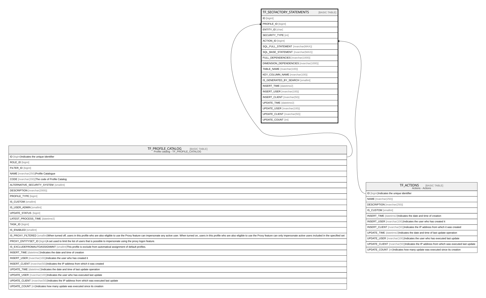

# TF_SECFACTORY_STATEMENTS

## Columns

| Name | Type | Default | Nullable | Parents | Comment |
| ---- | ---- | ------- | -------- | ------- | ------- |
| ID | bigint |  | false |  |  |
| PROFILE_ID | bigint |  | false | [TF_PROFILE_CATALOG](TF_PROFILE_CATALOG.md) |  |
| ENTITY_ID | char |  | false |  |  |
| SECURITY_TYPE | int | ((1)) | false |  |  |
| ACTION_ID | bigint |  | false | [TF_ACTIONS](TF_ACTIONS.md) |  |
| SQL_FULL_STATEMENT | nvarchar(MAX) |  | false |  |  |
| SQL_BASE_STATEMENT | nvarchar(MAX) |  | true |  |  |
| FULL_DEPENDENCIES | nvarchar(1000) |  | true |  |  |
| DIMENSION_DEPENDENCIES | nvarchar(1000) |  | true |  |  |
| TABLE_NAME | nvarchar(100) |  | true |  |  |
| KEY_COLUMN_NAME | nvarchar(100) |  | true |  |  |
| IS_GENERATED_BY_SEARCH | smallint | ((0)) | false |  |  |
| INSERT_TIME | datetime2 | (sysutcdatetime()) | false |  |  |
| INSERT_USER | nvarchar(100) | (N'MAIN') | false |  |  |
| INSERT_CLIENT | nvarchar(50) | (N'localhost') | false |  |  |
| UPDATE_TIME | datetime2 | (sysutcdatetime()) | false |  |  |
| UPDATE_USER | nvarchar(100) | (N'MAIN') | false |  |  |
| UPDATE_CLIENT | nvarchar(50) | (N'localhost') | false |  |  |
| UPDATE_COUNT | int | ((0)) | false |  |  |

## Constraints

| Name | Type | Definition |
| ---- | ---- | ---------- |
| PK_SECFACTORY_STATEMENTS | PRIMARY KEY | CLUSTERED, unique, part of a PRIMARY KEY constraint, [ ID ] |
| UQ_SECFACTORY_STATEMENTS_AK | UNIQUE | NONCLUSTERED, unique, part of a UNIQUE constraint, [ PROFILE_ID, ENTITY_ID, ACTION_ID ] |
| FK_SECFACTORY_STATEM_ACT | FOREIGN KEY | FOREIGN KEY(ACTION_ID) REFERENCES TF_ACTIONS(ID) ON UPDATE NO_ACTION ON DELETE NO_ACTION |
| FK_SECFACTORY_STATEM_PROF | FOREIGN KEY | FOREIGN KEY(PROFILE_ID) REFERENCES TF_PROFILE_CATALOG(ID) ON UPDATE NO_ACTION ON DELETE CASCADE |

## Indexes

| Name | Definition |
| ---- | ---------- |
| PK_SECFACTORY_STATEMENTS | CLUSTERED, unique, part of a PRIMARY KEY constraint, [ ID ] |
| UQ_SECFACTORY_STATEMENTS_AK | NONCLUSTERED, unique, part of a UNIQUE constraint, [ PROFILE_ID, ENTITY_ID, ACTION_ID ] |

## Relations

---

> Generated by [tbls](https://github.com/k1LoW/tbls)
