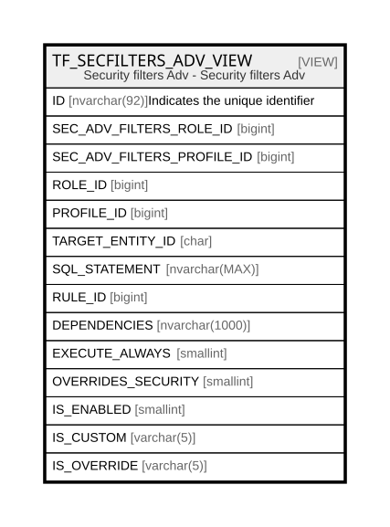

# TF_SECFILTERS_ADV_VIEW

## Description

Security filters Adv - Security filters Adv  


<details>
<summary><strong>Table Definition</strong></summary>

```sql
-- Talentia Software - All right reserved
-- Type: VIEW                     Name: TF_SECFILTERS_ADV_VIEW
-- Date: 09-04-2026 07:27:59 (UTC)
-- 
-- ChangeLogId: 00000000-0000-0000-0000-000000000000
-- ChangeSetId: 1b076caf-c3d8-448b-9f40-4be43b92e8b2
-- Original file name: C:\repos\Talentia-Software\hcm-core/DB/ProductDB/EDM\Schema\Views\TF_SECFILTERS_ADV_VIEW.xml


CREATE VIEW [TF_SECFILTERS_ADV_VIEW]
 AS 
( 
                  SELECT
                  CONVERT(NVARCHAR, COALESCE(AF.ID, 0)) + '_' + CONVERT(NVARCHAR, COALESCE(AFC.ID, 0)) + '_' + CONVERT(NVARCHAR, COALESCE(PC.ID, PRC.ID)) AS ID,
                  AF.ID SEC_ADV_FILTERS_ROLE_ID,
                  AFC.ID SEC_ADV_FILTERS_PROFILE_ID,
                  COALESCE(PRC.ROLE_ID, PC.ROLE_ID) ROLE_ID,
                  COALESCE(AFC.PROFILE_ID, PC.ID) AS PROFILE_ID,
                  COALESCE(AFC.TARGET_ENTITY_ID,AF.TARGET_ENTITY_ID) AS TARGET_ENTITY_ID,
                  CASE WHEN AFC.ID IS NOT NULL THEN AFC.SQL_STATEMENT ELSE AF.SQL_STATEMENT END SQL_STATEMENT,
                  CASE WHEN AFC.ID IS NOT NULL THEN AFC.RULE_ID ELSE AF.RULE_ID END RULE_ID,
                  CASE WHEN AFC.ID IS NOT NULL THEN AFC.DEPENDENCIES ELSE AF.DEPENDENCIES END DEPENDENCIES,
                  CASE WHEN AFC.ID IS NOT NULL THEN AFC.EXECUTE_ALWAYS ELSE AF.EXECUTE_ALWAYS END EXECUTE_ALWAYS,
                  COALESCE(AFC.OVERRIDES_SECURITY,AF.OVERRIDES_SECURITY) AS OVERRIDES_SECURITY,
                  COALESCE(AFC.IS_ENABLED, AF.IS_ENABLED) as IS_ENABLED,
                  CASE WHEN AFC.ID IS NULL THEN 'False' ELSE 'True' END IS_CUSTOM,
                  CASE WHEN AF.ID IS NOT NULL AND AFC.ID IS NOT NULL THEN 'True' else 'False' END IS_OVERRIDE
                  FROM TF_SEC_ADV_FILTERS_ROLE AF
                  INNER JOIN TF_PROFILE_CATALOG PC on AF.ROLE_ID = PC.ROLE_ID
                  FULL JOIN TF_SEC_ADV_FILTERS_PROFILE AFC ON PC.ID = AFC.PROFILE_ID  AND AF.TARGET_ENTITY_ID = AFC.TARGET_ENTITY_ID
                  LEFT JOIN TF_PROFILE_CATALOG PRC on PRC.ID = AFC.PROFILE_ID
                 )

```

</details>

## Columns

| Name | Type | Default | Nullable | Comment |
| ---- | ---- | ------- | -------- | ------- |
| ID | nvarchar(92) |  | true | Indicates the unique identifier |
| SEC_ADV_FILTERS_ROLE_ID | bigint |  | true |  |
| SEC_ADV_FILTERS_PROFILE_ID | bigint |  | true |  |
| ROLE_ID | bigint |  | true |  |
| PROFILE_ID | bigint |  | true |  |
| TARGET_ENTITY_ID | char |  | true |  |
| SQL_STATEMENT | nvarchar(MAX) |  | true |  |
| RULE_ID | bigint |  | true |  |
| DEPENDENCIES | nvarchar(1000) |  | true |  |
| EXECUTE_ALWAYS | smallint |  | true |  |
| OVERRIDES_SECURITY | smallint |  | true |  |
| IS_ENABLED | smallint |  | true |  |
| IS_CUSTOM | varchar(5) |  | false |  |
| IS_OVERRIDE | varchar(5) |  | false |  |

## Referenced Tables

| Name | Columns | Comment | Type |
| ---- | ------- | ------- | ---- |
| [TF_SEC_ADV_FILTERS_ROLE](TF_SEC_ADV_FILTERS_ROLE.md) | 16 | Advanced Security Filters Role - Advanced Security Filters Role<br /> | BASIC TABLE |
| [TF_PROFILE_CATALOG](TF_PROFILE_CATALOG.md) | 24 | Profile catalog - TF_PROFILE_CATALOG<br /> | BASIC TABLE |
| [TF_SEC_ADV_FILTERS_PROFILE](TF_SEC_ADV_FILTERS_PROFILE.md) | 16 | Advanced Security Profile Filters - Advanced Security Profile Filters<br /> | BASIC TABLE |

## Relations



---

> Generated by [tbls](https://github.com/k1LoW/tbls)
