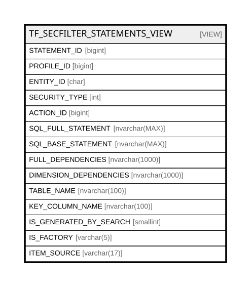

# TF_SECFILTER_STATEMENTS_VIEW

## Description

<details>
<summary><strong>Table Definition</strong></summary>

```sql
-- Talentia Software - All right reserved
-- Type: VIEW                     Name: TF_SECFILTER_STATEMENTS_VIEW
-- Date: 09-04-2026 07:27:59 (UTC)
-- 
-- ChangeLogId: 00000000-0000-0000-0000-000000000000
-- ChangeSetId: 61ac1b2a-ccf0-4d5d-b8cb-4497f3b1f4c0
-- Original file name: C:\repos\Talentia-Software\hcm-core/DB/ProductDB/EDM\Schema\Views\TF_SECFILTER_STATEMENTS_VIEW.xml


CREATE VIEW [TF_SECFILTER_STATEMENTS_VIEW]
 AS 
( 
          SELECT
          COALESCE(CS.ID,FS.ID) AS STATEMENT_ID,
          COALESCE(CS.PROFILE_ID,FS.PROFILE_ID) AS PROFILE_ID,
          COALESCE(CS.ENTITY_ID,FS.ENTITY_ID) AS ENTITY_ID,
          COALESCE(CS.SECURITY_TYPE,FS.SECURITY_TYPE) AS SECURITY_TYPE,
          COALESCE(CS.ACTION_ID,FS.ACTION_ID) AS ACTION_ID,
          CASE WHEN CS.ID IS NOT NULL THEN CS.SQL_FULL_STATEMENT ELSE FS.SQL_FULL_STATEMENT END SQL_FULL_STATEMENT,
          CASE WHEN CS.ID IS NOT NULL THEN CS.SQL_BASE_STATEMENT ELSE FS.SQL_BASE_STATEMENT END SQL_BASE_STATEMENT,
          CASE WHEN CS.ID IS NOT NULL THEN CS.FULL_DEPENDENCIES ELSE FS.FULL_DEPENDENCIES END FULL_DEPENDENCIES,
          CASE WHEN CS.ID IS NOT NULL THEN CS.DIMENSION_DEPENDENCIES ELSE FS.DIMENSION_DEPENDENCIES END DIMENSION_DEPENDENCIES,
          CASE WHEN CS.ID IS NOT NULL THEN CS.TABLE_NAME ELSE FS.TABLE_NAME END TABLE_NAME,
          CASE WHEN CS.ID IS NOT NULL THEN CS.KEY_COLUMN_NAME ELSE FS.KEY_COLUMN_NAME END KEY_COLUMN_NAME,
          COALESCE(CS.IS_GENERATED_BY_SEARCH,FS.IS_GENERATED_BY_SEARCH) AS IS_GENERATED_BY_SEARCH,
          CASE WHEN CS.ID IS NOT NULL THEN 'False' ELSE 'True' END IS_FACTORY,
          CASE WHEN (FS.ID IS NOT NULL) AND ( CS.ID IS NULL ) THEN 'Vanilla'
          WHEN (FS.ID IS NOT NULL) AND ( CS.ID IS NOT NULL ) THEN 'CustomizedVanilla' ELSE 'CustomizedOnly' END ITEM_SOURCE
          FROM TF_SECFACTORY_STATEMENTS FS
          FULL JOIN  TF_SECCUSTOM_STATEMENTS CS ON FS.PROFILE_ID = CS.PROFILE_ID  AND FS.ENTITY_ID = CS.ENTITY_ID AND FS.ACTION_ID = CS.ACTION_ID
         )

```

</details>

## Columns

| Name | Type | Default | Nullable | Comment |
| ---- | ---- | ------- | -------- | ------- |
| STATEMENT_ID | bigint |  | true |  |
| PROFILE_ID | bigint |  | true |  |
| ENTITY_ID | char |  | true |  |
| SECURITY_TYPE | int |  | true |  |
| ACTION_ID | bigint |  | true |  |
| SQL_FULL_STATEMENT | nvarchar(MAX) |  | true |  |
| SQL_BASE_STATEMENT | nvarchar(MAX) |  | true |  |
| FULL_DEPENDENCIES | nvarchar(1000) |  | true |  |
| DIMENSION_DEPENDENCIES | nvarchar(1000) |  | true |  |
| TABLE_NAME | nvarchar(100) |  | true |  |
| KEY_COLUMN_NAME | nvarchar(100) |  | true |  |
| IS_GENERATED_BY_SEARCH | smallint |  | true |  |
| IS_FACTORY | varchar(5) |  | false |  |
| ITEM_SOURCE | varchar(17) |  | false |  |

## Referenced Tables

| Name | Columns | Comment | Type |
| ---- | ------- | ------- | ---- |
| [TF_SECFACTORY_STATEMENTS](TF_SECFACTORY_STATEMENTS.md) | 19 |  | BASIC TABLE |
| [TF_SECCUSTOM_STATEMENTS](TF_SECCUSTOM_STATEMENTS.md) | 19 |  | BASIC TABLE |

## Relations



---

> Generated by [tbls](https://github.com/k1LoW/tbls)
