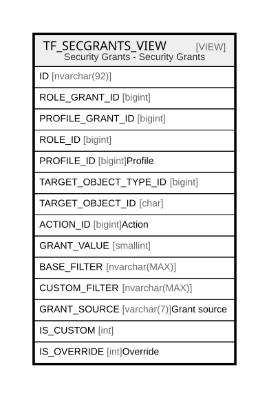

# TF_SECGRANTS_VIEW

## Description

Security Grants - Security Grants  


<details>
<summary><strong>Table Definition</strong></summary>

```sql
-- Talentia Software - All right reserved
-- Type: VIEW                     Name: TF_SECGRANTS_VIEW
-- Date: 09-04-2026 07:27:59 (UTC)
-- 
-- ChangeLogId: 00000000-0000-0000-0000-000000000000
-- ChangeSetId: d113a907-258c-4fef-b30a-1cd577da982a
-- Original file name: C:\repos\Talentia-Software\hcm-core/DB/ProductDB/EDM\Schema\Views\TF_SECGRANTS_VIEW.xml


CREATE VIEW [TF_SECGRANTS_VIEW]
 AS 
( 
                  SELECT 
				  CONVERT(NVARCHAR, RG.ID) + '_0_' + CONVERT(NVARCHAR, PC.ID) AS ID,
				  RG.ID AS ROLE_GRANT_ID,
				  NULL AS PROFILE_GRANT_ID,
				  RG.ROLE_ID AS ROLE_ID,
				  PC.ID AS PROFILE_ID,
				  RG.TARGET_OBJECT_TYPE_ID AS TARGET_OBJECT_TYPE_ID,
				  RG.TARGET_OBJECT_ID AS TARGET_OBJECT_ID, 
				  RG.ACTION_ID AS ACTION_ID,
				  RG.GRANT_VALUE AS GRANT_VALUE,
				  RG.BASE_FILTER AS BASE_FILTER,
				  RG.CUSTOM_FILTER AS CUSTOM_FILTER,
				  'Role' AS GRANT_SOURCE,
				  0 AS IS_CUSTOM,
				  0 AS IS_OVERRIDE
				  FROM TF_PROFILE_CATALOG PC 
				  INNER JOIN TF_ROLE_GRANTS RG ON PC.ROLE_ID = RG.ROLE_ID
				  LEFT JOIN TF_PROFILE_GRANTS RPG ON (RPG.PROFILE_ID = PC.ID AND RPG.ACTION_ID = RG.ACTION_ID AND RPG.TARGET_OBJECT_TYPE_ID = RG.TARGET_OBJECT_TYPE_ID AND RPG.TARGET_OBJECT_ID = RG.TARGET_OBJECT_ID)
				  WHERE RPG.ID IS NULL
				  UNION ALL
				  SELECT 
				  CONVERT(NVARCHAR, COALESCE(RG.ID, 0)) + '_' + CONVERT(NVARCHAR, RPG.ID) + '_' + CONVERT(NVARCHAR, PC.ID) AS ID,
				  RG.ID AS ROLE_GRANT_ID,
				  RPG.ID AS PROFILE_GRANT_ID,
				  PC.ROLE_ID AS ROLE_ID,
				  PC.ID AS PROFILE_ID,
				  RPG.TARGET_OBJECT_TYPE_ID,
				  RPG.TARGET_OBJECT_ID AS TARGET_OBJECT_ID,
				  RPG.ACTION_ID,
				  RPG.GRANT_VALUE AS GRANT_VALUE,
				  COALESCE (RPG.BASE_FILTER, RG.BASE_FILTER) AS BASE_FILTER,
				  COALESCE (RPG.CUSTOM_FILTER, RG.CUSTOM_FILTER) AS CUSTOM_FILTER,
				  'Profile' AS GRANT_SOURCE,
				  1 AS IS_CUSTOM,
				  CASE WHEN RG.ID IS NOT NULL THEN 1 ELSE 0 END IS_OVERRIDE
				  FROM TF_PROFILE_CATALOG PC 
				  INNER JOIN TF_PROFILE_GRANTS RPG ON PC.ID = RPG.PROFILE_ID
				  LEFT JOIN TF_ROLE_GRANTS RG ON (RG.ROLE_ID = PC.ROLE_ID 
				  				AND   RG.ACTION_ID = RPG.ACTION_ID
				  				AND   RG.TARGET_OBJECT_TYPE_ID = RPG.TARGET_OBJECT_TYPE_ID
				  				AND   RG.TARGET_OBJECT_ID = RPG.TARGET_OBJECT_ID)				  
                 )

```

</details>

## Columns

| Name | Type | Default | Nullable | Comment |
| ---- | ---- | ------- | -------- | ------- |
| ID | nvarchar(92) |  | true |  |
| ROLE_GRANT_ID | bigint |  | true |  |
| PROFILE_GRANT_ID | bigint |  | true |  |
| ROLE_ID | bigint |  | false |  |
| PROFILE_ID | bigint |  | false | Profile |
| TARGET_OBJECT_TYPE_ID | bigint |  | false |  |
| TARGET_OBJECT_ID | char |  | false |  |
| ACTION_ID | bigint |  | false | Action |
| GRANT_VALUE | smallint |  | false |  |
| BASE_FILTER | nvarchar(MAX) |  | true |  |
| CUSTOM_FILTER | nvarchar(MAX) |  | true |  |
| GRANT_SOURCE | varchar(7) |  | false | Grant source |
| IS_CUSTOM | int |  | false |  |
| IS_OVERRIDE | int |  | false | Override |

## Referenced Tables

| Name | Columns | Comment | Type |
| ---- | ------- | ------- | ---- |
| [TF_PROFILE_CATALOG](TF_PROFILE_CATALOG.md) | 24 | Profile catalog - TF_PROFILE_CATALOG<br /> | BASIC TABLE |
| [TF_ROLE_GRANTS](TF_ROLE_GRANTS.md) | 18 | Role Grants - Role Grants<br /> | BASIC TABLE |
| [TF_PROFILE_GRANTS](TF_PROFILE_GRANTS.md) | 15 | Profile grant - TF_PROFILE_GRANT<br /> | BASIC TABLE |

## Relations



---

> Generated by [tbls](https://github.com/k1LoW/tbls)
