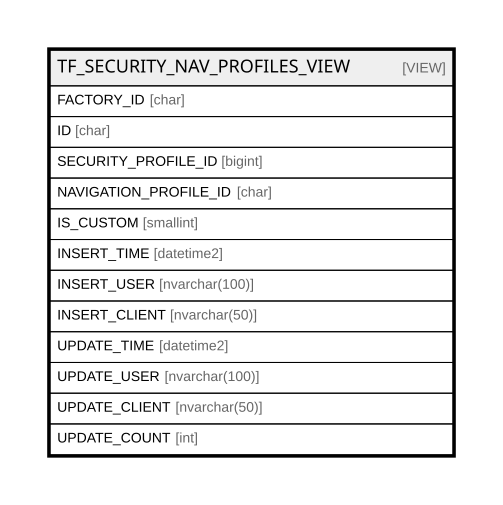

# TF_SECURITY_NAV_PROFILES_VIEW

## Description

<details>
<summary><strong>Table Definition</strong></summary>

```sql
-- Talentia Software - All right reserved
-- Type: VIEW                     Name: TF_SECURITY_NAV_PROFILES_VIEW
-- Date: 09-04-2026 07:27:59 (UTC)
-- 
-- ChangeLogId: 00000000-0000-0000-0000-000000000000
-- ChangeSetId: 8aec5e49-d8e3-43c0-8215-f420eefead9c
-- Original file name: C:\repos\Talentia-Software\hcm-core/DB/ProductDB/EDM\Schema\Views\TF_SECURITY_NAV_PROFILES_VIEW.xml


CREATE VIEW [TF_SECURITY_NAV_PROFILES_VIEW]
 AS 
( 
          SELECT FACTORY_ID,
                 ID,
                 SECURITY_PROFILE_ID,
                 NAVIGATION_PROFILE_ID,
                 IS_CUSTOM,
                 INSERT_TIME,
                 INSERT_USER,
                 INSERT_CLIENT,
                 UPDATE_TIME,
                 UPDATE_USER,
                 UPDATE_CLIENT,
                 UPDATE_COUNT
          FROM TF_SECURITY_NAV_PROFILES
          WHERE IS_CUSTOM = 1
          UNION ALL
          SELECT FACTORY_ID,
                 ID,
                 SECURITY_PROFILE_ID,
                 NAVIGATION_PROFILE_ID,
                 IS_CUSTOM,
                 INSERT_TIME,
                 INSERT_USER,
                 INSERT_CLIENT,
                 UPDATE_TIME,
                 UPDATE_USER,
                 UPDATE_CLIENT,
                 UPDATE_COUNT
          FROM TF_SECURITY_NAV_PROFILES
          WHERE IS_CUSTOM = 0 AND NOT EXISTS (SELECT ID FROM TF_SECURITY_NAV_PROFILES SNP WHERE SNP.IS_CUSTOM = 1 AND TF_SECURITY_NAV_PROFILES.ID = SNP.FACTORY_ID)
         )

```

</details>

## Columns

| Name | Type | Default | Nullable | Comment |
| ---- | ---- | ------- | -------- | ------- |
| FACTORY_ID | char |  | true |  |
| ID | char |  | false |  |
| SECURITY_PROFILE_ID | bigint |  | false |  |
| NAVIGATION_PROFILE_ID | char |  | false |  |
| IS_CUSTOM | smallint |  | false |  |
| INSERT_TIME | datetime2 |  | false |  |
| INSERT_USER | nvarchar(100) |  | false |  |
| INSERT_CLIENT | nvarchar(50) |  | false |  |
| UPDATE_TIME | datetime2 |  | false |  |
| UPDATE_USER | nvarchar(100) |  | false |  |
| UPDATE_CLIENT | nvarchar(50) |  | false |  |
| UPDATE_COUNT | int |  | false |  |

## Referenced Tables

| Name | Columns | Comment | Type |
| ---- | ------- | ------- | ---- |
| [TF_SECURITY_NAV_PROFILES](TF_SECURITY_NAV_PROFILES.md) | 12 | Security Navigation Profiles - TF_SECURITY_NAV_PROFILES<br /> | BASIC TABLE |

## Relations



---

> Generated by [tbls](https://github.com/k1LoW/tbls)
