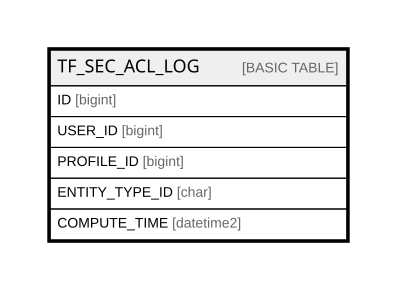

# TF_SEC_ACL_LOG

## Columns

| Name | Type | Default | Nullable | Comment |
| ---- | ---- | ------- | -------- | ------- |
| ID | bigint |  | false |  |
| USER_ID | bigint |  | false |  |
| PROFILE_ID | bigint |  | false |  |
| ENTITY_TYPE_ID | char |  | false |  |
| COMPUTE_TIME | datetime2 | (sysutcdatetime()) | false |  |

## Constraints

| Name | Type | Definition |
| ---- | ---- | ---------- |
| PK_SEC_ACL_LOG | PRIMARY KEY | CLUSTERED, unique, part of a PRIMARY KEY constraint, [ ID ] |

## Indexes

| Name | Definition |
| ---- | ---------- |
| PK_SEC_ACL_LOG | CLUSTERED, unique, part of a PRIMARY KEY constraint, [ ID ] |
| IDX_SEC_ACL_LOG | NONCLUSTERED, [ USER_ID, PROFILE_ID, ENTITY_TYPE_ID, COMPUTE_TIME ] |
| IDX_SEC_ACL_LOG_ENTITY_TYPE | NONCLUSTERED, [ ENTITY_TYPE_ID ] |

## Relations

---

> Generated by [tbls](https://github.com/k1LoW/tbls)
