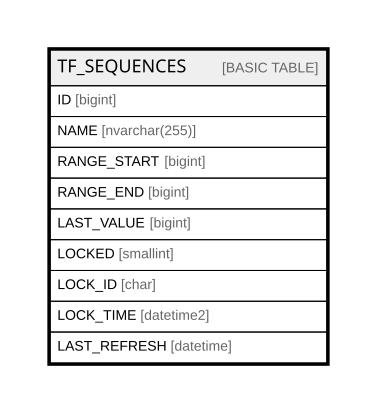

# TF_SEQUENCES

## Columns

| Name | Type | Default | Nullable | Comment |
| ---- | ---- | ------- | -------- | ------- |
| ID | bigint |  | false |  |
| NAME | nvarchar(255) |  | false |  |
| RANGE_START | bigint |  | false |  |
| RANGE_END | bigint |  | false |  |
| LAST_VALUE | bigint |  | false |  |
| LOCKED | smallint | ((0)) | false |  |
| LOCK_ID | char |  | true |  |
| LOCK_TIME | datetime2 |  | true |  |
| LAST_REFRESH | datetime | (getutcdate()) | false |  |

## Constraints

| Name | Type | Definition |
| ---- | ---- | ---------- |
| PK_SEQUENCES | PRIMARY KEY | CLUSTERED, unique, part of a PRIMARY KEY constraint, [ ID ] |
| UQ_SEQUENCES_NAME | UNIQUE | NONCLUSTERED, unique, part of a UNIQUE constraint, [ NAME ] |

## Indexes

| Name | Definition |
| ---- | ---------- |
| PK_SEQUENCES | CLUSTERED, unique, part of a PRIMARY KEY constraint, [ ID ] |
| UQ_SEQUENCES_NAME | NONCLUSTERED, unique, part of a UNIQUE constraint, [ NAME ] |

## Relations

---

> Generated by [tbls](https://github.com/k1LoW/tbls)
