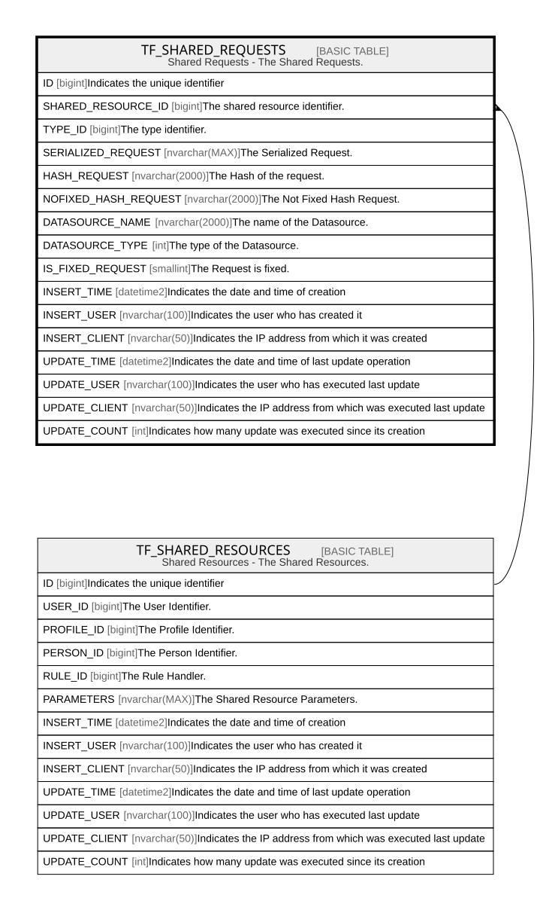

# TF_SHARED_REQUESTS

## Description

Shared Requests - The Shared Requests.  

## Columns

| Name | Type | Default | Nullable | Parents | Comment |
| ---- | ---- | ------- | -------- | ------- | ------- |
| ID | bigint |  | false |  | Indicates the unique identifier |
| SHARED_RESOURCE_ID | bigint |  | false | [TF_SHARED_RESOURCES](TF_SHARED_RESOURCES.md) | The shared resource identifier. |
| TYPE_ID | bigint |  | false |  | The type identifier. |
| SERIALIZED_REQUEST | nvarchar(MAX) |  | true |  | The Serialized Request. |
| HASH_REQUEST | nvarchar(2000) |  | false |  | The Hash of the request. |
| NOFIXED_HASH_REQUEST | nvarchar(2000) |  | false |  | The Not Fixed Hash Request. |
| DATASOURCE_NAME | nvarchar(2000) |  | true |  | The name of the Datasource. |
| DATASOURCE_TYPE | int |  | false |  | The type of the Datasource. |
| IS_FIXED_REQUEST | smallint | ((0)) | false |  | The Request is fixed. |
| INSERT_TIME | datetime2 | (sysutcdatetime()) | false |  | Indicates the date and time of creation |
| INSERT_USER | nvarchar(100) | (N'MAIN') | false |  | Indicates the user who has created it |
| INSERT_CLIENT | nvarchar(50) | (N'localhost') | false |  | Indicates the IP address from which it was created |
| UPDATE_TIME | datetime2 | (sysutcdatetime()) | false |  | Indicates the date and time of last update operation |
| UPDATE_USER | nvarchar(100) | (N'MAIN') | false |  | Indicates the user who has executed last update |
| UPDATE_CLIENT | nvarchar(50) | (N'localhost') | false |  | Indicates the IP address from which was executed last update |
| UPDATE_COUNT | int | ((0)) | false |  | Indicates how many update was executed since its creation |

## Constraints

| Name | Type | Definition |
| ---- | ---- | ---------- |
| PK_SHAREDREQUEST | PRIMARY KEY | CLUSTERED, unique, part of a PRIMARY KEY constraint, [ ID ] |
| FK_SHAREDREQ_SHRES | FOREIGN KEY | FOREIGN KEY(SHARED_RESOURCE_ID) REFERENCES TF_SHARED_RESOURCES(ID) ON UPDATE NO_ACTION ON DELETE CASCADE |

## Indexes

| Name | Definition |
| ---- | ---------- |
| PK_SHAREDREQUEST | CLUSTERED, unique, part of a PRIMARY KEY constraint, [ ID ] |

## Relations

---

> Generated by [tbls](https://github.com/k1LoW/tbls)
