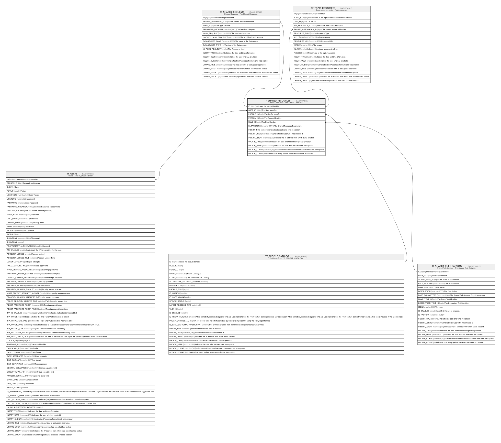

# TF_SHARED_RESOURCES

## Description

Shared Resources - The Shared Resources.  

## Columns

| Name | Type | Default | Nullable | Children | Parents | Comment |
| ---- | ---- | ------- | -------- | -------- | ------- | ------- |
| ID | bigint |  | false | [TF_SHARED_REQUESTS](TF_SHARED_REQUESTS.md) [TF_TOPIC_RESOURCES](TF_TOPIC_RESOURCES.md) |  | Indicates the unique identifier |
| USER_ID | bigint |  | true |  | [TF_USERS](TF_USERS.md) | The User Identifier. |
| PROFILE_ID | bigint |  | false |  | [TF_PROFILE_CATALOG](TF_PROFILE_CATALOG.md) | The Profile Identifier. |
| PERSON_ID | bigint |  | true |  |  | The Person Identifier. |
| RULE_ID | bigint |  | false |  | [TF_SHARED_RULE_CATALOG](TF_SHARED_RULE_CATALOG.md) | The Rule Handler. |
| PARAMETERS | nvarchar(MAX) |  | true |  |  | The Shared Resource Parameters. |
| INSERT_TIME | datetime2 | (sysutcdatetime()) | false |  |  | Indicates the date and time of creation |
| INSERT_USER | nvarchar(100) | (N'MAIN') | false |  |  | Indicates the user who has created it |
| INSERT_CLIENT | nvarchar(50) | (N'localhost') | false |  |  | Indicates the IP address from which it was created |
| UPDATE_TIME | datetime2 | (sysutcdatetime()) | false |  |  | Indicates the date and time of last update operation |
| UPDATE_USER | nvarchar(100) | (N'MAIN') | false |  |  | Indicates the user who has executed last update |
| UPDATE_CLIENT | nvarchar(50) | (N'localhost') | false |  |  | Indicates the IP address from which was executed last update |
| UPDATE_COUNT | int | ((0)) | false |  |  | Indicates how many update was executed since its creation |

## Constraints

| Name | Type | Definition |
| ---- | ---- | ---------- |
| PK_SHAREDRESOURCES | PRIMARY KEY | CLUSTERED, unique, part of a PRIMARY KEY constraint, [ ID ] |
| FK_SHAREDRES_PROFILES | FOREIGN KEY | FOREIGN KEY(PROFILE_ID) REFERENCES TF_PROFILE_CATALOG(ID) ON UPDATE NO_ACTION ON DELETE NO_ACTION |
| FK_SHAREDRES_RULECAT | FOREIGN KEY | FOREIGN KEY(RULE_ID) REFERENCES TF_SHARED_RULE_CATALOG(ID) ON UPDATE NO_ACTION ON DELETE NO_ACTION |
| FK_SHAREDRES_USERS | FOREIGN KEY | FOREIGN KEY(USER_ID) REFERENCES TF_USERS(ID) ON UPDATE NO_ACTION ON DELETE NO_ACTION |

## Indexes

| Name | Definition |
| ---- | ---------- |
| PK_SHAREDRESOURCES | CLUSTERED, unique, part of a PRIMARY KEY constraint, [ ID ] |

## Relations

---

> Generated by [tbls](https://github.com/k1LoW/tbls)
