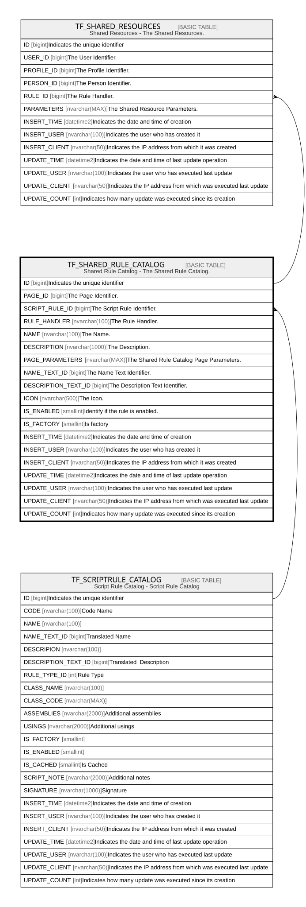

# TF_SHARED_RULE_CATALOG

## Description

Shared Rule Catalog - The Shared Rule Catalog.  

## Columns

| Name | Type | Default | Nullable | Children | Parents | Comment |
| ---- | ---- | ------- | -------- | -------- | ------- | ------- |
| ID | bigint |  | false | [TF_SHARED_RESOURCES](TF_SHARED_RESOURCES.md) |  | Indicates the unique identifier |
| PAGE_ID | bigint |  | true |  |  | The Page Identifier. |
| SCRIPT_RULE_ID | bigint |  | true |  | [TF_SCRIPTRULE_CATALOG](TF_SCRIPTRULE_CATALOG.md) | The Script Rule Identifier. |
| RULE_HANDLER | nvarchar(100) |  | false |  |  | The Rule Handler. |
| NAME | nvarchar(100) |  | false |  |  | The Name. |
| DESCRIPTION | nvarchar(1000) |  | true |  |  | The Description. |
| PAGE_PARAMETERS | nvarchar(MAX) |  | true |  |  | The Shared Rule Catalog Page Parameters. |
| NAME_TEXT_ID | bigint |  | true |  |  | The Name Text Identifier. |
| DESCRIPTION_TEXT_ID | bigint |  | true |  |  | The Description Text Identifier. |
| ICON | nvarchar(500) |  | true |  |  | The Icon. |
| IS_ENABLED | smallint | ((1)) | false |  |  | Identify if the rule is enabled. |
| IS_FACTORY | smallint | ((0)) | false |  |  | Is factory |
| INSERT_TIME | datetime2 | (sysutcdatetime()) | false |  |  | Indicates the date and time of creation |
| INSERT_USER | nvarchar(100) | (N'MAIN') | false |  |  | Indicates the user who has created it |
| INSERT_CLIENT | nvarchar(50) | (N'localhost') | false |  |  | Indicates the IP address from which it was created |
| UPDATE_TIME | datetime2 | (sysutcdatetime()) | false |  |  | Indicates the date and time of last update operation |
| UPDATE_USER | nvarchar(100) | (N'MAIN') | false |  |  | Indicates the user who has executed last update |
| UPDATE_CLIENT | nvarchar(50) | (N'localhost') | false |  |  | Indicates the IP address from which was executed last update |
| UPDATE_COUNT | int | ((0)) | false |  |  | Indicates how many update was executed since its creation |

## Constraints

| Name | Type | Definition |
| ---- | ---- | ---------- |
| PK_TFSHARED_RULE_CATALOG | PRIMARY KEY | CLUSTERED, unique, part of a PRIMARY KEY constraint, [ ID ] |
| UQ_SHAREDRULE_CAT_NAME | UNIQUE | NONCLUSTERED, unique, part of a UNIQUE constraint, [ NAME ] |
| FK_TFSHARED_RULECAT_SRCAT | FOREIGN KEY | FOREIGN KEY(SCRIPT_RULE_ID) REFERENCES TF_SCRIPTRULE_CATALOG(ID) ON UPDATE NO_ACTION ON DELETE NO_ACTION |

## Indexes

| Name | Definition |
| ---- | ---------- |
| PK_TFSHARED_RULE_CATALOG | CLUSTERED, unique, part of a PRIMARY KEY constraint, [ ID ] |
| UQ_SHAREDRULE_CAT_NAME | NONCLUSTERED, unique, part of a UNIQUE constraint, [ NAME ] |

## Relations

---

> Generated by [tbls](https://github.com/k1LoW/tbls)
