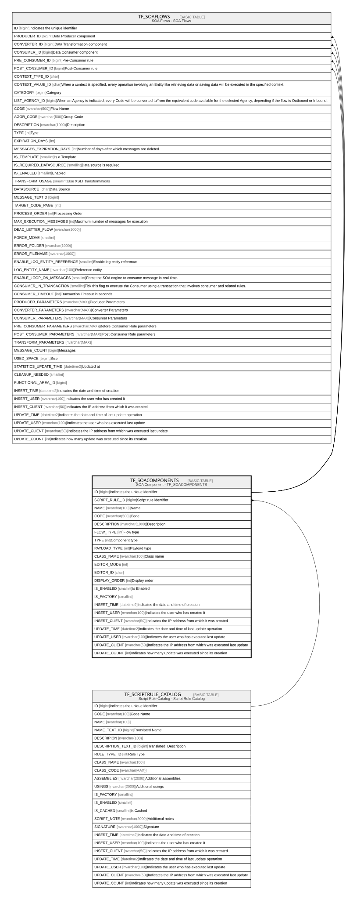

# TF_SOACOMPONENTS

## Description

SOA Component - TF_SOACOMPONENTS  

## Columns

| Name | Type | Default | Nullable | Children | Parents | Comment |
| ---- | ---- | ------- | -------- | -------- | ------- | ------- |
| ID | bigint |  | false | [TF_SOAFLOWS](TF_SOAFLOWS.md) |  | Indicates the unique identifier |
| SCRIPT_RULE_ID | bigint |  | true |  | [TF_SCRIPTRULE_CATALOG](TF_SCRIPTRULE_CATALOG.md) | Script rule identifier |
| NAME | nvarchar(100) |  | false |  |  | Name |
| CODE | nvarchar(500) |  | false |  |  | Code |
| DESCRIPTION | nvarchar(1000) |  | true |  |  | Description |
| FLOW_TYPE | int |  | false |  |  | Flow type |
| TYPE | int |  | false |  |  | Component type |
| PAYLOAD_TYPE | int | ((0)) | false |  |  | Payload type |
| CLASS_NAME | nvarchar(100) |  | false |  |  | Class name |
| EDITOR_MODE | int | ((1)) | false |  |  |  |
| EDITOR_ID | char |  | true |  |  |  |
| DISPLAY_ORDER | int |  | true |  |  | Display order |
| IS_ENABLED | smallint | ((1)) | false |  |  | Is Enabled |
| IS_FACTORY | smallint | ((0)) | false |  |  |  |
| INSERT_TIME | datetime2 | (sysutcdatetime()) | false |  |  | Indicates the date and time of creation |
| INSERT_USER | nvarchar(100) | (N'MAIN') | false |  |  | Indicates the user who has created it |
| INSERT_CLIENT | nvarchar(50) | (N'localhost') | false |  |  | Indicates the IP address from which it was created |
| UPDATE_TIME | datetime2 | (sysutcdatetime()) | false |  |  | Indicates the date and time of last update operation |
| UPDATE_USER | nvarchar(100) | (N'MAIN') | false |  |  | Indicates the user who has executed last update |
| UPDATE_CLIENT | nvarchar(50) | (N'localhost') | false |  |  | Indicates the IP address from which was executed last update |
| UPDATE_COUNT | int | ((0)) | false |  |  | Indicates how many update was executed since its creation |

## Constraints

| Name | Type | Definition |
| ---- | ---- | ---------- |
| PK_TF_SOACOMPONENTS | PRIMARY KEY | CLUSTERED, unique, part of a PRIMARY KEY constraint, [ ID ] |
| UQ_TF_SOACOMPONENTS_CODE | UNIQUE | NONCLUSTERED, unique, part of a UNIQUE constraint, [ CODE ] |
| FK_COMP_SR_CATALOG | FOREIGN KEY | FOREIGN KEY(SCRIPT_RULE_ID) REFERENCES TF_SCRIPTRULE_CATALOG(ID) ON UPDATE NO_ACTION ON DELETE NO_ACTION |

## Indexes

| Name | Definition |
| ---- | ---------- |
| PK_TF_SOACOMPONENTS | CLUSTERED, unique, part of a PRIMARY KEY constraint, [ ID ] |
| UQ_TF_SOACOMPONENTS_CODE | NONCLUSTERED, unique, part of a UNIQUE constraint, [ CODE ] |

## Relations

---

> Generated by [tbls](https://github.com/k1LoW/tbls)
