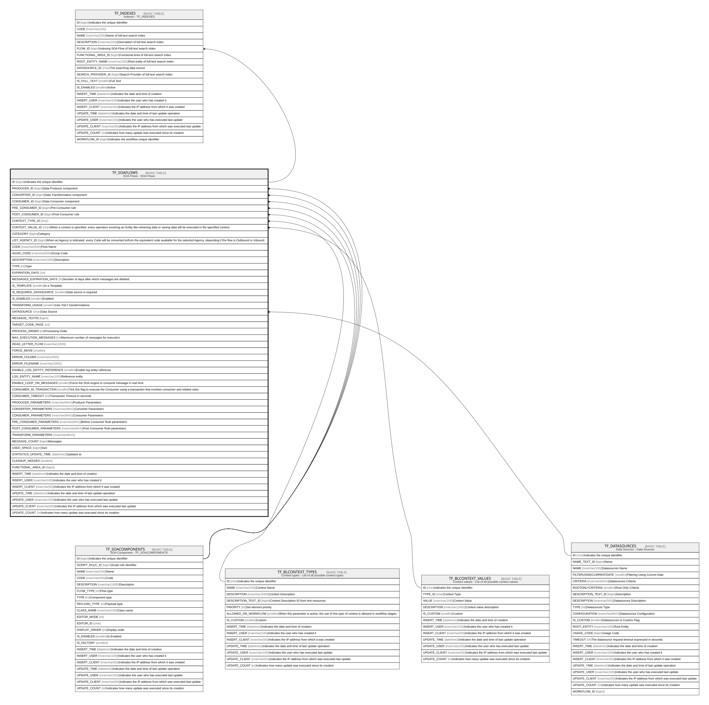

# TF_SOAFLOWS

## Description

SOA Flows - SOA Flows  

## Columns

| Name | Type | Default | Nullable | Children | Parents | Comment |
| ---- | ---- | ------- | -------- | -------- | ------- | ------- |
| ID | bigint |  | false | [TF_INDEXES](TF_INDEXES.md) |  | Indicates the unique identifier |
| PRODUCER_ID | bigint |  | true |  | [TF_SOACOMPONENTS](TF_SOACOMPONENTS.md) | Data Producer component |
| CONVERTER_ID | bigint |  | true |  | [TF_SOACOMPONENTS](TF_SOACOMPONENTS.md) | Data Transformation component |
| CONSUMER_ID | bigint |  | true |  | [TF_SOACOMPONENTS](TF_SOACOMPONENTS.md) | Data Consumer component |
| PRE_CONSUMER_ID | bigint |  | true |  | [TF_SOACOMPONENTS](TF_SOACOMPONENTS.md) | Pre-Consumer rule |
| POST_CONSUMER_ID | bigint |  | true |  | [TF_SOACOMPONENTS](TF_SOACOMPONENTS.md) | Post-Consumer rule |
| CONTEXT_TYPE_ID | char | ('00000000-0000-0000-0000-000000000001') | false |  | [TF_BLCONTEXT_TYPES](TF_BLCONTEXT_TYPES.md) |  |
| CONTEXT_VALUE_ID | char |  | true |  | [TF_BLCONTEXT_VALUES](TF_BLCONTEXT_VALUES.md) | When a context is specified, every operation involving an Entity like retrieving data or saving data will be executed in the specified context. |
| CATEGORY | bigint |  | true |  |  | Category |
| LIST_AGENCY_ID | bigint |  | true |  |  | When an Agency is indicated, every Code will be converted to/from the equivalent code available for the selected Agency, depending if the flow is Outbound or Inbound. |
| CODE | nvarchar(500) |  | false |  |  | Flow Name |
| AGGR_CODE | nvarchar(500) |  | true |  |  | Group Code |
| DESCRIPTION | nvarchar(1000) |  | true |  |  | Description |
| TYPE | int |  | false |  |  | Type |
| EXPIRATION_DAYS | int |  | true |  |  |  |
| MESSAGES_EXPIRATION_DAYS | int |  | false |  |  | Number of days after which messages are deleted. |
| IS_TEMPLATE | smallint | ((0)) | true |  |  | Is a Template |
| IS_REQUIRED_DATASOURCE | smallint | ((0)) | false |  |  | Data source is required |
| IS_ENABLED | smallint | ((1)) | false |  |  | Enabled |
| TRANSFORM_USAGE | smallint | ((0)) | true |  |  | Use XSLT transformations |
| DATASOURCE | char |  | true |  | [TF_DATASOURCES](TF_DATASOURCES.md) | Data Source |
| MESSAGE_TEXTID | bigint |  | true |  |  |  |
| TARGET_CODE_PAGE | int | ((65001)) | false |  |  |  |
| PROCESS_ORDER | int | ((0)) | false |  |  | Processing Order |
| MAX_EXECUTION_MESSAGES | int |  | true |  |  | Maximum number of messages for execution |
| DEAD_LETTER_FLOW | nvarchar(1000) |  | true |  |  |  |
| FORCE_MOVE | smallint | ((0)) | true |  |  |  |
| ERROR_FOLDER | nvarchar(1000) |  | true |  |  |  |
| ERROR_FILENAME | nvarchar(1000) |  | true |  |  |  |
| ENABLE_LOG_ENTITY_REFERENCE | smallint | ((0)) | true |  |  | Enable log entity reference |
| LOG_ENTITY_NAME | nvarchar(100) |  | true |  |  | Reference entity |
| ENABLE_LOOP_ON_MESSAGES | smallint | ((0)) | true |  |  | Force the SOA engine to consume message in real time. |
| CONSUMER_IN_TRANSACTION | smallint | ((0)) | false |  |  | Tick this flag to execute the Consumer using a transaction that involves consumer and related rules. |
| CONSUMER_TIMEOUT | int |  | true |  |  | Transaction Timeout in seconds |
| PRODUCER_PARAMETERS | nvarchar(MAX) |  | true |  |  | Producer Parameters |
| CONVERTER_PARAMETERS | nvarchar(MAX) |  | true |  |  | Converter Parameters |
| CONSUMER_PARAMETERS | nvarchar(MAX) |  | true |  |  | Consumer Parameters |
| PRE_CONSUMER_PARAMETERS | nvarchar(MAX) |  | true |  |  | Before Consumer Rule parameters |
| POST_CONSUMER_PARAMETERS | nvarchar(MAX) |  | true |  |  | Post Consumer Rule parameters |
| TRANSFORM_PARAMETERS | nvarchar(MAX) |  | true |  |  |  |
| MESSAGE_COUNT | bigint | ((0)) | true |  |  | Messages |
| USED_SPACE | bigint | ((0)) | true |  |  | Size |
| STATISTICS_UPDATE_TIME | datetime2 | (sysutcdatetime()) | true |  |  | Updated at |
| CLEANUP_NEEDED | smallint | ((0)) | false |  |  |  |
| FUNCTIONAL_AREA_ID | bigint |  | true |  |  |  |
| INSERT_TIME | datetime2 | (sysutcdatetime()) | true |  |  | Indicates the date and time of creation |
| INSERT_USER | nvarchar(100) | (N'MAIN') | true |  |  | Indicates the user who has created it |
| INSERT_CLIENT | nvarchar(50) | (N'localhost') | true |  |  | Indicates the IP address from which it was created |
| UPDATE_TIME | datetime2 | (sysutcdatetime()) | true |  |  | Indicates the date and time of last update operation |
| UPDATE_USER | nvarchar(100) | (N'MAIN') | true |  |  | Indicates the user who has executed last update |
| UPDATE_CLIENT | nvarchar(50) | (N'localhost') | true |  |  | Indicates the IP address from which was executed last update |
| UPDATE_COUNT | int | ((0)) | true |  |  | Indicates how many update was executed since its creation |

## Constraints

| Name | Type | Definition |
| ---- | ---- | ---------- |
| PK_TFSOAFLOWS | PRIMARY KEY | CLUSTERED, unique, part of a PRIMARY KEY constraint, [ ID ] |
| UQ_TFFLOW_CODE | UNIQUE | NONCLUSTERED, unique, part of a UNIQUE constraint, [ CODE ] |
| FK_TFFLOW_CONSUMER | FOREIGN KEY | FOREIGN KEY(CONSUMER_ID) REFERENCES TF_SOACOMPONENTS(ID) ON UPDATE NO_ACTION ON DELETE NO_ACTION |
| FK_TFFLOW_CONTEXTTYPES | FOREIGN KEY | FOREIGN KEY(CONTEXT_TYPE_ID) REFERENCES TF_BLCONTEXT_TYPES(ID) ON UPDATE NO_ACTION ON DELETE NO_ACTION |
| FK_TFFLOW_CONTEXTVALUE | FOREIGN KEY | FOREIGN KEY(CONTEXT_VALUE_ID) REFERENCES TF_BLCONTEXT_VALUES(ID) ON UPDATE NO_ACTION ON DELETE NO_ACTION |
| FK_TFFLOW_CONVERTER | FOREIGN KEY | FOREIGN KEY(CONVERTER_ID) REFERENCES TF_SOACOMPONENTS(ID) ON UPDATE NO_ACTION ON DELETE NO_ACTION |
| FK_TFFLOW_DATASOURCE | FOREIGN KEY | FOREIGN KEY(DATASOURCE) REFERENCES TF_DATASOURCES(ID) ON UPDATE NO_ACTION ON DELETE NO_ACTION |
| FK_TFFLOW_POSTCONSUMER | FOREIGN KEY | FOREIGN KEY(POST_CONSUMER_ID) REFERENCES TF_SOACOMPONENTS(ID) ON UPDATE NO_ACTION ON DELETE NO_ACTION |
| FK_TFFLOW_PRECONSUMER | FOREIGN KEY | FOREIGN KEY(PRE_CONSUMER_ID) REFERENCES TF_SOACOMPONENTS(ID) ON UPDATE NO_ACTION ON DELETE NO_ACTION |
| FK_TFFLOW_PRODUCER | FOREIGN KEY | FOREIGN KEY(PRODUCER_ID) REFERENCES TF_SOACOMPONENTS(ID) ON UPDATE NO_ACTION ON DELETE NO_ACTION |

## Indexes

| Name | Definition |
| ---- | ---------- |
| PK_TFSOAFLOWS | CLUSTERED, unique, part of a PRIMARY KEY constraint, [ ID ] |
| UQ_TFFLOW_CODE | NONCLUSTERED, unique, part of a UNIQUE constraint, [ CODE ] |
| IDX_SOAFLOWS_CATEGORY | NONCLUSTERED, [ CATEGORY ] |
| IDX_SOAFLOWS_AGENCY_ID | NONCLUSTERED, [ LIST_AGENCY_ID ] |

## Relations

---

> Generated by [tbls](https://github.com/k1LoW/tbls)
