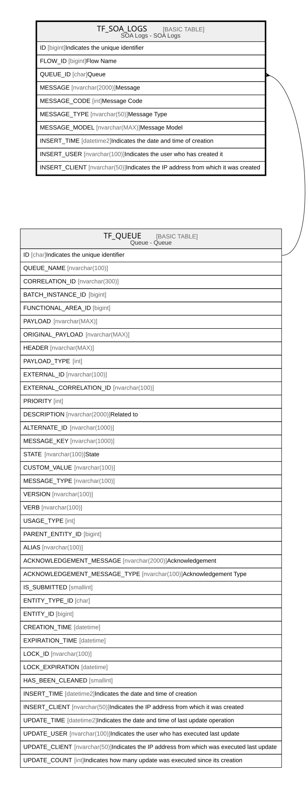

# TF_SOA_LOGS

## Description

SOA Logs - SOA Logs  

## Columns

| Name | Type | Default | Nullable | Parents | Comment |
| ---- | ---- | ------- | -------- | ------- | ------- |
| ID | bigint |  | false |  | Indicates the unique identifier |
| FLOW_ID | bigint |  | true |  | Flow Name |
| QUEUE_ID | char |  | true | [TF_QUEUE](TF_QUEUE.md) | Queue |
| MESSAGE | nvarchar(2000) |  | true |  | Message |
| MESSAGE_CODE | int |  | true |  | Message Code |
| MESSAGE_TYPE | nvarchar(50) |  | true |  | Message Type |
| MESSAGE_MODEL | nvarchar(MAX) |  | true |  | Message Model |
| INSERT_TIME | datetime2 | (sysutcdatetime()) | false |  | Indicates the date and time of creation |
| INSERT_USER | nvarchar(100) | (N'MAIN') | false |  | Indicates the user who has created it |
| INSERT_CLIENT | nvarchar(50) | (N'localhost') | false |  | Indicates the IP address from which it was created |

## Constraints

| Name | Type | Definition |
| ---- | ---- | ---------- |
| PK_SOA_LOGS | PRIMARY KEY | CLUSTERED, unique, part of a PRIMARY KEY constraint, [ ID ] |
| FK_SOA_LOGS_QUEUE | FOREIGN KEY | FOREIGN KEY(QUEUE_ID) REFERENCES TF_QUEUE(ID) ON UPDATE NO_ACTION ON DELETE CASCADE |

## Indexes

| Name | Definition |
| ---- | ---------- |
| PK_SOA_LOGS | CLUSTERED, unique, part of a PRIMARY KEY constraint, [ ID ] |
| IDX_SOALOGS_QUEUE | NONCLUSTERED, [ QUEUE_ID ] |
| IDX_SOALOGS_FLOW | NONCLUSTERED, [ FLOW_ID ] |
| IDX_SOALOGS_INSERTTIME | NONCLUSTERED, [ ID, INSERT_TIME ] |

## Relations

---

> Generated by [tbls](https://github.com/k1LoW/tbls)
